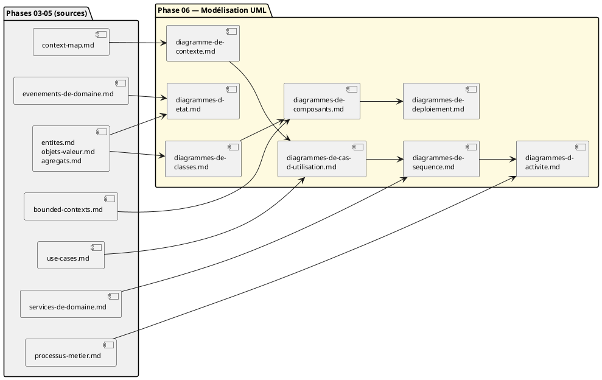

# Dossier de Modélisation UML — Eventix

| Champ | Valeur |
|---|---|
| **Phase** | 06 — Modélisation UML |
| **Projet** | Eventix — plateforme de billetterie en ligne, marketplace multi-organisateurs |
| **Périmètre** | MVP |
| **Marché initial** | Cameroun |
| **Notation** | PlantUML — UML 2.5 |
| **Statut global** | Dossier complet — 8 diagrammes livrés, à valider par l'équipe |

---

## Table des matières

1. [Objectif de ce dossier](#1-objectif-de-ce-dossier)
2. [Sommaire des documents](#2-sommaire-des-documents)
3. [Carte des dépendances](#3-carte-des-dépendances)
4. [Ordre de lecture recommandé](#4-ordre-de-lecture-recommandé)
5. [Décisions architecturales majeures](#5-décisions-architecturales-majeures)
6. [Principes et patterns appliqués, sans POO](#6-principes-et-patterns-appliqués-sans-poo)
7. [Registre consolidé des points à clarifier](#7-registre-consolidé-des-points-à-clarifier)
8. [Qualité des sources — incohérences détectées](#8-qualité-des-sources--incohérences-détectées)
9. [Statut détaillé par document](#9-statut-détaillé-par-document)
10. [Prochaines étapes suggérées](#10-prochaines-étapes-suggérées)

---

## 1. Objectif de ce dossier

Ce dossier traduit en UML 2.5 l'ensemble du travail de modélisation métier et de Domain-Driven Design déjà produit pour Eventix (phases 03 à 05 : processus métier, cas d'usage, bounded contexts, agrégats, services de domaine, événements de domaine). Il ne redéfinit aucune de ces sources — chaque document ci-dessous les référence et les prolonge, sans jamais les reformuler intégralement, conformément au principe de faible couplage documentaire appliqué de bout en bout.

Eventix n'étant pas développé en programmation orientée objet, ce dossier a systématiquement adapté la rigueur UML classique à ce contexte : les diagrammes de classes restent allégés (structure de données, sans opérations), et partout où SOLID ou les design patterns orientés objet auraient normalement guidé une justification, l'équivalent en discipline DDD tactique (agrégats, objets de valeur, référence par identité) a été utilisé à la place — voir §6.

---

## 2. Sommaire des documents

| # | Document | Contenu | Sources (phases 03-05) |
|---|---|---|---|
| 1 | [`diagramme-de-contexte.md`](diagramme-de-contexte.md) | Eventix comme système unique, acteurs et systèmes externes | `context-map.md` |
| 2 | [`diagrammes-de-cas-d-utilisation.md`](diagrammes-de-cas-d-utilisation.md) | 26 cas d'usage, organisés en 5 vues par acteur | `use-cases.md` |
| 3 | [`diagrammes-de-classes.md`](diagrammes-de-classes.md) | Structure conceptuelle du domaine, 20 agrégats, allégée (sans POO) | `entites.md`, `objets-valeur.md`, `agregats.md` |
| 4 | [`diagrammes-de-sequence.md`](diagrammes-de-sequence.md) | Orchestration des 10 services de domaine | `diagrammes-de-cas-d-utilisation.md`, `services-de-domaine.md` |
| 5 | [`diagrammes-d-etat.md`](diagrammes-d-etat.md) | 13 automates d'agrégats, transitions nommées par événement | `agregats.md`, `evenements-de-domaine.md` |
| 6 | [`diagrammes-d-activite.md`](diagrammes-d-activite.md) | Flux de contrôle, décisions et boucles de reprise des processus clés | `processus-metier.md`, `diagrammes-de-sequence.md` |
| 7 | [`diagrammes-de-composants.md`](diagrammes-de-composants.md) | 12 composants alignés sur les bounded contexts | `diagrammes-de-classes.md`, `bounded-contexts.md` |
| 8 | [`diagrammes-de-deploiement.md`](diagrammes-de-deploiement.md) | Infrastructure préliminaire, sans décision technique prématurée | `diagrammes-de-composants.md` |

---

## 3. Carte des dépendances

Deux documents (`diagrammes-de-classes.md` et `diagrammes-de-sequence.md`) sont des points de convergence : plusieurs autres documents en dépendent, ce qui en fait les deux livrables à valider en priorité en cas de révision — une correction s'y propagerait vers le reste du dossier.

---

## 4. Ordre de lecture recommandé

1. **`diagramme-de-contexte.md`** — pour situer Eventix dans son écosystème avant tout détail.
2. **`diagrammes-de-cas-d-utilisation.md`** — pour comprendre qui fait quoi.
3. **`diagrammes-de-classes.md`** — pour le vocabulaire structurel (agrégats, objets de valeur) utilisé par tous les diagrammes suivants.
4. **`diagrammes-de-sequence.md`** puis **`diagrammes-d-etat.md`** — deux lectures complémentaires de la même dynamique (orchestration inter-agrégats, puis cycle de vie de chaque agrégat).
5. **`diagrammes-d-activite.md`** — pour la logique de décision détaillée des processus les plus riches.
6. **`diagrammes-de-composants.md`** puis **`diagrammes-de-deploiement.md`** — pour refermer le dossier sur la structure physique potentielle.

Un lecteur pressé qui ne veut que les décisions d'architecture peut se limiter à la section « Note d'architecture » de chaque document, toutes listées dans la table du §9.

---

## 5. Décisions architecturales majeures

| Décision | Document source | Pourquoi |
|---|---|---|
| Marketplace multi-organisateurs avec commission, PSP Mobile Money traité comme boîte noire unique | `diagramme-de-contexte.md` | Évite d'anticiper un choix d'intégration (API directe vs agrégateur) non encore tranché |
| 20 agrégats (pas 16), frontières de `agregats.md` prioritaires sur les relations de composition brutes de `entites.md` | `diagrammes-de-classes.md` | `agregats.md` applique explicitement les règles D1-D5 ; `entites.md` ne liste que des candidats avant affinement |
| Réservation et Disponibilité en agrégats séparés, Billet et Achat en agrégats séparés | `diagrammes-de-classes.md` | Isoler les invariants à forte contention (réservation) et respecter le cycle de vie propre du Billet (D4) |
| Tout service de domaine ne modifie un agrégat que par sa racine, jamais directement un autre agrégat | `diagrammes-de-sequence.md` | Traduction directe de D2 (référence par identité) au niveau de l'orchestration |
| Horloge système introduite comme acteur pour les comportements temporels (expiration, clôture) | `diagrammes-de-cas-d-utilisation.md`, `diagrammes-de-sequence.md` | La notation UML exige un acteur déclencheur ; `evenements-de-domaine.md` ne rattachait ces déclenchements à aucun acteur humain |
| Boucles de nouvelle tentative explicites (émission de billet, remboursement, retrait) | `diagrammes-d-activite.md` | `processus-metier.md` les décrit en prose ; aucun autre diagramme du dossier ne les rendait visibles |
| 12 composants alignés strictement 1:1 sur les bounded contexts, ni plus fin ni plus grossier | `diagrammes-de-composants.md` | Respecte à la fois la cohérence métier (§3.1 de `bounded-contexts.md`) et la frontière explicite (§3.5) |
| Infrastructure de déploiement préliminaire : un seul nœud applicatif logique, monolithe vs microservices non tranché | `diagrammes-de-deploiement.md` | Aucune source ne préjuge de l'architecture technique ; un choix prématuré aurait contredit `bounded-contexts.md` §11 |

---

## 6. Principes et patterns appliqués, sans POO

| Principe (équivalent SOLID / pattern) | Traduction DDD tactique retenue | Document |
|---|---|---|
| Responsabilité unique | Un agrégat = un invariant de cohérence (ou un petit groupe fortement couplé) | `diagrammes-de-classes.md` §13 |
| Ouvert/fermé | Extension par ajout d'agrégats ou de bounded contexts, jamais par modification des existants | `diagrammes-de-classes.md` §13, `diagrammes-de-composants.md` §9 |
| Inversion de dépendance | Référence inter-agrégats et inter-composants exclusivement par identité (règle D2) | `diagrammes-de-classes.md`, `diagrammes-de-sequence.md`, `diagrammes-de-composants.md` |
| Substitution (Liskov) | Objets de valeur toujours remplacés en bloc, jamais mutés partiellement | `diagrammes-de-classes.md` §13 |
| Interface Segregation | Chaque interface entre composants porte une seule capacité nommée, jamais une interface fourre-tout | `diagrammes-de-composants.md` §9 |
| Anti-Corruption Layer | Passerelle de paiement Mobile Money traitée comme système externe unique, abstraction du contrat MTN/Orange | `diagramme-de-contexte.md` §7, `diagrammes-de-classes.md` §13 |
| Adapter / Strategy | Passerelle de notification (SMS/Email) traitée comme une seule capacité métier, indépendante du canal technique | `diagramme-de-contexte.md` §7 |

Cette table est elle-même la réponse consolidée à la question posée en tout début de ce chantier : un diagramme de classes sans POO reste utile, à condition de transférer la rigueur de conception du niveau comportemental (classes avec méthodes) au niveau structurel (frontières de cohérence des données) — exactement ce que documente chaque ligne ci-dessus.

---

## 7. Registre consolidé des points à clarifier

36 points de clarification ont été identifiés sur l'ensemble du dossier. Ils sont regroupés ici par thème ; chaque document source donne le détail complet et la justification de chaque question.

### 7.1. Décisions produit (nécessitent un arbitrage du product owner)

| Thème | Question résumée | Document |
|---|---|---|
| Paiement | Intégration directe MTN/Orange ou via agrégateur tiers ? | `diagramme-de-contexte.md` |
| Paiement | Retrait organisateur automatisé ou manuel au MVP ? | `diagramme-de-contexte.md` |
| Identité | Agent de contrôle : compte dédié ou rôle de l'Organisateur ? | `diagramme-de-contexte.md`, `diagrammes-de-cas-d-utilisation.md` |
| Trust & Safety | Modération 100% humaine ou règles automatiques ? | `diagramme-de-contexte.md` |
| Communication | SMS et Email systématiques, ou un seul canal par défaut ? | `diagramme-de-contexte.md` |
| Finance | Devise unique (XAF) ou multi-devises dès le MVP ? | `diagramme-de-contexte.md` |
| Finance | Facturation fiscale (TVA) requise au MVP ? | `diagramme-de-contexte.md` |
| Analytics | Export externe des statistiques (CSV, API, BI) requis ? | `diagramme-de-contexte.md` |
| Billetterie | Le transfert de billet nécessite-t-il un compte destinataire ? | `diagramme-de-contexte.md`, `diagrammes-de-classes.md` |
| Cas d'usage | Un Use Case dédié au signalement est-il nécessaire ? | `diagrammes-de-cas-d-utilisation.md` |
| Cas d'usage | Un Use Case d'authentification/inscription manque-t-il ? | `diagrammes-de-cas-d-utilisation.md` |
| Identité | Le rôle Administrateur doit-il être scindé (Trust & Safety vs Finance) ? | `diagrammes-de-cas-d-utilisation.md` |
| Billetterie | Le transfert de billet a-t-il un Use Case dédié prévu ? | `diagrammes-de-cas-d-utilisation.md` |
| Finance | Clôture financière strictement automatique ou validée par un administrateur ? | `diagrammes-de-cas-d-utilisation.md`, `diagrammes-de-sequence.md` |
| Contrôle d'accès | Le mode multi-scanners est-il réellement dans le périmètre du MVP ? | `diagrammes-de-cas-d-utilisation.md` |
| Billetterie | Le Transfert doit-il porter un statut (PENDING/ACCEPTED/REJECTED) ? | `diagrammes-de-classes.md` |
| Contrôle d'accès | En mode dégradé, le scanner suspendu doit-il afficher un message explicite ? | `diagrammes-de-sequence.md` |
| Catalogue | Un événement refusé peut-il être corrigé et resoumis ? | `diagrammes-d-etat.md` |
| Identité | Une Organisation suspendue ou un Compte révoqué peuvent-ils être réhabilités ? | `diagrammes-d-etat.md` |
| Catalogue | Un événement en cours ou terminé peut-il encore être annulé ? | `diagrammes-d-etat.md` |
| Trust & Safety | Le traitement d'un signalement a-t-il une issue explicite documentée ? | `diagrammes-d-etat.md` |
| Communication | Une notification/distribution échouée doit-elle être retentée automatiquement ? | `diagrammes-d-etat.md` |
| Catalogue | Lors d'une annulation, la notification doit-elle attendre l'invalidation complète des billets ? | `diagrammes-d-activite.md` |
| Fiabilité | Les boucles de nouvelle tentative doivent-elles avoir une limite avant escalade humaine ? | `diagrammes-d-activite.md` |
| Déploiement | Le cache local de l'Agent de contrôle doit-il survivre à une réinstallation ? | `diagrammes-de-deploiement.md` |

### 7.2. Décisions techniques (différées par choix de méthode, à trancher en aval)

| Thème | Question résumée | Document |
|---|---|---|
| Fiabilité | Mécanisme technique d'idempotence (clé, verrou, file de messages) | `diagrammes-de-sequence.md`, `diagrammes-de-deploiement.md` |
| Déploiement | Monolithe modulaire ou microservices ? | `diagrammes-de-deploiement.md` |
| Déploiement | Composants transversaux (Identity, Trust & Safety, Analytics) répliqués ou uniques ? | `diagrammes-de-composants.md` |

### 7.3. Corrections de documentation à reporter en amont (phases 03-05)

| Thème | Question résumée | Document |
|---|---|---|
| Catalogue | `evenements-de-domaine.md` doit-il ajouter l'issue « Vérification complémentaire » ? | `diagrammes-d-activite.md` |
| Identité | L'attribut `ÉtatUtilisateur` doit-il être documenté par des événements dédiés ? | `diagrammes-d-etat.md` |
| Agrégats | Le résumé de `agregats.md` doit-il être corrigé à 20 agrégats plutôt que 16 ? | `diagrammes-de-classes.md` |
| Composants | La relation `StatutBilletUtilisé` (BC-07 → BC-02) doit-elle être corrigée en BC-07 → BC-06 ? | `diagrammes-de-composants.md` |

---

## 8. Qualité des sources — incohérences détectées

Au-delà des clarifications (des questions ouvertes), huit incohérences factuelles ont été détectées entre documents sources au fil de ce chantier. Chacune est documentée en détail à l'endroit où elle a été trouvée ; cette table n'en est que l'index.

| # | Incohérence | Documents en tension | Détectée dans |
|---|---|---|---|
| 1 | `entites.md` §7.1 fait de Billet un composant d'Achat ; `agregats.md` les sépare | `entites.md` vs `agregats.md` | `diagrammes-de-classes.md` §14 |
| 2 | `entites.md` §7.1 fait de Point d'entrée un composant d'Événement ; `agregats.md` les sépare | `entites.md` vs `agregats.md` | `diagrammes-de-classes.md` §14 |
| 3 | Résumé de `agregats.md` annonce 16 agrégats ; le décompte détaillé en donne 20 | `agregats.md` (interne) | `diagrammes-de-classes.md` §14 |
| 4 | Double nommage des événements de réconciliation (agrégat vs service) | `evenements-de-domaine.md` (interne) | `diagrammes-d-etat.md` §19 |
| 5 | Faute de frappe `ExpirationTraitéee` | `evenements-de-domaine.md` | `diagrammes-d-etat.md` §19 |
| 6 | Décompte de 16 agrégats répété dans `evenements-de-domaine.md`, propageant l'incohérence n°3 | `evenements-de-domaine.md` | `diagrammes-d-etat.md` §19 |
| 7 | Troisième issue de vérification (« Vérification complémentaire », PM06) absente d'`evenements-de-domaine.md` | `processus-metier.md` vs `evenements-de-domaine.md` | `diagrammes-d-activite.md` §13 |
| 8 | Ordre contradictoire pour l'annulation d'événement (notifier avant ou après invalidation) | `processus-metier.md` vs `services-de-domaine.md` | `diagrammes-d-activite.md` §13 |

À ces huit incohérences factuelles s'ajoute une relation de composant mal dirigée, déjà comptée en §7.3 (`StatutBilletUtilisé`), par nature plus proche d'une clarification à trancher que d'une contradiction entre deux sources.

---

## 9. Statut détaillé par document

| Document | Version | Statut | Diagrammes produits |
|---|---|---|---|
| `diagramme-de-contexte.md` | 1.0 | À valider | 1 |
| `diagrammes-de-cas-d-utilisation.md` | 1.0 | À valider | 6 (vue d'ensemble + 5 détaillées) |
| `diagrammes-de-classes.md` | 1.0 | À valider | 9 (vue d'ensemble + 8 détaillées) |
| `diagrammes-de-sequence.md` | 1.0 | À valider | 11 (10 services + 1 contre-exemple) |
| `diagrammes-d-etat.md` | 1.0 | À valider | 13 automates |
| `diagrammes-d-activite.md` | 1.0 | À valider | 11 (ACT-01 à ACT-08, dont sous-diagrammes) |
| `diagrammes-de-composants.md` | 1.0 | À valider | 3 (2 vues + 1 illustration de notation) |
| `diagrammes-de-deploiement.md` | 1.0 | À valider | 1 |
| **Total** | — | **8/8 documents livrés** | **55 diagrammes** |

Aucun document n'a encore de statut « validé » : les 36 points de clarification du §7 restent ouverts, et plusieurs touchent des choix structurants (frontières d'agrégats, périmètre du MVP) qu'il serait prématuré de figer sans retour du product owner.

---

## 10. Prochaines étapes suggérées

1. **Arbitrer les décisions produit** du §7.1 — en priorité celles qui touchent plusieurs documents à la fois (ex. le statut du Transfert de billet, qui remonte jusqu'à `diagrammes-de-classes.md`).
2. **Corriger les sources amont** listées en §7.3 et §8 (`entites.md`, `agregats.md`, `evenements-de-domaine.md`, `services-de-domaine.md`) pour que la phase 05 reste une base saine pour toute évolution future de ce dossier.
3. **Construire le Modèle Conceptuel de Données (Merise)**, annoncé en tout début de ce chantier comme la suite logique de `diagrammes-de-classes.md`, en s'appuyant directement sur les 20 agrégats déjà délimités.
4. **Trancher les décisions techniques** du §7.2 (idempotence, monolithe vs microservices) dès que l'équipe de développement est constituée — ce dossier leur fournit déjà toute l'information métier nécessaire pour le faire sans attendre de nouvelles clarifications produit.

---

**Fin du dossier de modélisation UML — Eventix, phase 06.**
