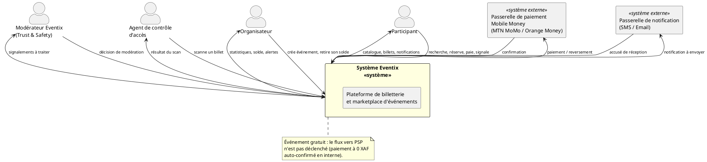

# Diagramme de Contexte — Eventix

| Champ | Valeur |
|---|---|
| **Phase** | 06 — Modélisation UML |
| **Projet** | Eventix |
| **Périmètre** | MVP |
| **Marché initial** | Cameroun |
| **Source** | `context-map.md` (DDD, phase 05) |
| **Notation** | PlantUML — UML 2.5 |
| **Statut** | Version de référence — à valider par l'équipe |

---

## Table des matières

1. [Objectif et portée](#1-objectif-et-portée)
2. [Notation et conventions](#2-notation-et-conventions)
3. [Acteurs identifiés](#3-acteurs-identifiés)
4. [Systèmes externes identifiés](#4-systèmes-externes-identifiés)
5. [Diagramme de contexte](#5-diagramme-de-contexte)
6. [Traçabilité des flux vers les bounded contexts](#6-traçabilité-des-flux-vers-les-bounded-contexts)
7. [Note d'architecture](#7-note-darchitecture)
8. [Cas limites et évolutivité](#8-cas-limites-et-évolutivité)
9. [Hypothèses retenues](#9-hypothèses-retenues)
10. [Points à clarifier avec le client / product owner](#10-points-à-clarifier-avec-le-client--product-owner)
11. [Statut](#11-statut)

---

## 1. Objectif et portée

Ce document représente Eventix comme **un système unique** (boîte noire) et positionne les acteurs humains et les systèmes externes qui interagissent avec lui. C'est le tout premier niveau de modélisation UML du projet : il ne détaille ni les cas d'usage, ni les classes, ni l'architecture interne.

**Ce que ce diagramme ne fait pas :**
- il ne redécoupe pas les bounded contexts internes (déjà établis dans `bounded-contexts.md` et `context-map.md`) ;
- il ne préjuge pas de l'architecture technique (monolithe modulaire, microservices, etc.) ;
- il ne détaille pas les protocoles (REST, webhook, file de messages) — ces choix relèvent des diagrammes de composants et de déploiement, plus tard dans ce dossier.

Le diagramme de contexte sert de **pont entre la vision DDD** (`context-map.md`, orientée relations internes entre 12 BC) **et la vision UML orientée acteurs**, qui alimentera directement le diagramme de cas d'usage (livrable suivant).

---

## 2. Notation et conventions

Le "diagramme de contexte" (ou *System Context Diagram*) n'est pas un type de diagramme UML formel au sens strict — ce n'est ni un diagramme de cas d'usage, ni un diagramme de composants. C'est une vue d'architecture (issue de la tradition RUP/Kruchten et du C4 model, niveau 1) que l'on modélise avec des éléments UML 2.5 standards :

| Élément UML | Usage dans ce diagramme |
|---|---|
| `Actor` | Acteur humain primaire ou secondaire (Participant, Organisateur, Agent, Modérateur) |
| `Component` stéréotypé `<<système externe>>` | Système tiers hors périmètre Eventix (PSP Mobile Money, passerelle de notification) |
| `Rectangle` stéréotypé `<<système>>` | Le système Eventix dans son ensemble, traité comme une boîte noire |
| `Association` dirigée | Flux d'interaction, annoté par sa nature métier (jamais par un protocole technique) |

Cette convention est cohérente avec celle de `context-map.md` : chaque relation reste **dirigée, typée informellement (nature de l'échange) et justifiée**, mais ici le grain d'analyse est "acteur ↔ système global" et non "BC ↔ BC".

---

## 3. Acteurs identifiés

| Acteur | Type | Description | Rattachement DDD (traçabilité) |
|---|---|---|---|
| **Participant** | Primaire (humain) | Personne qui découvre des événements, réserve, paie et se présente à l'entrée avec un billet | BC-03, BC-04, BC-06, BC-12, BC-10 |
| **Organisateur** | Primaire (humain) | Vendeur sur la marketplace : crée des événements, configure la billetterie, consulte ses statistiques, retire son solde | BC-01, BC-02, BC-08, BC-11 |
| **Agent de contrôle d'accès** | Primaire (humain) | Personne présente physiquement à l'entrée de l'événement, scanne les billets via l'application de contrôle QR | BC-07 |
| **Modérateur Eventix** | Primaire (humain, interne) | Membre de l'équipe plateforme qui traite les signalements et prend des décisions de sécurité | BC-10 |

> **Remarque de modélisation :** le Modérateur Eventix agit *depuis* le back-office, qui fait partie du système Eventix au sens large. Il reste néanmoins modélisé comme acteur externe au sens UML, car il déclenche des décisions par une action humaine discrétionnaire, non automatisée — exactement le même traitement que ferait un audit RUP classique pour un "opérateur système".

---

## 4. Systèmes externes identifiés

| Système externe | Rôle | Nature de l'échange | Rattachement DDD (traçabilité) |
|---|---|---|---|
| **Passerelle de paiement Mobile Money** (MTN MoMo / Orange Money) | Collecte des paiements participants ; reversement (payout) vers l'Organisateur | Demande de paiement / confirmation ; demande de retrait / confirmation | BC-05, BC-08 |
| **Passerelle de notification** (SMS / Email) | Achemine les billets et les notifications transactionnelles vers le Participant | Envoi de message ; accusé de réception (optionnel) | BC-12 |

> Ces deux systèmes sont traités comme des **boîtes noires uniques** à ce niveau, même si en interne ils peuvent recouvrir plusieurs fournisseurs (MTN **et** Orange, SMS **et** Email). Ce regroupement est volontaire : le diagramme de contexte reste au niveau "capacité métier", pas "fournisseur technique". Le détail des adaptateurs par fournisseur apparaîtra dans les diagrammes de composants.

---

## 5. Diagramme de contexte

**Aperçu rendu :**

> Le détail exact de chaque flux (nature complète de l'échange, sens bidirectionnel) est volontairement condensé sur le schéma pour rester lisible — la version exhaustive se trouve dans la table de traçabilité (section 6) ci-dessous.

---

## 6. Traçabilité des flux vers les bounded contexts

Cette table relie chaque flux du diagramme de contexte à son origine dans `context-map.md`, pour garantir qu'aucune interaction externe n'a été inventée ni oubliée.

| # | Flux (diagramme de contexte) | BC interne principal | Relation source dans context-map.md |
|---|---|---|---|
| 1 | Participant → Eventix : découverte | BC-03 | `BC-02 → BC-03` puis `BC-03 → PARTICIPANT` |
| 2 | Participant → Eventix : réservation | BC-04 | `BC-03 → BC-04` |
| 3 | Participant → Eventix : paiement | BC-05 | `BC-04 → BC-05` |
| 4 | Eventix → Participant : billets | BC-06 | `BC-06 → PARTICIPANT` |
| 5 | Eventix → Participant : notifications | BC-12 | `BC-12 → PARTICIPANT` |
| 6 | Participant → Eventix : signalement | BC-10 | `PARTICIPANT → BC-10` |
| 7 | Organisateur → Eventix : création événement | BC-01, BC-02 | `BC-01 → BC-02` |
| 8 | Eventix → Organisateur : statistiques | BC-11 | `BC-11 → ORGANISATEUR` |
| 9 | Organisateur → Eventix : retrait / Eventix → Organisateur : solde | BC-08 | `BC-08 → ORGANISATEUR` |
| 10 | Agent → Eventix : scan billet / Eventix → Agent : résultat | BC-07 | `BC-06 → BC-07` |
| 11 | Eventix ↔ Modérateur : signalements / décisions | BC-10 | `PARTICIPANT → BC-10`, `BC-10 → BC-01`, `BC-10 → BC-02` |
| 12 | Eventix ↔ PSP : paiement / reversement | BC-05, BC-08 | `BC-04 → BC-05`, `BC-05 → BC-06` (nouveau flux sortant, absent du BC map car hors périmètre DDD interne) |
| 13 | Eventix ↔ Passerelle de notification | BC-12 | `BC-06 → BC-12`, `BC-02 → BC-12` (nouveau flux sortant, absent du BC map car hors périmètre DDD interne) |

Les flux 12 et 13 n'apparaissaient pas dans `context-map.md` car ce document ne cartographie que les relations **entre bounded contexts internes** — les systèmes externes (PSP, passerelle de notification) sont par définition hors de cette carte. Le diagramme de contexte comble volontairement ce blanc : c'est sa raison d'être.

---

## 7. Note d'architecture

**Pourquoi regrouper MTN MoMo et Orange Money en un seul système externe "Passerelle de paiement" ?**
Sur le plan métier, Eventix a un seul besoin : *encaisser un paiement et reverser un solde*. Faire apparaître deux boîtes distinctes au niveau contexte anticiperait une décision d'intégration (API directe vs agrégateur) qui n'est pas encore tranchée et qui relève des diagrammes de composants/déploiement. Ce regroupement illustre par anticipation un principe qui devra guider l'implémentation : le **Dependency Inversion Principle** (SOLID) — le cœur métier du BC-05 Payment dépendra d'une abstraction (port) `PaymentGatewayPort`, pas des SDK MTN/Orange. Cette abstraction agit comme un **Anti-Corruption Layer** (déjà nommé comme type de relation possible dans `context-map.md`, bien que non utilisé explicitement dans les tables fournies) : elle protège le modèle de domaine Eventix des changements de contrat côté opérateurs télécom.

**Pourquoi regrouper SMS et Email en une seule "Passerelle de notification" ?**
Même logique : BC-12 (Communication) a la responsabilité unique d'acheminer un message vers un participant, quel que soit le canal. Multiplier les acteurs externes ici (SMS, Email, futur WhatsApp) surchargerait le diagramme sans apporter de valeur de compréhension à ce niveau — c'est un cas typique de sur-engineering à éviter. Le pattern recommandé en interne (à détailler dans les diagrammes de composants) est un **Adapter/Strategy** par canal, exposé derrière une interface unique `NotificationSender`.

**Pourquoi l'Agent de contrôle d'accès est un acteur distinct de l'Organisateur ?**
Dans une marketplace multi-organisateurs à l'échelle d'Eventbrite, le contrôle d'entrée est très souvent délégué à du personnel qui n'a pas — et ne doit pas avoir — les droits complets d'un compte Organisateur (accès aux revenus, à la configuration tarifaire, etc.). Séparer cet acteur respecte le **principe de moindre privilège** et anticipe une segmentation des rôles qui devra apparaître dans BC-01 (Identity) et dans le futur diagramme de cas d'usage. *(Voir point de clarification n°3 ci-dessous : cette séparation n'est pour l'instant qu'une hypothèse de modélisation.)*

**Pourquoi le Modérateur Eventix apparaît comme acteur alors qu'il appartient à l'équipe interne ?**
Un acteur UML n'est pas nécessairement "externe à l'entreprise" — il est externe **au système logiciel modélisé**. Le Modérateur déclenche une décision humaine et discrétionnaire (suspension, bannissement) qui ne peut pas être automatisée sans base d'apprentissage ni gouvernance claire pour un MVP. Le modéliser comme acteur, plutôt que comme un simple processus interne du système, est fidèle à la réalité opérationnelle et évite de sous-entendre une automatisation qui n'existe pas encore (BC-10 reste, au MVP, un contexte à forte intervention humaine).

---

## 8. Cas limites et évolutivité

| Cas d'évolution futur | Impact sur ce diagramme | Pourquoi la modélisation actuelle l'absorbe |
|---|---|---|
| Ajout d'un moyen de paiement carte bancaire internationale (Visa/Mastercard) | Aucun changement structurel | La "Passerelle de paiement" reste un système externe unique ; seul l'intérieur de l'adaptateur change (Open/Closed Principle) |
| Ouverture à d'autres pays (multi-devises, multi-PSP) | Aucun changement structurel à ce niveau | Même raisonnement — la variabilité est absorbée par l'ACL, pas par le contexte |
| Ajout d'une application mobile native pour le Participant | Aucun changement — le Participant reste un acteur unique | Le canal d'accès (web, mobile) est un choix de déploiement, pas un changement d'acteur métier |
| Automatisation partielle de la modération (règles, scoring) | Le Modérateur reste acteur, mais son volume d'intervention diminue | La frontière acteur/système ne change pas tant qu'il reste un point de décision humaine ultime |
| Retrait organisateur totalement automatisé (payout API) | Aucun changement structurel | Le flux Eventix ↔ PSP couvre déjà cette interaction, que le déclenchement soit manuel (ops Eventix) ou automatique |
| Ajout d'un export comptable vers un ERP externe | Nouveau système externe à ajouter (hors MVP) | Extension additive, ne remet pas en cause les acteurs existants |

---

## 9. Hypothèses retenues

Sur la base de vos réponses et pour rester pragmatique au niveau MVP :

1. **Modèle marketplace multi-organisateurs avec commission** — confirmé. Cela n'ajoute pas d'acteur au diagramme de contexte, mais structure fortement BC-05/BC-08 (à détailler dans les diagrammes de classes et de séquence).
2. **Paiement via MTN MoMo / Orange Money, événement gratuit possible** — modélisé comme un seul système externe "Passerelle de paiement" ; pour un événement gratuit, le flux `Eventix → PSP` n'est **pas déclenché** (paiement à 0 XAF auto-confirmé en interne, sans appel externe). Voir note sur le diagramme.
3. **Billet transférable ou non selon configuration** — n'affecte pas ce diagramme (c'est une règle de cycle de vie du billet, traitée dans le diagramme d'état). Aucun acteur ni système externe additionnel n'est requis pour le transfert (on suppose qu'il se fait entre deux comptes Participant existants — voir clarification n°9).
4. **Canal MVP = Web only, mais application de scan QR incluse** — j'ai donc modélisé l'Agent de contrôle d'accès comme acteur à part entière dès le MVP (et non comme un simple mode d'affichage web), car le scan QR suppose une interface dédiée et potentiellement un fonctionnement en connectivité dégradée (cf. friction BC-07 dans `context-map.md`). Ce point technique (app native vs web mobile) relève du diagramme de déploiement, pas de celui-ci.
5. **Retrait de solde (payout) traité manuellement par l'équipe Eventix au MVP** (hypothèse, à confirmer — voir clarification n°2). Le diagramme reste valide dans les deux cas car le flux Eventix ↔ PSP est déjà présent.
6. **SMS et Email regroupés en un seul système externe** de notification, sans distinction de canal par défaut à ce niveau (voir clarification n°5).
7. **Devise unique FCFA (XAF)** pour le MVP Cameroun (voir clarification n°6).

---

## 10. Points à clarifier avec le client / product owner

| # | Question | Pourquoi c'est important |
|---|---|---|
| 1 | L'intégration Mobile Money se fait-elle directement avec les API MTN et Orange, ou via un agrégateur tiers (ex. PawaPay, MyCoolPay, Notchpay, Freemopay) ? | Détermine si "Passerelle de paiement" doit à terme être scindée en plusieurs composants, et le niveau d'effort de l'Anti-Corruption Layer côté BC-05 |
| 2 | Le retrait de solde de l'Organisateur (BC-08) est-il automatisé (payout API) ou traité manuellement par l'équipe Eventix au MVP ? | Impacte directement le flux Eventix ↔ Passerelle de paiement et le futur diagramme de séquence de règlement |
| 3 | L'Agent de contrôle d'accès dispose-t-il d'un compte dédié (rôle "staff" délégué), ou l'Organisateur assure-t-il lui-même le contrôle au MVP ? | Impacte le modèle d'acteurs de BC-01 (Identity) et les cas d'usage de contrôle d'accès |
| 4 | La modération (BC-10) est-elle 100% humaine au MVP, ou des règles automatiques (seuils, mots-clés) sont-elles déjà prévues ? | Impacte le degré d'automatisation à représenter dans les diagrammes d'activité/d'état de BC-10 |
| 5 | Les notifications transactionnelles (billet, confirmation) passent-elles systématiquement par SMS **et** Email, ou un seul canal par défaut (le SMS a un coût direct par opérateur au Cameroun) ? | Impacte le contrat de BC-12 et les coûts d'exploitation |
| 6 | Le MVP doit-il gérer une devise unique (XAF) ou anticiper le multi-devises dès maintenant ? | Impacte la modélisation monétaire dans les diagrammes de classes (Value Object `Montant`) |
| 7 | Une obligation de facturation/reçu fiscal (TVA, régime camerounais) est-elle requise dès le MVP ? | Peut introduire un acteur ou système externe supplémentaire (administration fiscale, export comptable) |
| 8 | Les statistiques de BC-11 sont-elles consultées uniquement dans l'application, ou un export externe (CSV, API, BI) est-il attendu au MVP ? | Peut introduire un système externe additionnel non modélisé ici |
| 9 | Le transfert de billet nécessite-t-il que le destinataire ait déjà un compte Participant, ou peut-il se faire via un simple lien/QR à un tiers sans compte ? | Impacte le cycle de vie du billet (diagramme d'état) et potentiellement les acteurs (destinataire anonyme ?) |

---

## 11. Statut

| Champ | Valeur |
|---|---|
| Document | diagramme-de-contexte.md |
| Version | 1.0 |
| Statut | À valider par l'équipe |
| Périmètre | MVP Eventix |
| Marché | Cameroun |
| Notation | PlantUML — UML 2.5 |
| Diagramme suivant | `diagrammes-de-cas-d-utilisation.md` |