# Diagrammes d'Activité — Eventix

| Champ | Valeur |
|---|---|
| **Phase** | 06 — Modélisation UML |
| **Projet** | Eventix |
| **Périmètre** | MVP |
| **Marché initial** | Cameroun |
| **Source** | `processus-metier.md` (phase 03, PM01 → PM72), `diagrammes-de-sequence.md` (phase 06) |
| **Notation** | PlantUML — UML 2.5 (activity diagrams, couloirs d'activité) |
| **Statut** | Version de référence — à valider par l'équipe |

---

## Table des matières

1. [Objectif et portée](#1-objectif-et-portée)
2. [Notation et conventions](#2-notation-et-conventions)
3. [Ce que ce document ajoute par rapport aux diagrammes de séquence](#3-ce-que-ce-document-ajoute-par-rapport-aux-diagrammes-de-séquence)
4. [ACT-01 — Vérification et publication](#4-act-01--vérification-et-publication)
5. [ACT-02 — Réservation, paiement et émission du billet](#5-act-02--réservation-paiement-et-émission-du-billet)
6. [ACT-03 — Expiration et réconciliation](#6-act-03--expiration-et-réconciliation)
7. [ACT-04 — Contrôle d'accès et mode dégradé](#7-act-04--contrôle-daccès-et-mode-dégradé)
8. [ACT-05 — Annulation et report d'événement](#8-act-05--annulation-et-report-dévénement)
9. [ACT-06 — Remboursement](#9-act-06--remboursement)
10. [ACT-07 — Signalement, bannissement et contournement](#10-act-07--signalement-bannissement-et-contournement)
11. [ACT-08 — Clôture financière et retrait](#11-act-08--clôture-financière-et-retrait)
12. [Table de traçabilité](#12-table-de-traçabilité)
13. [Incohérences détectées dans les sources](#13-incohérences-détectées-dans-les-sources)
14. [Note d'architecture](#14-note-darchitecture)
15. [Cas limites et évolutivité](#15-cas-limites-et-évolutivité)
16. [Hypothèses retenues](#16-hypothèses-retenues)
17. [Points à clarifier avec le client / product owner](#17-points-à-clarifier-avec-le-client--product-owner)
18. [Statut](#18-statut)

---

## 1. Objectif et portée

Ce document modélise le **flux de contrôle** des processus métier d'Eventix déjà décrits en prose dans `processus-metier.md` (72 processus, PM01 à PM72) et déjà orchestrés côté agrégats dans `diagrammes-de-sequence.md`. Un diagramme d'activité répond à une question différente de celle d'un diagramme de séquence :

- le diagramme de séquence répond à *"qui envoie quel message à qui, dans quel ordre"* ;
- le diagramme d'activité répond à *"quelles sont les branches possibles, où bifurque-t-on, où répète-t-on, où agit-on en parallèle"*.

Les deux sont complémentaires, jamais redondants : ce document ne redessine pas les échanges déjà détaillés dans `diagrammes-de-sequence.md`, il en explicite la **logique de décision** — en particulier les cas d'erreur, de nouvelle tentative et de branches multiples que `processus-metier.md` décrit en texte mais que les diagrammes de séquence, focalisés sur l'orchestration nominale, ne détaillaient pas tous.

---

## 2. Notation et conventions

| Élément UML 2.5 | Usage |
|---|---|
| Couloir d'activité (`\|Nom\|`) | Acteur ou sous-système responsable des actions qui suivent |
| Nœud d'action (`:Texte;`) | Une action métier |
| Nœud de décision (`if/then/elseif/else/endif`) | Embranchement, avec autant de branches que d'issues métier documentées |
| Fork / Join (`fork/fork again/end fork`) | Actions concourantes, sans ordre imposé entre elles |
| Boucle (`repeat/repeat while`) | Répétition explicite (nouvelle tentative), reprise directement des cas PM47/PM51/PM60 |
| Nœud renvoi (fond rose) | Renvoi vers un autre diagramme d'activité de ce document, pour éviter de dupliquer un processus déjà modélisé ailleurs |
| Note ancrée | Signale une incohérence de source ou une hypothèse, jamais une redite |

**Sur l'absence de POO :** comme pour les diagrammes de séquence et d'état, un diagramme d'activité décrit un flux de contrôle conceptuel — decision, répétition, parallélisme — totalement indépendant du style d'implémentation. C'est même le diagramme le plus proche d'un algorithme procédural classique, ce qui en fait probablement le plus naturel de tout ce dossier UML pour une équipe qui n'utilise pas la programmation orientée objet.

---

## 3. Ce que ce document ajoute par rapport aux diagrammes de séquence

Trois enrichissements notables, absents des diagrammes de séquence car hors de leur portée (l'orchestration nominale entre agrégats) :

1. **Un troisième cas de décision de vérification.** `processus-metier.md` (PM06) documente trois issues possibles — VALIDÉ, REFUSÉ, **VÉRIFICATION COMPLÉMENTAIRE** — alors que `evenements-de-domaine.md` et `diagrammes-d-etat.md` n'en modélisaient que deux (`ÉvénementValidé`, `ÉvénementRefusé`). Voir section 13.
2. **Des boucles de nouvelle tentative explicites** (PM47 émission de billet, PM51 remboursement, PM60 retrait) : `diagrammes-de-sequence.md` documentait l'idempotence comme une exigence en note, mais pas le mécanisme de reprise lui-même.
3. **Des embranchements à plus de deux issues**, en particulier le traitement d'un signalement (PM54, jusqu'à six issues) et l'analyse de contournement de bannissement (PM56, trois issues) — plus riches que les `alt` à deux branches des diagrammes de séquence correspondants.

---

## 4. ACT-01 — Vérification et publication

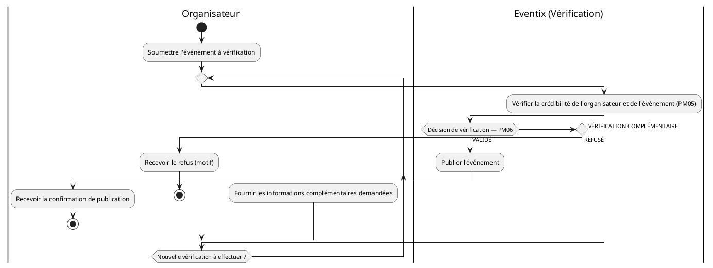

**Ce qui change par rapport à SEQ-01 :** `diagrammes-de-sequence.md` (SEQ-01) ne modélisait qu'une décision binaire (vérifié/non vérifié). Ce diagramme restitue la troisième issue documentée par `processus-metier.md` — voir la clarification n°1, qui recommande de mettre également à jour `diagrammes-d-etat.md` et `evenements-de-domaine.md` en conséquence.

---

## 5. ACT-02 — Réservation, paiement et émission du billet

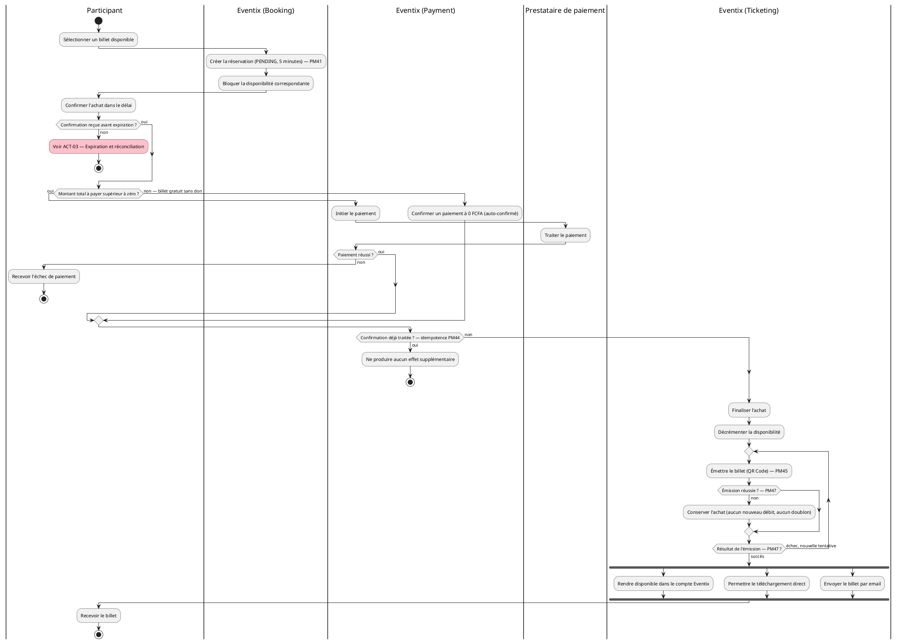

**Ce qui change par rapport à SEQ-03 :** la boucle de nouvelle tentative d'émission (PM47) est désormais explicite — SEQ-03 supposait une émission réussie du premier coup. Le fork final (PM46 : compte, téléchargement, email) montre que ces trois canaux sont **concourants**, pas séquentiels : aucun n'attend la fin d'un autre.

---

## 6. ACT-03 — Expiration et réconciliation

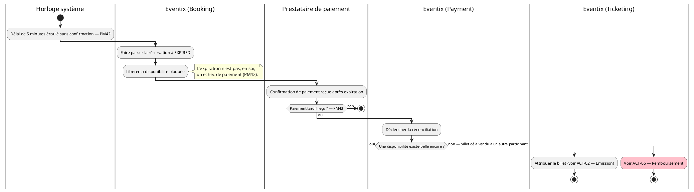

**Lecture :** ce diagramme confirme, par construction, l'indépendance entre `Réservation` et `Disponibilité` déjà justifiée dans `diagrammes-de-classes.md` §6 : l'expiration de l'une (couloir Booking) et la vérification de l'autre (couloir Payment, via Réconciliation) sont deux flux distincts qui ne se rejoignent qu'au moment de la réconciliation.

---

## 7. ACT-04 — Contrôle d'accès et mode dégradé

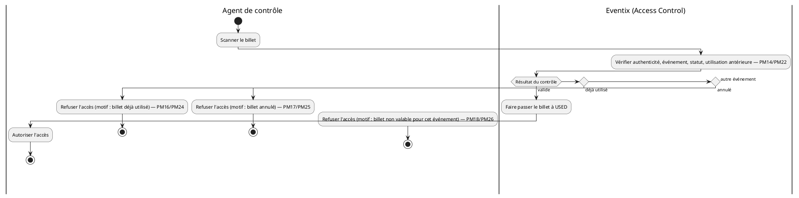

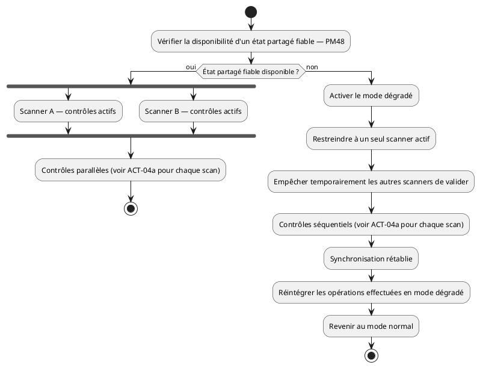

**Ce qui change par rapport à SEQ-07a/07b :** PM14-26 documente **quatre motifs de refus distincts** (déjà utilisé, annulé, mauvais événement, plus le cas valide), alors que SEQ-07a n'en distinguait que deux (valide/invalide). ACT-04a restitue cette granularité, utile pour l'ergonomie du futur écran de contrôle (message d'erreur différencié par motif).

---

## 8. ACT-05 — Annulation et report d'événement

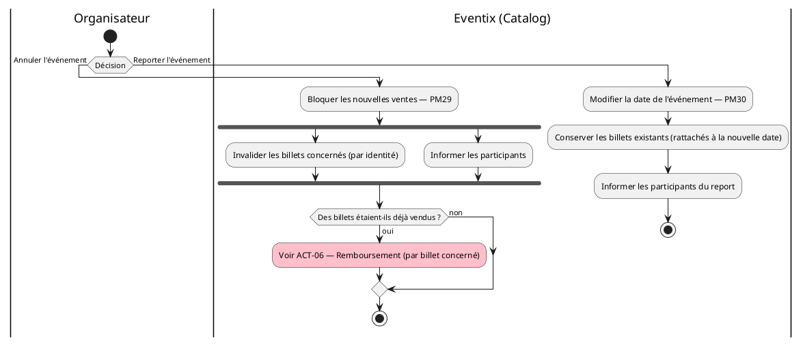

**Choix de modélisation — écart assumé avec les sources :** `processus-metier.md` (PM29) décrit un ordre séquentiel (bloquer → informer → invalider → rembourser), tandis que `services-de-domaine.md` (repris dans SEQ-05) fixe un ordre différent (bloquer → invalider → rembourser → informer). Ce diagramme représente l'invalidation et la notification comme **concourantes** (`fork`/`end fork`) plutôt que de trancher arbitrairement entre les deux ordres contradictoires — un choix qui satisfait les deux contraintes de fond (bloquer avant tout, rembourser seulement si des billets existaient) sans imposer un ordre entre invalidation et notification qu'aucune source ne justifie clairement. Voir clarification n°2.

---

## 9. ACT-06 — Remboursement

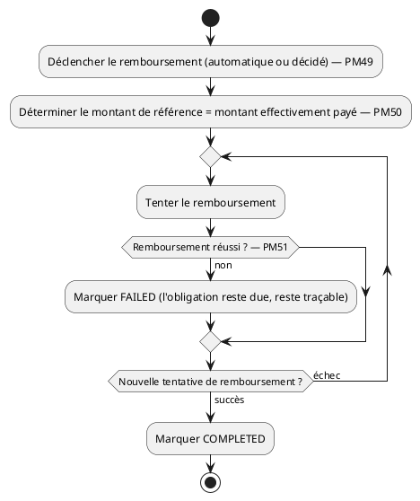

**Lecture :** processus volontairement réutilisable — ACT-03 et ACT-05 y renvoient tous deux plutôt que de dupliquer cette logique. La boucle n'a **aucune limite de tentatives documentée** : voir clarification n°3, un vrai sujet opérationnel (un remboursement qui échoue indéfiniment doit-il être escaladé à un humain ?).

---

## 10. ACT-07 — Signalement, bannissement et contournement

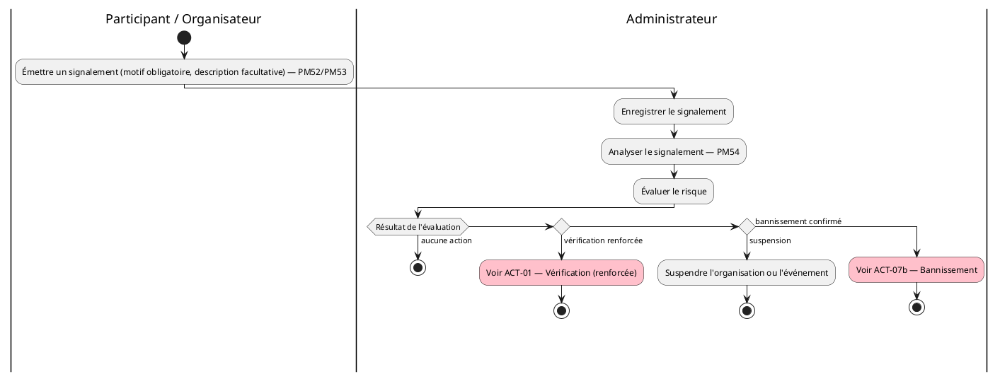

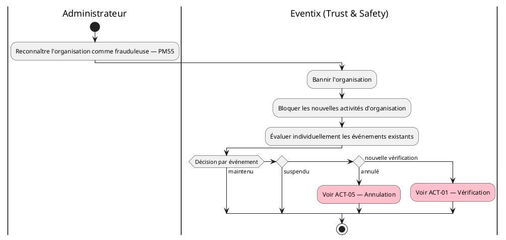

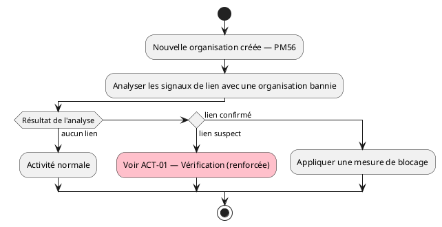

**Choix de modélisation :** PM54 énumère six issues possibles (aucune action, vérification renforcée, suspension, annulation, remboursement, bannissement) mais ce n'est pas une liste de branches mutuellement exclusives — annulation et remboursement sont des **conséquences** d'une suspension/d'un bannissement déjà modélisées ailleurs (ACT-05, ACT-06), pas des issues indépendantes de l'évaluation du risque elle-même. Le diagramme la restitue donc comme une décision à quatre branches réelles, avec deux renvois explicites, plutôt que de forcer artificiellement six branches au même niveau.

---

## 11. ACT-08 — Clôture financière et retrait

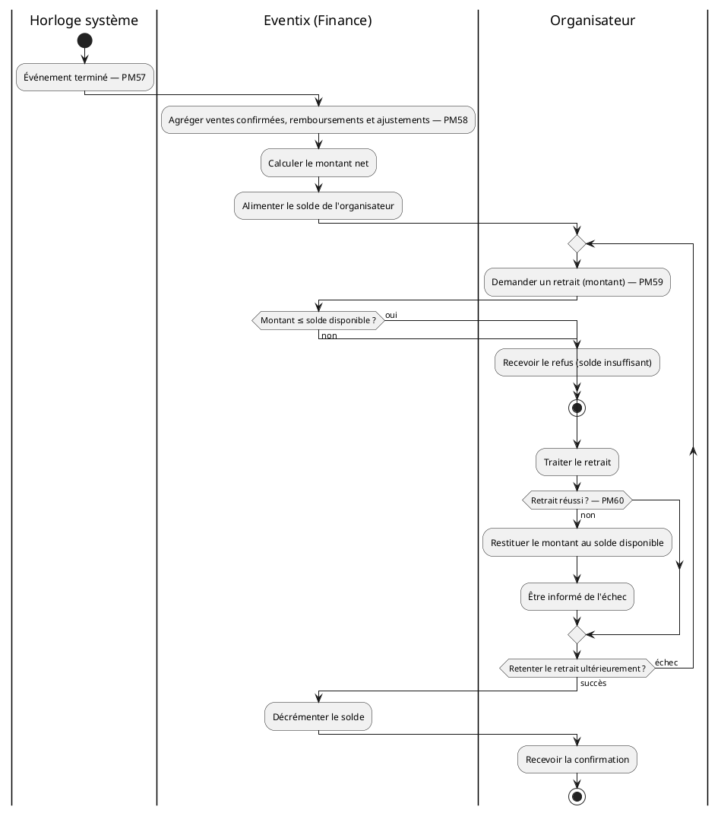

**Lecture :** la boucle de nouvelle tentative de retrait (PM60) est désormais explicite, comme pour l'émission de billet et le remboursement — un troisième cas du même schéma "échec technique ≠ abandon de l'obligation métier" (cf. invariants PM71). PM61 (retraits multiples tant qu'un solde est disponible) n'ajoute pas de branche : c'est simplement la répétabilité naturelle de ce même flux dans le temps, pas un cas particulier à modéliser séparément.

---

## 12. Table de traçabilité

| Diagramme | Processus métier couverts | Diagramme de séquence correspondant |
|---|---|---|
| ACT-01 | PM04–PM07 | SEQ-01 |
| ACT-02 | PM09–PM12, PM41, PM44–PM47 | SEQ-03 |
| ACT-03 | PM42, PM43, PM63 | SEQ-02, SEQ-04 |
| ACT-04a | PM14–PM18, PM22–PM26 | SEQ-07a |
| ACT-04b | PM48, PM67 | SEQ-07b |
| ACT-05 | PM29, PM30, PM64, PM65 | SEQ-05, SEQ-06 |
| ACT-06 | PM49–PM51 | *(sous-processus de SEQ-04/SEQ-05)* |
| ACT-07a | PM52–PM54, PM68 | SEQ-09 |
| ACT-07b | PM55 | *(non détaillé en séquence — décision humaine)* |
| ACT-07c | PM56, PM69 | *(non détaillé en séquence — décision humaine)* |
| ACT-08 | PM57–PM61, PM70 | SEQ-08, SEQ-10 |

PM01–PM03 (création, configuration, modification d'événement), PM08 (recherche), PM13/PM19–PM21/PM27 (jalons temporels sans embranchement), PM31–PM40 (archivage, comptes, historique) et PM71–PM72 (invariants, vue globale) ne font l'objet d'aucun diagramme d'activité dédié : ce sont des opérations à agrégat unique sans branche de décision significative, cohérent avec le même principe de sélection déjà appliqué aux diagrammes de séquence et d'état.

---

## 13. Incohérences détectées dans les sources

1. **Troisième issue de vérification absente en aval.** `processus-metier.md` (PM06) prévoit trois issues (VALIDÉ / REFUSÉ / VÉRIFICATION COMPLÉMENTAIRE), mais `evenements-de-domaine.md` ne catalogue que deux événements (`ÉvénementValidé`, `ÉvénementRefusé`) et `diagrammes-d-etat.md` (§4) n'a donc modélisé que deux transitions depuis `SUBMITTED`. Cette troisième issue devra être ajoutée aux deux documents en amont pour rester cohérente avec ce diagramme d'activité.
2. **Ordre contradictoire pour l'annulation d'événement.** `processus-metier.md` (PM29) ordonne « bloquer → informer → invalider → rembourser » ; `services-de-domaine.md` (repris dans `diagrammes-de-sequence.md` SEQ-05) ordonne « bloquer → invalider → rembourser → informer ». Ce document contourne la contradiction en modélisant invalidation et notification comme concourantes (voir §8) plutôt que de trancher unilatéralement.
3. **Aucune limite de tentatives documentée** pour les trois boucles de reprise (émission de billet PM47, remboursement PM51, retrait PM60) — un risque de boucle infinie en théorie, sans mécanisme d'escalade prévu dans les sources.

---

## 14. Note d'architecture

**Pourquoi ne pas avoir simplement recopié les diagrammes de séquence en y ajoutant des symboles de décision ?**
Parce que les deux diagrammes ne portent pas la même charge d'information. Un diagramme de séquence garantit qu'aucun agrégat n'est appelé dans le mauvais ordre ; un diagramme d'activité garantit qu'aucune branche métier documentée n'a été oubliée. En pratique, écrire ce document a permis de retrouver trois enrichissements que `diagrammes-de-sequence.md` ne portait pas (§3) — la preuve que les deux vues se justifient l'une l'autre plutôt que de faire doublon.

**Sur le choix de "renvois" plutôt que de dupliquer un sous-processus :** `ACT-06` (remboursement) est référencé depuis `ACT-03` et `ACT-05` sans être recopié. C'est la même discipline de faible couplage documentaire déjà appliquée à travers tout ce dossier : un processus métier a une seule représentation UML de référence, jamais deux versions qui pourraient diverger silencieusement au fil des révisions.

---

## 15. Cas limites et évolutivité

| Cas d'évolution futur | Impact sur ces diagrammes | Pourquoi la modélisation actuelle l'absorbe |
|---|---|---|
| Ajout d'une limite de tentatives avec escalade humaine (PM47/PM51/PM60) | Ajout d'une branche de sortie sur la boucle `repeat` | La structure de boucle explicite facilite cet ajout, contrairement à une supposée reprise implicite |
| Ajout d'une quatrième issue de vérification (ex. "vérification déléguée à un tiers") | Ajout d'une branche `elseif` dans ACT-01 | Le principe de décision à N branches est déjà établi |
| Automatisation de PM54 (scoring de risque plutôt qu'analyse humaine) | Le couloir "Administrateur" devient un couloir "Eventix (Scoring)" | La structure de décision à 4 branches reste valide indépendamment de qui la prend |

---

## 16. Hypothèses retenues

1. **Invalidation et notification lors d'une annulation sont concourantes** (fork), ce qui satisfait à la fois PM29 et `services-de-domaine.md` sans arbitrer artificiellement entre leurs ordres contradictoires (voir clarification n°2).
2. **Les six issues de PM54 ne sont pas mutuellement exclusives** : annulation et remboursement sont traités comme des conséquences d'une suspension/d'un bannissement, pas comme des branches indépendantes de la décision elle-même.

---

## 17. Points à clarifier avec le client / product owner

| # | Question | Pourquoi c'est important |
|---|---|---|
| 1 | La troisième issue de vérification ("VÉRIFICATION COMPLÉMENTAIRE", PM06) doit-elle être ajoutée à `evenements-de-domaine.md` et `diagrammes-d-etat.md` ? | Cohérence documentaire ; impacte aussi le futur diagramme de composants (l'organisateur doit pouvoir soumettre un complément) |
| 2 | Lors d'une annulation d'événement, la notification des participants doit-elle attendre que tous les billets soient invalidés, ou peut-elle partir en parallèle ? | Détermine si le choix "concourant" de ce document doit être remplacé par un ordre strict |
| 3 | Les boucles de nouvelle tentative (émission de billet, remboursement, retrait) doivent-elles avoir un nombre maximal de tentatives avant escalade à un opérateur humain ? | Évite un risque de blocage indéfini en production |

---

## 18. Statut

| Champ | Valeur |
|---|---|
| Document | diagrammes-d-activite.md |
| Version | 1.0 |
| Statut | À valider par l'équipe |
| Périmètre | MVP Eventix |
| Marché | Cameroun |
| Notation | PlantUML — UML 2.5 |
| Diagrammes produits | 11 (ACT-01 à ACT-08, avec ACT-04 et ACT-07 en sous-diagrammes) |
| Diagramme suivant | `diagrammes-de-composants.md` |
