# Diagrammes d'État — Eventix

| Champ | Valeur |
|---|---|
| **Phase** | 06 — Modélisation UML |
| **Projet** | Eventix |
| **Périmètre** | MVP |
| **Marché initial** | Cameroun |
| **Source** | `agregats.md`, `evenements-de-domaine.md` (phase 05) |
| **Notation** | PlantUML — UML 2.5 (state machine diagrams) |
| **Statut** | Version de référence — à valider par l'équipe |

---

## Table des matières

1. [Objectif et portée](#1-objectif-et-portée)
2. [Notation et conventions](#2-notation-et-conventions)
3. [Critère de sélection — qui reçoit un diagramme, et pourquoi](#3-critère-de-sélection--qui-reçoit-un-diagramme-et-pourquoi)
4. [Événement (BC-02)](#4-événement-bc-02)
5. [Organisation (BC-01)](#5-organisation-bc-01)
6. [Compte organisateur (BC-01)](#6-compte-organisateur-bc-01)
7. [Réservation (BC-04)](#7-réservation-bc-04)
8. [Disponibilité (BC-04)](#8-disponibilité-bc-04)
9. [Paiement (BC-05)](#9-paiement-bc-05)
10. [Réconciliation (BC-05)](#10-réconciliation-bc-05)
11. [Billet (BC-06)](#11-billet-bc-06)
12. [Point d'entrée (BC-07)](#12-point-dentrée-bc-07)
13. [Clôture (BC-08)](#13-clôture-bc-08)
14. [Retrait (BC-08)](#14-retrait-bc-08)
15. [Remboursement (BC-09)](#15-remboursement-bc-09)
16. [Mesure de sécurité (BC-10)](#16-mesure-de-sécurité-bc-10)
17. [Table d'exclusion](#17-table-dexclusion)
18. [Table de couverture des événements](#18-table-de-couverture-des-événements)
19. [Incohérences détectées dans les sources](#19-incohérences-détectées-dans-les-sources)
20. [Note d'architecture](#20-note-darchitecture)
21. [Cas limites et évolutivité](#21-cas-limites-et-évolutivité)
22. [Hypothèses retenues](#22-hypothèses-retenues)
23. [Points à clarifier avec le client / product owner](#23-points-à-clarifier-avec-le-client--product-owner)
24. [Statut](#24-statut)

---

## 1. Objectif et portée

Ce document montre les transitions d'état des agrégats et entités d'Eventix, **chacune déclenchée par un événement de domaine nommé**. Il croise deux sources déjà stables :

- `agregats.md` — les frontières de cohérence et les attributs d'état (`ÉtatÉvénement`, `ÉtatBillet`, etc.) déjà repris dans `diagrammes-de-classes.md` ;
- `evenements-de-domaine.md` — le catalogue des 77 événements, chacun avec un nom au passé, un déclencheur et une charge utile.

**Règle de construction stricte :** chaque flèche de transition porte, comme étiquette, le nom **exact** d'un événement du catalogue (entre guillemets simples inversés, comme dans la source). Aucune transition n'est inventée ; si un état plausible n'a pas d'événement documenté pour y entrer ou en sortir, ce document le signale comme un manque plutôt que de combler le vide par une supposition silencieuse.

**Sur l'absence de POO :** un diagramme d'état est encore plus indépendant du paradigme qu'un diagramme de séquence — un automate à états finis décrit un comportement conceptuel, pas une structure de code. Il sera directement utile à la conception du futur MCD : chaque état devient un candidat naturel de valeur pour une colonne "statut" en base de données, et chaque transition documente une règle de mise à jour à valider (triggers, contraintes, ou logique applicative selon le choix technique retenu plus tard).

---

## 2. Notation et conventions

| Élément UML 2.5 | Usage |
|---|---|
| Pseudo-état initial (`[*] -->`) | Création de l'agrégat/l'entité, toujours associée à un événement de création |
| Pseudo-état final (`--> [*]`) | État terminal, sans transition sortante documentée |
| État simple | Une valeur discrète de l'attribut d'état (ex. `ÉtatÉvénement = PUBLISHED`) |
| Transition étiquetée `` `NomDeLÉvénement` `` | Le nom est repris **verbatim** de `evenements-de-domaine.md` |
| Transition réflexive (boucle sur le même état) | Événement qui modifie une donnée interne sans changer le macro-état (ex. `DisponibilitéBloquée`) |
| Note ancrée | Signale soit un choix de simplification, soit un manque dans les sources (jamais une invention comblant ce manque) |

---

## 3. Critère de sélection — qui reçoit un diagramme, et pourquoi

Un agrégat ou une entité reçoit un diagramme d'état seulement si `evenements-de-domaine.md` documente **au moins deux événements distincts** modifiant son état — en dessous de ce seuil, un diagramme n'apporterait aucune information au-delà d'une seule ligne de texte. Ce choix reprend directement la discipline "allégé" déjà appliquée à `diagrammes-de-classes.md`. Treize éléments franchissent ce seuil ; les autres sont listés et justifiés en section 17 plutôt que silencieusement omis.

---

## 4. Événement (BC-02)

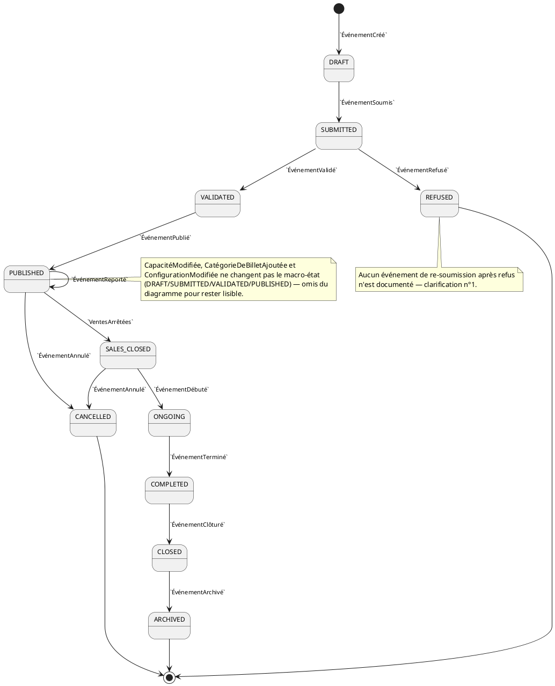

**Lecture :** c'est le diagramme le plus riche du dossier (10 états), cohérent avec le rôle central de l'Événement dans le domaine. `SALES_CLOSED` est un état à part entière — pas une simple variante de `PUBLISHED` — car `VentesArrêtées` sépare clairement deux moments du parcours organisateur déjà identifiés dans `evenements-de-domaine.md` §8.2. `ÉvénementAnnulé` n'est autorisé qu'à partir de `PUBLISHED` ou `SALES_CLOSED`, jamais depuis `ONGOING`/`COMPLETED` — hypothèse métier raisonnable (on n'annule pas un événement déjà en cours), à confirmer (voir clarification n°3).

---

## 5. Organisation (BC-01)

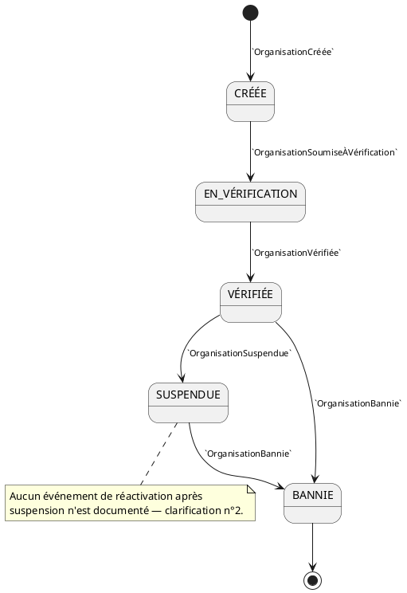

**Lecture :** `SUSPENDUE` n'a qu'une seule transition sortante documentée (vers `BANNIE`), ce qui donnerait à penser qu'une suspension est nécessairement définitive à terme — improbable en pratique. C'est un manque de source, pas un choix de modélisation ; voir clarification n°2.

---

## 6. Compte organisateur (BC-01)

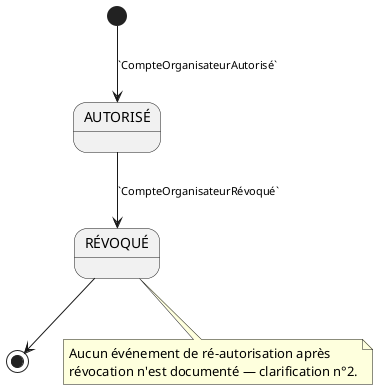

**Lecture :** même limite que pour `Organisation` — un compte révoqué semble définitivement fermé faute d'événement de retour documenté.

---

## 7. Réservation (BC-04)

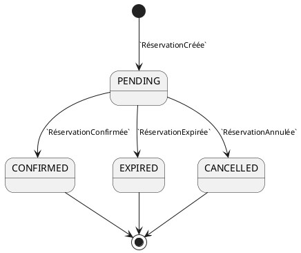

**Lecture :** les trois issues de `PENDING` sont mutuellement exclusives et correspondent exactement aux trois branches déjà vues dans `diagrammes-de-sequence.md` (SEQ-02, SEQ-03). Aucune ambiguïté ici — c'est l'un des agrégats les mieux couverts par les sources.

---

## 8. Disponibilité (BC-04)

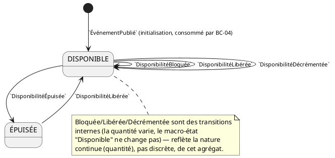

**Lecture — cas volontairement atypique :** `Disponibilité` n'a pas de création propre dans le catalogue d'événements ; sa naissance est déduite de la table des consommateurs (`evenements-de-domaine.md` §7.1 : « `ÉvénementPublié` → BC-04 → Initialisation des disponibilités »). Ce diagramme illustre aussi qu'un agrégat n'a pas toujours besoin d'un automate riche : l'essentiel de son comportement est une variation de quantité, pas une succession d'états métier — cohérent avec la remarque déjà faite dans `diagrammes-de-classes.md` §6 sur la nature à forte contention de cet agrégat.

---

## 9. Paiement (BC-05)

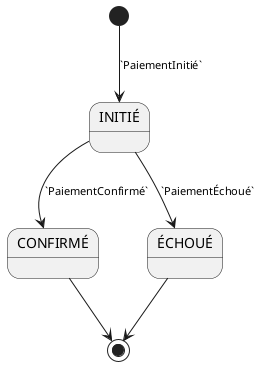

**Lecture :** aucune ambiguïté — un des automates les plus simples et les mieux couverts.

---

## 10. Réconciliation (BC-05)

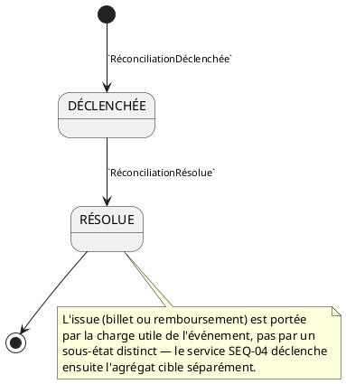

**Lecture :** volontairement à deux états seulement — l'issue (billet ou remboursement) ne fait pas partie de l'état de l'agrégat Réconciliation lui-même, mais de sa charge utile, conformément à `services-de-domaine.md` (« le service la porte et déclenche ensuite l'opération dans l'agrégat choisi »). Voir aussi section 19 pour une incohérence de nommage détectée sur cet agrégat.

---

## 11. Billet (BC-06)

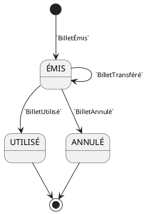

**Lecture :** `BilletTransféré` est une transition réflexive — le transfert change le propriétaire (voir `diagrammes-de-classes.md` §7, entité `Transfert`), jamais la validité du billet. C'est cohérent avec `diagrammes-de-sequence.md` (SEQ-07a) : la décision de contrôle d'accès ne teste que `ÉMIS` vs `UTILISÉ`/`ANNULÉ`, jamais l'historique de propriété.

---

## 12. Point d'entrée (BC-07)

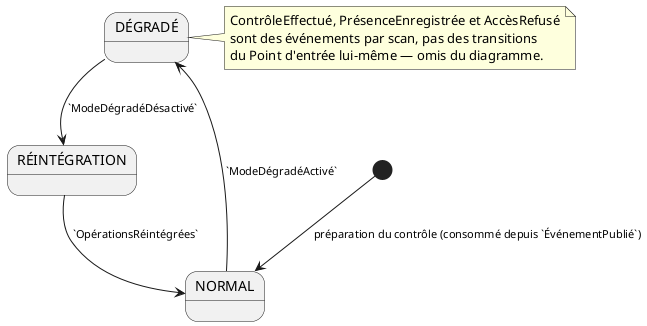

**Lecture :** l'état intermédiaire `RÉINTÉGRATION` est ajouté pour donner sa place à `OpérationsRéintégrées` — un événement à part entière dans le catalogue, distinct de `ModeDégradéDésactivé`. Ce rejeu est directement lié à l'exigence d'idempotence déjà signalée dans `diagrammes-de-sequence.md` §15 (point de clarification n°1 de ce document) : le retour à `NORMAL` n'est pas instantané, il suppose un rattrapage des opérations effectuées en mode dégradé.

---

## 13. Clôture (BC-08)

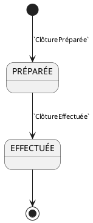

**Lecture :** le plus court diagramme du dossier — inclus malgré sa simplicité car la Clôture est une étape financière significative (voir `diagrammes-de-sequence.md` SEQ-08), et parce que deux états valent mieux qu'une case vide dans la table d'exclusion.

---

## 14. Retrait (BC-08)

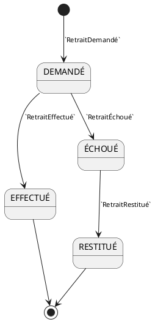

**Lecture :** entité membre de l'Agrégat Solde organisateur (voir `diagrammes-de-classes.md` §9) — c'est elle, et non la racine, qui porte le véritable automate. `RESTITUÉ` est un état terminal distinct d'`EFFECTUÉ` : le montant retourne au solde, mais le retrait lui-même reste tracé comme ayant échoué puis été compensé, jamais réécrit.

---

## 15. Remboursement (BC-09)

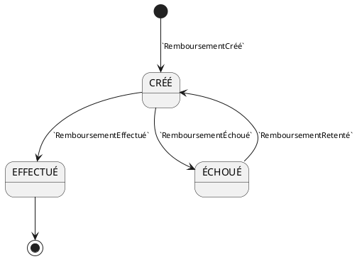

**Lecture :** seul automate du dossier avec un **retour en arrière explicite** (`ÉCHOUÉ → CRÉÉ` via `RemboursementRetenté`) plutôt qu'un état terminal après échec — cohérent avec l'obligation métier « un paiement tardif n'est jamais ignoré » déjà vue dans `services-de-domaine.md` §5.4 : un remboursement dû ne peut pas rester bloqué sur un échec technique.

---

## 16. Mesure de sécurité (BC-10)

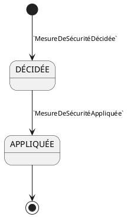

**Lecture :** correspond exactement à `SEQ-09` de `diagrammes-de-sequence.md` — la mesure est d'abord enregistrée (`DÉCIDÉE`), puis effectivement appliquée à sa cible (`APPLIQUÉE`).

---

## 17. Table d'exclusion

| Agrégat / entité | Événements documentés | Pourquoi exclu |
|---|---|---|
| Utilisateur (racine) | `UtilisateurCréé`, `UtilisateurAuthentifié` | `UtilisateurAuthentifié` est une action journalisée, pas une transition d'état ; l'attribut `ÉtatUtilisateur` du diagramme de classes n'a aucune transition documentée — voir clarification n°4 |
| Compte participant | `CompteParticipantActivé` | Un seul événement, aucune transition ultérieure documentée |
| Achat | `AchatFinalisé` | Un seul événement ; pas de cycle de vie au-delà de sa création |
| Solde organisateur (racine) | `SoldeAlimenté` | Variation continue (montant), pas d'état discret — même nature que Disponibilité mais sans même un second état comme "Épuisée" |
| Obligation de remboursement (racine) | `ObligationDeRemboursementCréée` | Un seul événement propre ; le cycle de vie réel est porté par l'entité membre Remboursement (§15) |
| Signalement | `SignalementReçu` | Un seul événement ; aucune résolution documentée — voir clarification n°5 |
| Distribution | `BilletDistribué`, `DistributionÉchouée` | Deux états possibles mais aucun événement de nouvelle tentative (contrairement à Retrait/Remboursement) — voir clarification n°6 |
| Notification | `NotificationEnvoyée`, `NotificationÉchouée` | Même remarque que Distribution |
| Événement métier, Statistique, Historique | Un seul événement d'enregistrement chacun | Agrégats d'observation en écriture seule (append-only), sans cycle de vie |

---

## 18. Table de couverture des événements

Sur les 77 événements annoncés par le résumé de `evenements-de-domaine.md`, cette section vérifie qu'aucun événement pertinent à une transition d'état n'a été oublié :

| Catégorie d'événement | Couvert par un diagramme d'état ? |
|---|---|
| Événements d'agrégat (§5, BC-01 à BC-12) | ✅ Tous les événements de transition sont repris dans les 13 diagrammes ou listés en exclusion (§17) avec justification |
| Événements de service (§6) | ⚠️ Non repris directement — ils décrivent le déroulement d'un service (déjà couvert par `diagrammes-de-sequence.md`), pas la transition d'un agrégat. Exception : les événements de service qui doublonnent un événement d'agrégat sont signalés en incohérence (§19) |
| Événements purement journalisés (consommés uniquement par BC-11) | ✅ Explicitement exclus quand ils ne portent aucune transition d'état propre (ex. `UtilisateurAuthentifié`) |

---

## 19. Incohérences détectées dans les sources

1. **Double nommage pour la Réconciliation :** `evenements-de-domaine.md` §5.4 nomme les événements de l'agrégat `RéconciliationDéclenchée` / `RéconciliationRésolue`, tandis que §6.4 (côté service) nomme des moments très proches `RéconciliationDébutée` / `RéconciliationConclue`. La règle E4 (« un événement est produit par une seule source ») est ambiguë ici : soit ce sont quatre événements distincts (le service en émet deux, l'agrégat en émet deux autres, à des instants légèrement différents), soit il s'agit d'une duplication de nommage pour le même fait. Ce document a retenu les noms de §5.4 (niveau agrégat), cohérents avec le principe que ce diagramme modélise les transitions de l'agrégat.
2. **Faute de frappe :** l'événement `ExpirationTraitéee` (§6.2) comporte une lettre en trop. À corriger dans `evenements-de-domaine.md`.
3. **Décompte des agrégats :** le résumé de `evenements-de-domaine.md` reprend le chiffre de « seize agrégats », déjà signalé comme incohérent avec le décompte détaillé de vingt dans `diagrammes-de-classes.md` §14. Cette incohérence se propage donc d'un document à l'autre.
4. **Formatage Markdown dégradé en fin de fichier source :** à partir de la section 8.2, `evenements-de-domaine.md` perd son formatage (blocs `text` non fermés, titres sans `#`), rendant la lecture des flux transversaux 8.2 à 8.4 plus difficile. Sans incidence sur le contenu extrait ici, mais à corriger pour la lisibilité du document source.

---

## 20. Note d'architecture

**Pourquoi certains agrégats "continus" (Disponibilité, Solde organisateur) résistent à la modélisation par automate à états finis ?**
Un automate à états finis décrit une variable qualitative avec un petit nombre de valeurs discrètes. Une quantité ou un montant est une variable quantitative : lui appliquer une machine à états forcerait des seuils arbitraires (à partir de quel montant le Solde change-t-il "d'état" ?). La bonne pratique, déjà appliquée ici, est de ne modéliser un état discret que lorsque le domaine en définit un explicitement (`ÉPUISÉE` existe parce que `DisponibilitéÉpuisée` existe ; il n'existe pas d'équivalent documenté pour le Solde).

**Pourquoi documenter des "manques" plutôt que de les combler ?**
Trois clarifications de ce document (n°1, 2, 5) portent sur des transitions de retour absentes (refus → resoumission, suspension → réactivation, signalement → résolution). Il aurait été tentant d'ajouter ces transitions "évidentes" pour obtenir des diagrammes plus complets. Ce serait pourtant une décision métier non validée, injectée silencieusement dans un document de modélisation — exactement le type d'erreur qu'un architecte senior doit éviter. Signaler le manque coûte une ligne de note ; deviner la règle et se tromper coûte une reprise de plusieurs diagrammes en aval (séquence, activité).

---

## 21. Cas limites et évolutivité

| Cas d'évolution futur | Impact sur ces diagrammes | Pourquoi la modélisation actuelle l'absorbe |
|---|---|---|
| Réactivation d'une Organisation suspendue (si confirmée) | Ajout d'une transition `SUSPENDUE → VÉRIFIÉE` | N'invalide aucun état existant, un ajout pur |
| Ajout d'une notion de "billet en attente de transfert" (si le transfert nécessite acceptation du destinataire) | Ajout d'un état intermédiaire dans l'automate Billet | Le reste de l'automate (ÉMIS/UTILISÉ/ANNULÉ) reste valide |
| Ajout d'une nouvelle mesure de sécurité réversible (ex. avertissement simple, non appliqué physiquement) | Ajout d'un état ou d'une transition dans l'automate Mesure de sécurité | Structure à deux états déjà extensible sans rupture |
| Retry automatique des notifications/distributions échouées | Passage de "trivial" à un automate à part entière, symétrique à Retrait/Remboursement | Cohérent avec le principe déjà appliqué à ces deux entités |

---

## 22. Hypothèses retenues

1. **`ÉvénementAnnulé` n'est possible que depuis `PUBLISHED` ou `SALES_CLOSED`**, jamais depuis `ONGOING` ou après — hypothèse métier raisonnable, non explicitement confirmée par les sources (clarification n°3).
2. **La naissance de l'agrégat Disponibilité est déduite** de la table des consommateurs de `evenements-de-domaine.md` §7.1, faute d'événement de création dédié.
3. **Les incohérences de nommage relevées en section 19** ont été résolues en faveur des événements au niveau agrégat plutôt que service, car ce document modélise des transitions d'agrégat.

---

## 23. Points à clarifier avec le client / product owner

| # | Question | Pourquoi c'est important |
|---|---|---|
| 1 | Un événement refusé peut-il être corrigé et resoumis, ou le refus est-il définitif au MVP ? | Détermine si l'automate Événement doit prévoir `REFUSED → DRAFT` |
| 2 | Une Organisation suspendue (ou un Compte organisateur révoqué) peut-elle être réhabilitée ? Si oui, sous quelle condition ? | Détermine si ces automates doivent prévoir une transition de retour |
| 3 | Un événement déjà en cours (`ONGOING`) ou terminé peut-il encore être annulé (ex. incident de sécurité en cours d'événement) ? | Détermine l'étendue réelle des transitions `ÉvénementAnnulé` |
| 4 | L'attribut `ÉtatUtilisateur` (présent dans `diagrammes-de-classes.md`) correspond-il à un cycle de vie réel (actif/suspendu/supprimé) qui devrait être documenté par des événements dédiés ? | Combler un gap entre le modèle de classes et le catalogue d'événements |
| 5 | Le traitement d'un Signalement se termine-t-il par un événement explicite (ex. `SignalementClassé`, `SignalementTraité`) absent du catalogue actuel ? | Nécessaire pour tracer complètement le cycle de vie de BC-10 |
| 6 | Une notification ou une distribution de billet échouée doit-elle être retentée automatiquement (comme un Retrait ou un Remboursement), ou l'échec reste-t-il définitif ? | Détermine si ces deux entités méritent un automate enrichi |

---

## 24. Statut

| Champ | Valeur |
|---|---|
| Document | diagrammes-d-etat.md |
| Version | 1.0 |
| Statut | À valider par l'équipe |
| Périmètre | MVP Eventix |
| Marché | Cameroun |
| Notation | PlantUML — UML 2.5 |
| Diagrammes produits | 13 (sur 22 candidats identifiés — 9 exclus et justifiés en §17) |
| Diagramme suivant | `diagrammes-d-activite.md` |
