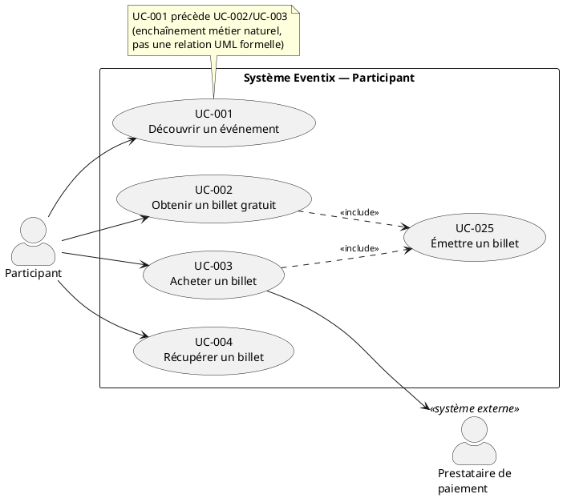
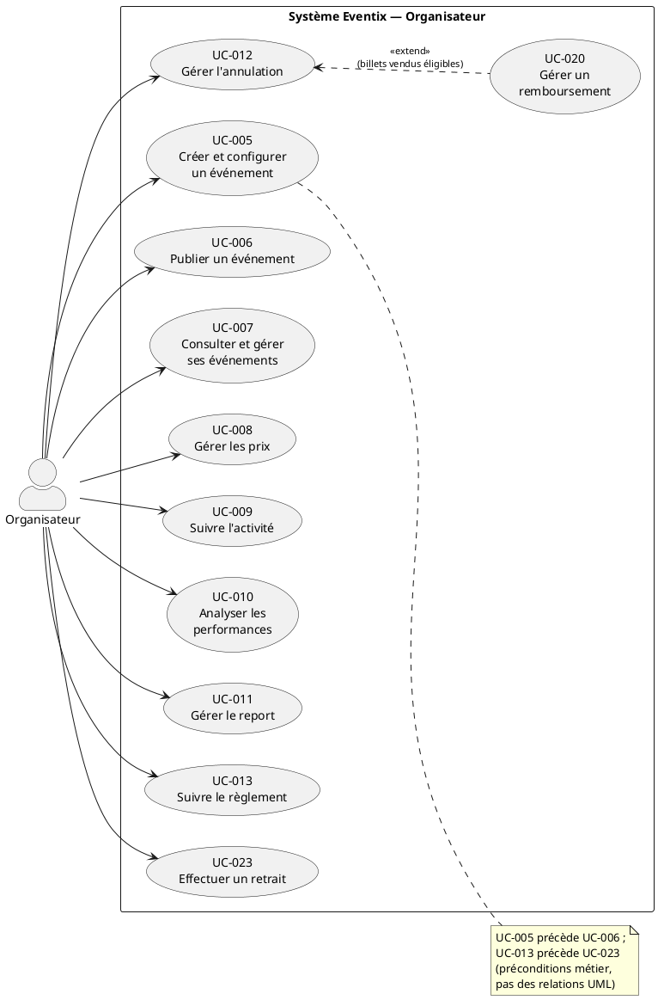
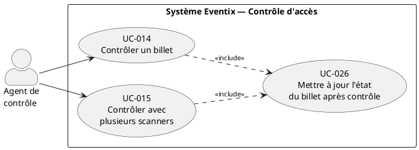
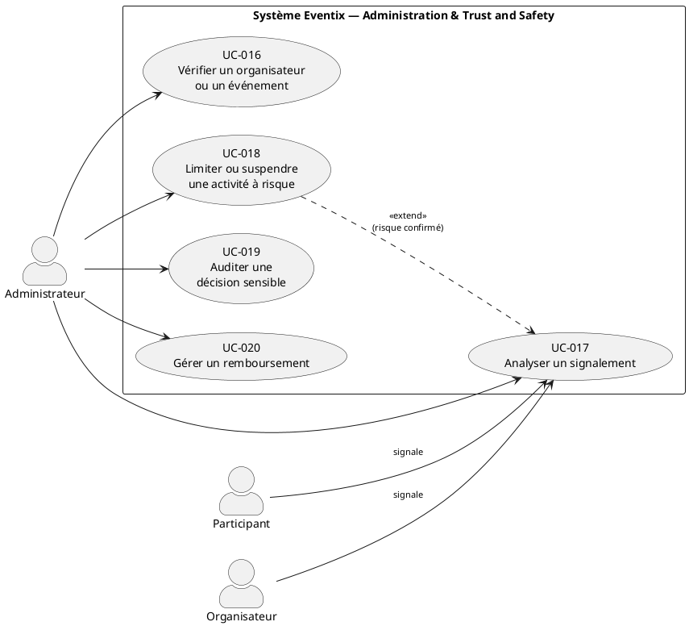
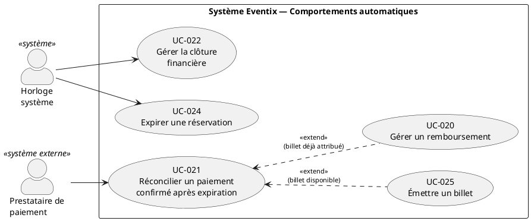

# Diagrammes de Cas d'Utilisation — Eventix

| Champ | Valeur |
|---|---|
| **Phase** | 06 — Modélisation UML |
| **Projet** | Eventix |
| **Périmètre** | MVP |
| **Marché initial** | Cameroun |
| **Source** | `use-cases.md` (phase 04), `diagramme-de-contexte.md` (phase 06) |
| **Notation** | PlantUML — UML 2.5 |
| **Statut** | Version de référence — à valider par l'équipe |

---

## Table des matières

1. [Objectif et portée](#1-objectif-et-portée)
2. [Notation et conventions](#2-notation-et-conventions)
3. [Acteurs](#3-acteurs)
4. [Pourquoi plusieurs diagrammes plutôt qu'un seul](#4-pourquoi-plusieurs-diagrammes-plutôt-quun-seul)
5. [Vue d'ensemble](#5-vue-densemble)
6. [Diagramme détaillé — Participant](#6-diagramme-détaillé--participant)
7. [Diagramme détaillé — Organisateur](#7-diagramme-détaillé--organisateur)
8. [Diagramme détaillé — Agent de contrôle](#8-diagramme-détaillé--agent-de-contrôle)
9. [Diagramme détaillé — Administrateur & Trust and Safety](#9-diagramme-détaillé--administrateur--trust-and-safety)
10. [Diagramme détaillé — Comportements automatiques](#10-diagramme-détaillé--comportements-automatiques)
11. [Table des relations include / extend](#11-table-des-relations-include--extend)
12. [Note d'architecture](#12-note-darchitecture)
13. [Cas limites et évolutivité](#13-cas-limites-et-évolutivité)
14. [Hypothèses retenues](#14-hypothèses-retenues)
15. [Points à clarifier avec le client / product owner](#15-points-à-clarifier-avec-le-client--product-owner)
16. [Statut](#16-statut)

---

## 1. Objectif et portée

Ce document traduit en diagrammes UML 2.5 les 26 Use Cases déjà rédigés et validés au niveau métier dans `use-cases.md`. Conformément au principe de **faible couplage documentaire** déjà posé par cette source (section 22 de `use-cases.md`), ce document :

- **ne reformule pas** les scénarios nominaux, alternatifs ou d'exception — ils restent dans `use-cases.md` ;
- **ne recopie pas** les règles métier (RM-xx) — elles restent dans `regles-metier.md` ;
- **se concentre sur la structure relationnelle** : qui déclenche quoi, quelles inclusions/extensions sont réellement justifiées, comment organiser la lecture d'ensemble.

Chaque cas d'usage est référencé par son identifiant global (`UC-001` … `UC-026`) sans réinvention : aucun identifiant n'est créé dans ce document, conformément à la convention établie.

---

## 2. Notation et conventions

| Élément UML 2.5 | Usage |
|---|---|
| `Actor` | Acteur principal ou secondaire, humain ou système |
| `Usecase` (ellipse) | Un Use Case, référencé par son ID |
| `Rectangle` (system boundary) | Frontière du système Eventix |
| `Association` acteur → cas d'usage | Participation à l'objectif |
| `<<include>>` (dépendance pointillée) | Comportement **toujours exécuté** dans le flux nominal du cas de base |
| `<<extend>>` (dépendance pointillée, flèche vers le cas de base) | Comportement **conditionnel**, inséré à un point d'extension précis |
| `Package` | Regroupement visuel par domaine métier (ne correspond pas nécessairement à un bounded context — voir §12) |

Conformément au principe 11 de `use-cases.md` ("les relations `include`/`extend` ne sont utilisées que lorsqu'elles représentent une véritable relation comportementale"), **chaque relation de ce document est justifiée individuellement en section 11** — aucune n'est ajoutée par automatisme ou par habitude de notation.

---

## 3. Acteurs

| Acteur | Type | Rôle | Cas d'usage principaux |
|---|---|---|---|
| **Participant** | Primaire (humain) | Découvre, réserve/achète, récupère et utilise un billet | UC-001 à UC-004 |
| **Organisateur** | Primaire (humain) | Crée, publie et gère ses événements ; suit son activité et ses finances | UC-005 à UC-013, UC-023 |
| **Agent de contrôle** | Primaire (humain) | Contrôle les billets à l'entrée de l'événement | UC-014, UC-015 |
| **Administrateur** | Primaire (humain, interne) | Vérifie, analyse les risques et traite les situations sensibles | UC-016 à UC-020 |
| **Prestataire de paiement** | Secondaire (système externe) | Traite les opérations de paiement et de reversement | UC-003, UC-021 |
| **Horloge système** | Secondaire (système interne) | Déclenche les comportements liés au temps ou à un état atteint | UC-021, UC-022, UC-024 |

> **Cohérence avec le diagramme de contexte :** l'acteur nommé « Modérateur Eventix (Trust & Safety) » dans la première version de `diagramme-de-contexte.md` a été renommé **Administrateur**, pour s'aligner sur la terminologie de `use-cases.md`, qui est la source la plus détaillée sur ce rôle. Le fichier de contexte a été corrigé en conséquence (image et code PlantUML régénérés).

> **Sur l'acteur « Horloge système » :** cet acteur n'apparaît pas dans le diagramme de contexte, et c'est volontaire — voir la justification en section 12. Il est introduit ici uniquement parce que la notation UML exige qu'un cas d'usage autonome (non atteint par `include`/`extend`) ait au moins un acteur déclencheur, et que `use-cases.md` décrit explicitement des déclencheurs temporels ("expiration du délai", "l'événement est terminé") sans les rattacher à un acteur humain.

> **Sur le déclencheur du signalement (UC-017) :** `use-cases.md` mentionne "un utilisateur signale un problème" comme déclencheur, sans Use Case dédié à l'acte de signalement lui-même. Plutôt que d'inventer un `UC-027` non présent dans la source, ce document modélise **Participant** et **Organisateur** comme acteurs secondaires déclencheurs de `UC-017`, ce qui reflète fidèlement la phrase source sans ajouter de portée. Voir clarification n°1.

---

## 4. Pourquoi plusieurs diagrammes plutôt qu'un seul

Un diagramme unique regroupant les 26 Use Cases, 6 acteurs et 8 relations include/extend serait illisible et n'apporterait aucune valeur de compréhension — c'est le cas typique de sur-engineering que les exigences de ce dossier demandent d'éviter. La pratique RUP consiste à découper les vues de cas d'usage par **acteur principal / domaine métier cohérent**, chaque diagramme restant lisible sur un seul écran :

1. Une **vue d'ensemble** (packages, sans détail include/extend) pour la navigation.
2. Cinq **vues détaillées**, une par domaine, avec leurs relations internes.

Cette organisation reprend directement le découpage déjà utilisé dans `use-cases.md` (sections 7 à 13), ce qui garantit la traçabilité et évite toute réinterprétation du périmètre métier.

---

## 5. Vue d'ensemble

```plantuml
@startuml vue-d-ensemble-cas-d-usage
left to right direction
skinparam packageStyle rectangle
skinparam actorStyle awesome
skinparam usecase {
  BackgroundColor White
  ArrowFontSize 11
}

actor Participant as P
actor Organisateur as O
actor "Agent de\ncontrôle" as AG
actor Administrateur as ADM
actor "Prestataire de\npaiement" as PSP <<système externe>>
actor "Horloge\nsystème" as CLK <<système>>

rectangle "Système Eventix" {
  package "Participant — Billetterie" as PKG1 {
    usecase "UC-001\nDécouvrir un événement" as UC1
    usecase "UC-002\nObtenir un billet gratuit" as UC2
    usecase "UC-003\nAcheter un billet" as UC3
    usecase "UC-004\nRécupérer un billet" as UC4
  }
  package "Organisateur — Événements" as PKG2 {
    usecase "UC-005\nCréer et configurer" as UC5
    usecase "UC-006\nPublier" as UC6
    usecase "UC-007\nConsulter / gérer" as UC7
    usecase "UC-008\nGérer les prix" as UC8
    usecase "UC-009\nSuivre l'activité" as UC9
    usecase "UC-010\nAnalyser performances" as UC10
    usecase "UC-011\nGérer le report" as UC11
    usecase "UC-012\nGérer l'annulation" as UC12
  }
  package "Organisateur — Finance" as PKG3 {
    usecase "UC-013\nSuivre le règlement" as UC13
    usecase "UC-023\nEffectuer un retrait" as UC23
  }
  package "Contrôle d'accès" as PKG4 {
    usecase "UC-014\nContrôler un billet" as UC14
    usecase "UC-015\nContrôle multi-scanners" as UC15
  }
  package "Administration & Trust and Safety" as PKG5 {
    usecase "UC-016\nVérifier organisateur / événement" as UC16
    usecase "UC-017\nAnalyser un signalement" as UC17
    usecase "UC-018\nLimiter / suspendre" as UC18
    usecase "UC-019\nAuditer une décision" as UC19
    usecase "UC-020\nGérer un remboursement" as UC20
  }
  package "Comportements automatiques" as PKG6 {
    usecase "UC-021\nRéconcilier paiement tardif" as UC21
    usecase "UC-022\nClôturer les finances" as UC22
    usecase "UC-024\nExpirer une réservation" as UC24
    usecase "UC-025\nÉmettre un billet" as UC25
    usecase "UC-026\nMAJ état billet après contrôle" as UC26
  }
}

P --> UC1
P --> UC2
P --> UC3
P --> UC4
O --> UC5
O --> UC6
O --> UC7
O --> UC8
O --> UC9
O --> UC10
O --> UC11
O --> UC12
O --> UC13
O --> UC23
AG --> UC14
AG --> UC15
ADM --> UC16
ADM --> UC17
ADM --> UC18
ADM --> UC19
ADM --> UC20
PSP --> UC3
PSP --> UC21
CLK --> UC21
CLK --> UC22
CLK --> UC24
@enduml
```

---

## 6. Diagramme détaillé — Participant

**Lecture :** `UC-002` (billet gratuit) et `UC-003` (achat payant) convergent tous deux vers `UC-025` (Émettre un billet) — c'est la même capacité d'émission, indépendante du fait que le billet soit gratuit ou payant. `UC-001` n'a pas de relation UML vers les suivants : ce n'est qu'un enchaînement d'usage typique (le participant découvre avant d'acheter), pas une inclusion comportementale.

---

## 7. Diagramme détaillé — Organisateur

**Lecture :** `UC-020` (Gérer un remboursement, piloté par l'Administrateur) **étend** `UC-012` (Gérer l'annulation) uniquement lorsque des billets déjà vendus existent au moment de l'annulation — ce n'est pas systématique (un événement annulé avant toute vente ne déclenche aucun remboursement), d'où le choix d'`extend` plutôt qu'`include`.

---

## 8. Diagramme détaillé — Agent de contrôle

**Lecture :** la mise à jour d'état (`UC-026`) est **systématiquement** exécutée dès qu'un contrôle réussit, que ce soit via un scanner unique (`UC-014`) ou via le mode multi-scanners (`UC-015`) — d'où `<<include>>` dans les deux cas.

---

## 9. Diagramme détaillé — Administrateur & Trust and Safety

**Lecture :** `UC-018` (Limiter ou suspendre) **étend** `UC-017` (Analyser un signalement) au point d'extension "risque confirmé" — conformément au scénario alternatif de `UC-017`, une mesure n'est prise **que si** le risque est confirmé ; dans le cas contraire ("Aucun risque confirmé"), `UC-017` se termine sans déclencher `UC-018`. C'est le cas d'école de la relation `extend` : comportement optionnel, conditionné, inséré à un point précis du cas de base.

---

## 10. Diagramme détaillé — Comportements automatiques

**Lecture :** `UC-021` (Réconcilier un paiement tardif) a **deux issues mutuellement exclusives**, décrites comme deux scénarios alternatifs distincts dans `use-cases.md` : si le billet est encore disponible, `UC-025` (Émettre un billet) est déclenché ; s'il a déjà été attribué à quelqu'un d'autre, `UC-020` (Gérer un remboursement) est déclenché à la place. Deux `extend` avec des points d'extension distincts et exclusifs modélisent fidèlement cette bifurcation — un `include` serait incorrect ici puisqu'aucune des deux issues n'est systématique.

> **Note volontaire :** `UC-024` (Expirer une réservation) n'a **aucune** relation UML vers `UC-003` ou `UC-021`, bien que `use-cases.md` décrive dans le scénario alternatif de `UC-003` ce qui se passe après l'expiration. `UC-024` est déclenché par le temps, indépendamment de toute exécution de `UC-003` — ce n'est donc ni un `include` (qui suppose une invocation explicite dans le flux) ni un `extend` (qui suppose une insertion conditionnelle dans le flux du cas de base). C'est une dépendance métier temporelle, pas une relation comportementale UML ; la représenter comme telle aurait été un abus de notation.

---

## 11. Table des relations include / extend

| Relation | Type | Point d'extension / justification |
|---|---|---|
| `UC-002` → `UC-025` | `<<include>>` | L'émission de billet est systématique en cas de succès de l'obtention gratuite |
| `UC-003` → `UC-025` | `<<include>>` | L'émission de billet est systématique en cas de succès de l'achat payant |
| `UC-014` → `UC-026` | `<<include>>` | La mise à jour d'état est systématique en cas de contrôle réussi |
| `UC-015` → `UC-026` | `<<include>>` | Idem, en mode multi-scanners |
| `UC-020` → `UC-012` | `<<extend>>` | Point d'extension : "billets déjà vendus éligibles" — conditionnel, pas systématique |
| `UC-018` → `UC-017` | `<<extend>>` | Point d'extension : "risque confirmé" — conditionnel, pas systématique |
| `UC-025` → `UC-021` | `<<extend>>` | Point d'extension : "billet encore disponible" — une des deux issues possibles |
| `UC-020` → `UC-021` | `<<extend>>` | Point d'extension : "billet déjà attribué" — l'autre issue possible, exclusive de la précédente |

Aucune autre relation `include`/`extend` n'a été introduite. Les enchaînements purement séquentiels (UC-005 → UC-006, UC-013 → UC-023, UC-022 → UC-023) restent des **préconditions métier documentées en note**, et non des relations UML — les confondre avec `include`/`extend` aurait violé le principe 11 de `use-cases.md`.

---

## 12. Note d'architecture

**Pourquoi les packages du diagramme ne sont pas les bounded contexts de `context-map.md` ?**
Les packages de ce document regroupent les Use Cases par **acteur principal**, pas par bounded context. C'est un choix délibéré : le diagramme de cas d'usage répond à la question *"qui fait quoi ?"*, tandis que la carte des bounded contexts répond à *"quel sous-système porte quelle responsabilité ?"*. Un même Use Case peut ainsi traverser plusieurs BC en interne (`UC-003 Acheter un billet` touche BC-04, BC-05 et BC-06) sans que cela nuise à la lisibilité du diagramme de cas d'usage. Mélanger les deux grilles de lecture aurait produit un diagramme ambigu.

**Pourquoi introduire un acteur « Horloge système » plutôt que de laisser UC-021/022/024 sans acteur ?**
Trois options existaient : (1) ne pas modéliser d'acteur (viole la notation UML, qui exige qu'un cas d'usage indépendant — non atteint par `include`/`extend` — ait au moins une association vers un acteur) ; (2) rattacher ces cas à l'acteur Administrateur par facilité (mais cela laisserait croire à une action humaine systématique, ce que `use-cases.md` dément explicitement en les qualifiant de "comportement métier automatique") ; (3) introduire un acteur technique dédié. La troisième option a été retenue car elle est la plus honnête vis-à-vis du comportement réel décrit par la source, et parce qu'elle isole clairement, dès ce niveau de modélisation, les comportements qui devront être implémentés par un ordonnanceur (scheduler / cron / job asynchrone) — une information utile pour les diagrammes de composants et de déploiement à venir.

**Pourquoi ne pas modéliser de généralisation d'acteurs (ex. "Utilisateur" ⇽ Participant, Organisateur) ?**
`use-cases.md` ne décrit aucun Use Case commun aux deux rôles (pas de "S'authentifier" ou "Gérer son profil" formalisé). Introduire une généralisation sans cas d'usage partagé à accrocher dessus serait une anticipation non justifiée par les sources — exactement le type de sur-engineering à éviter. Voir clarification n°2 : si un Use Case d'authentification/inscription existe réellement au MVP, une généralisation deviendra pertinente et sera ajoutée à ce moment-là.

**Cohérence SOLID au niveau cas d'usage :** si ce document ne code rien, le choix de rattacher `UC-025` (Émettre un billet) et `UC-026` (MAJ état billet) comme cas d'usage **autonomes et réutilisables** (plutôt que de dupliquer leur logique dans chaque cas appelant) préfigure le **Single Responsibility Principle** au niveau du futur design : une seule capacité "émettre un billet", un seul point de vérité, invoquée par plusieurs déclencheurs. C'est l'équivalent, côté cas d'usage, d'une méthode de domaine partagée plutôt que dupliquée.

---

## 13. Cas limites et évolutivité

| Cas d'évolution futur | Impact sur ces diagrammes | Pourquoi la modélisation actuelle l'absorbe |
|---|---|---|
| Ajout d'un canal de vente physique (kiosque, agent de vente) — actuellement hors MVP | Nouveau package "Vente physique" avec un nouvel acteur | `UC-003`/`UC-025` restent réutilisables tels quels (l'émission de billet ne dépend pas du canal de vente) |
| Automatisation partielle de `UC-017` (scoring de risque) | `UC-017` garde son point d'extension "risque confirmé" | Le point d'extension `UC-018` reste valide, que la confirmation soit humaine ou algorithmique |
| Ajout d'un Use Case "Transférer un billet" (transfert confirmé comme faisant partie du MVP) | Nouveau Use Case à ajouter au package Participant, avec vérification de son rattachement à `UC-004` | N'affecte pas la structure existante — voir clarification n°4 |
| Ajout d'une revente de billets (marketplace secondaire) — actuellement explicitement hors MVP | Nouveau package dédié, hors de ce document tant que non entré au périmètre | Le document respecte déjà cette exclusion (section 23 de `use-cases.md`) |
| Automatisation complète de `UC-022` (clôture financière) sans intervention administrative | Aucun changement structurel | `Horloge système` reste l'acteur déclencheur, que la clôture soit 100% automatique ou supervisée |

---

## 14. Hypothèses retenues

1. **L'acteur « Administrateur »** couvre à la fois la vérification (UC-016), la modération (UC-017/UC-018/UC-019) et le traitement des remboursements (UC-020) — `use-cases.md` ne distingue pas de rôle "Support Finance" séparé du rôle "Trust & Safety" au MVP. Voir clarification n°3 si une séparation des droits est en réalité souhaitée.
2. **Le signalement (déclencheur de UC-017)** est représenté comme une action secondaire du Participant et de l'Organisateur, sans Use Case dédié, faute d'un tel Use Case dans la source.
3. **UC-022 (clôture financière)** est rattaché à l'acteur "Horloge système" plutôt qu'à l'Administrateur, en cohérence avec le libellé source ("comportement métier automatique / administratif") — hypothèse à confirmer, voir clarification n°5.
4. **Aucun Use Case d'authentification/inscription** n'est modélisé, car absent de `use-cases.md` — hypothèse que ce comportement est traité comme une capacité technique transverse hors du périmètre de ce document.

---

## 15. Points à clarifier avec le client / product owner

| # | Question | Pourquoi c'est important |
|---|---|---|
| 1 | Le signalement d'un problème (déclencheur de UC-017) mérite-t-il son propre Use Case documenté (acteur, scénario, règles), ou reste-t-il un simple événement déclencheur informel ? | Impacte la complétude du dossier de cas d'usage et la testabilité de cette fonctionnalité |
| 2 | Existe-t-il un Use Case d'authentification/inscription (BC-01 Identity) prévu pour le MVP, absent de `use-cases.md` ? | Impacte l'introduction éventuelle d'une généralisation d'acteurs et la complétude du diagramme |
| 3 | Le rôle Administrateur doit-il être scindé (ex. "Modérateur Trust & Safety" vs "Gestionnaire Finance") pour des raisons de séparation des droits, ou un rôle unique suffit-il au MVP ? | Impacte le modèle d'acteurs de BC-01 et la matrice de droits |
| 4 | Le transfert de billet (confirmé comme faisant partie du MVP côté métier) a-t-il un Use Case dédié prévu, ou doit-il être ajouté à ce dossier ? | Absent de `use-cases.md` fourni ; à ajouter si confirmé dans le périmètre |
| 5 | `UC-022` (clôture financière) est-il strictement automatique, ou nécessite-t-il une validation administrative avant que les fonds ne deviennent disponibles au retrait ? | Détermine si l'Administrateur doit apparaître comme acteur explicite de ce Use Case |
| 6 | Le mode multi-scanners (`UC-015`) est-il réellement dans le périmètre du MVP, ou s'agit-il d'une capacité anticipée pour une V1.1 ? | Impacte la priorisation et la complexité du diagramme d'état du contrôle d'accès à venir |

---

## 16. Statut

| Champ | Valeur |
|---|---|
| Document | diagrammes-de-cas-d-utilisation.md |
| Version | 1.0 |
| Statut | À valider par l'équipe |
| Périmètre | MVP Eventix |
| Marché | Cameroun |
| Notation | PlantUML — UML 2.5 |
| Use Cases couverts | UC-001 à UC-026 (26/26) |
| Diagramme suivant | `diagrammes-de-classes.md` |