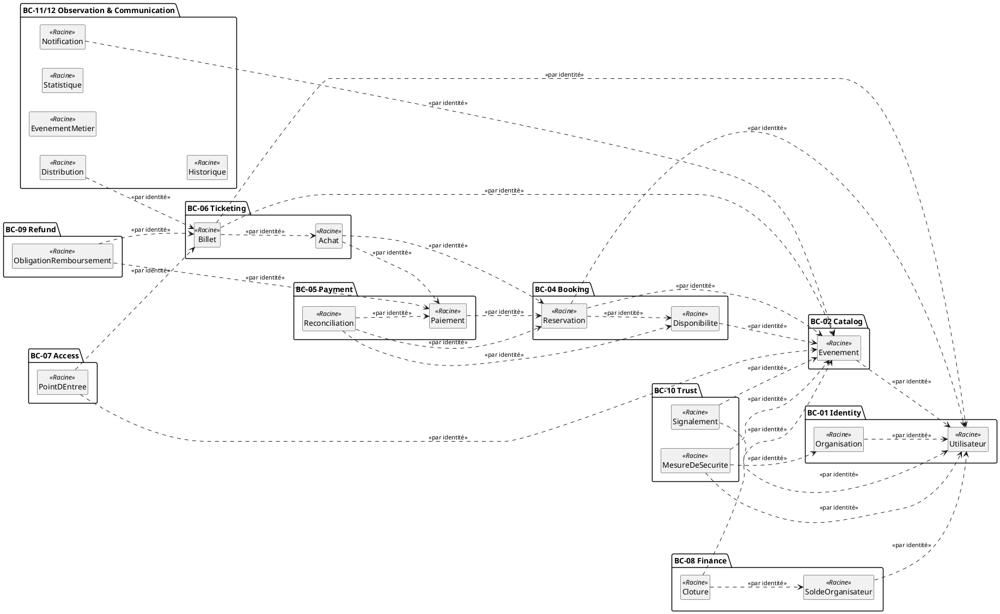
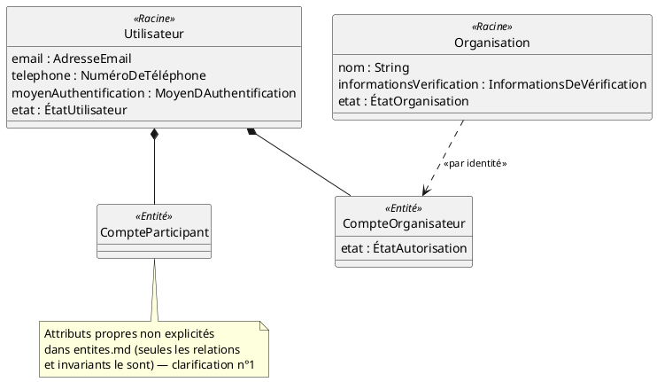
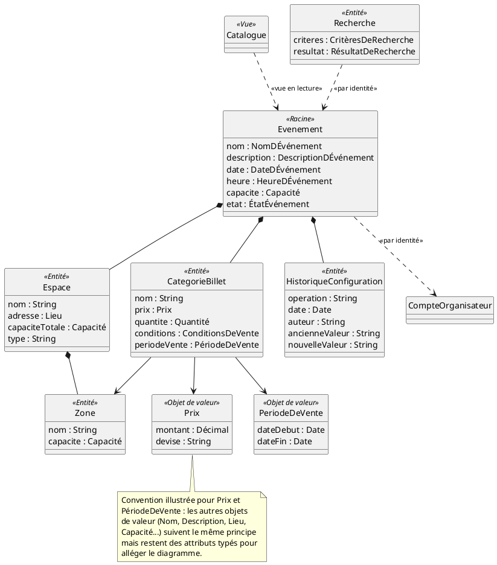
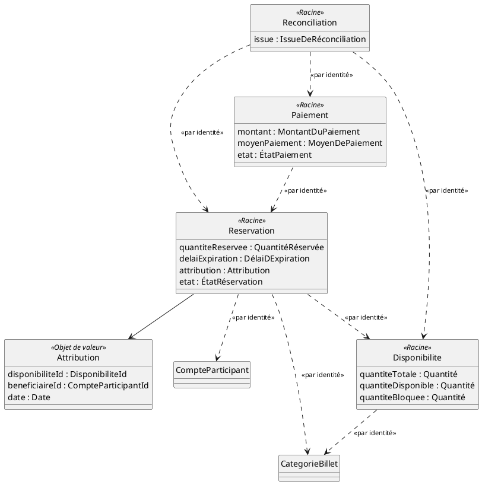
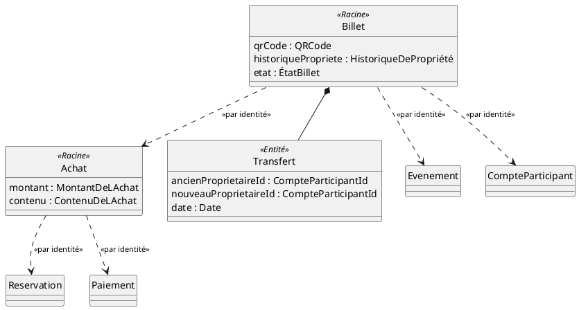
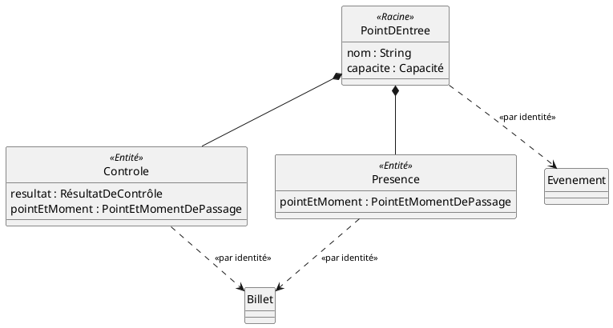
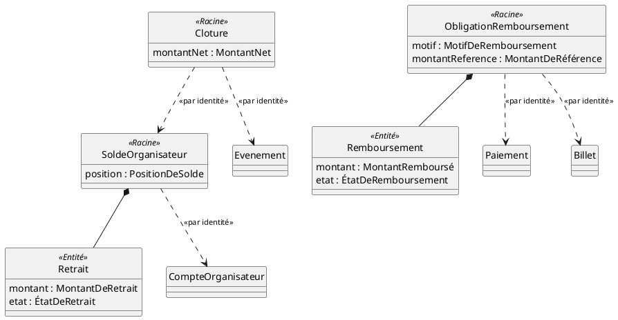
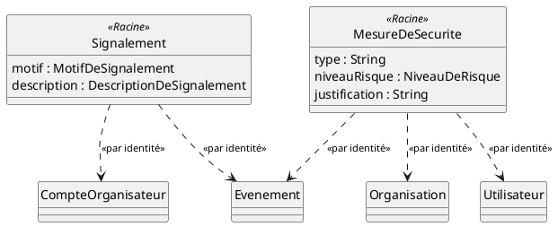
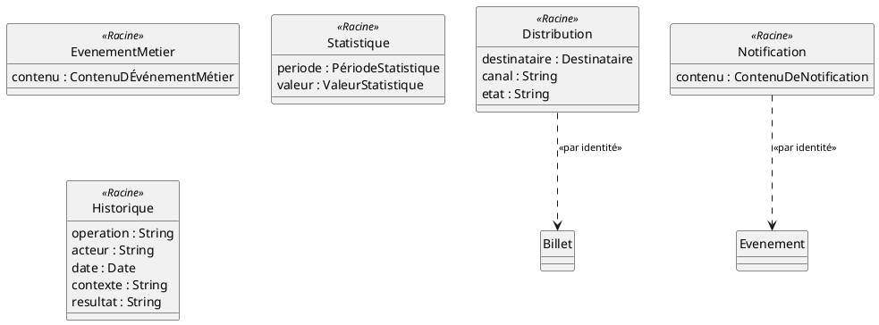

# Diagrammes de Classes (allégés) — Eventix

| Champ | Valeur |
|---|---|
| **Phase** | 06 — Modélisation UML |
| **Projet** | Eventix |
| **Périmètre** | MVP |
| **Marché initial** | Cameroun |
| **Source** | `entites.md`, `objets-valeur.md`, `agregats.md` (phase 05) |
| **Notation** | PlantUML — UML 2.5, sans compartiment d'opérations |
| **Statut** | Version de référence — à valider par l'équipe |

---

## Table des matières

1. [Objectif et portée — pourquoi un diagramme de classes sans POO](#1-objectif-et-portée--pourquoi-un-diagramme-de-classes-sans-poo)
2. [Notation et conventions](#2-notation-et-conventions)
3. [Vue d'ensemble du modèle de domaine](#3-vue-densemble-du-modèle-de-domaine)
4. [Identity & Access Management (BC-01)](#4-identity--access-management-bc-01)
5. [Event Catalog & Discovery (BC-02, BC-03)](#5-event-catalog--discovery-bc-02-bc-03)
6. [Booking & Payment (BC-04, BC-05)](#6-booking--payment-bc-04-bc-05)
7. [Ticketing & Fulfillment (BC-06)](#7-ticketing--fulfillment-bc-06)
8. [Access Control (BC-07)](#8-access-control-bc-07)
9. [Financial Settlement & Refund (BC-08, BC-09)](#9-financial-settlement--refund-bc-08-bc-09)
10. [Trust & Safety (BC-10)](#10-trust--safety-bc-10)
11. [Analytics & Communication (BC-11, BC-12)](#11-analytics--communication-bc-11-bc-12)
12. [Table des choix de relation](#12-table-des-choix-de-relation)
13. [Note d'architecture — SOLID et patterns sans POO](#13-note-darchitecture--solid-et-patterns-sans-poo)
14. [Incohérences détectées dans les sources](#14-incohérences-détectées-dans-les-sources)
15. [Cas limites et évolutivité](#15-cas-limites-et-évolutivité)
16. [Hypothèses retenues](#16-hypothèses-retenues)
17. [Points à clarifier avec le client / product owner](#17-points-à-clarifier-avec-le-client--product-owner)
18. [Statut](#18-statut)

---

## 1. Objectif et portée — pourquoi un diagramme de classes sans POO

Vous avez indiqué ne pas vouloir implémenter Eventix en programmation orientée objet, et un Modèle Conceptuel de Données (Merise) suivra ce dossier. Dans ce contexte, ce diagramme de classes **n'est pas un plan de code** : c'est la **structure conceptuelle du domaine métier**, servant de socle stable aux diagrammes de séquence et d'état à venir (qui ont besoin d'objets/entités déjà nommés pour leurs lignes de vie et leurs états), et de point de passage vers le futur MCD.

Concrètement, ce document :

- reprend **fidèlement** les 34 entités de `entites.md`, les objets de valeur de `objets-valeur.md` et les 20 agrégats de `agregats.md` — sans réinterpréter leurs définitions ;
- **ne montre aucune opération** (pas de méthodes, pas de comportement) — seulement des attributs typés, conformément à votre choix de ne pas utiliser la POO ;
- **respecte strictement les frontières d'agrégats** déjà tranchées dans `agregats.md`, y compris quand cela contredit une lecture plus naïve des relations de composition de `entites.md` (voir section 14) ;
- reste **allégé** : les ~30 objets de valeur ne sont pas tous dessinés comme des classes séparées — seuls quelques-uns sont représentés explicitement à titre d'exemple, les autres apparaissent comme attributs typés (voir section 2).

---

## 2. Notation et conventions

| Élément UML 2.5 | Usage | Pourquoi |
|---|---|---|
| `Class` sans compartiment d'opérations | Chaque entité et objet de valeur | Aucune méthode n'est modélisée — cohérent avec l'absence de POO |
| Stéréotype `<<Racine>>` | Entité racine d'un agrégat | Signale le seul point d'accès autorisé à l'agrégat (règle D2 de `agregats.md`) |
| Stéréotype `<<Entité>>` | Entité membre d'un agrégat, non racine | Possède une identité mais n'est jamais référencée depuis l'extérieur de l'agrégat |
| Stéréotype `<<Objet de valeur>>` | Concept sans identité propre | Représenté explicitement pour deux exemples (Prix, Période de vente) ; ailleurs, simple attribut typé |
| Stéréotype `<<Vue>>` | Projection en lecture seule, sans cycle de vie propre | Cas du Catalogue (BC-03), qui n'est pas un agrégat |
| Composition (`*--`, losange plein) | Membre partageant le cycle de vie de la racine | Traduit la règle D4 (« cycle de vie partagé ») de `agregats.md` |
| Association simple (`-->`) | Référence interne à un même agrégat | Ex. Catégorie de billet → Zone, tous deux membres de l'agrégat Événement |
| Dépendance pointillée `<<par identité>>` | Référence vers un autre agrégat | Traduit la règle D2 (« deux agrégats ne se référencent que par identifiant ») — jamais une association pleine, pour ne pas suggérer une navigation par objet complet |

**Sur l'absence de compartiment d'opérations :** `hide circle` et `skinparam classAttributeIconSize 0` sont appliqués à tous les diagrammes pour supprimer les icônes de visibilité (+/-/#) propres à la POO — les attributs sont listés sans modificateur d'accès, puisque la notion d'encapsulation par visibilité n'a pas de sens en dehors d'un contexte objet.

---

## 3. Vue d'ensemble du modèle de domaine

**Lecture :** chaque agrégat n'est représenté que par sa racine, ce qui donne la carte complète des dépendances inter-agrégats du système. Toutes les flèches sont en pointillé `<<par identité>>` — aucune composition n'apparaît à ce niveau, puisque la composition n'existe qu'**à l'intérieur** d'un agrégat, jamais entre deux agrégats (règle D2). C'est volontairement dense : c'est une carte de navigation, pas un diagramme à lire linéairement — les sections suivantes détaillent chaque zone.

---

## 4. Identity & Access Management (BC-01)

**Choix de relation :** `Utilisateur *-- CompteParticipant/CompteOrganisateur` en composition, car `agregats.md` les place explicitement comme membres de l'Agrégat Utilisateur (cycle de vie partagé, règle D4). `Organisation` reste un agrégat séparé référençant `CompteOrganisateur` **par identité**, exactement comme `agregats.md` le justifie : « l'Organisation a son propre cycle de vie de vérification, indépendant du compte de l'utilisateur qui la porte ».

---

## 5. Event Catalog & Discovery (BC-02, BC-03)

**Choix de relation :** `Espace`, `Zone`, `Catégorie de billet` et `Historique de configuration` sont en composition avec `Événement`, conformément à `agregats.md` : « Espace, Zone et Catégorie de billet partagent le cycle de vie de l'Événement (archivage commun) ». `Catalogue` est stéréotypé `<<Vue>>` et non `<<Racine>>` : `agregats.md` est explicite — « il ne possède pas d'invariant de cohérence propre » — ce n'est donc pas un agrégat mais une projection en lecture de l'Agrégat Événement. `Recherche` reste une entité sans agrégat de cohérence (opération transitoire selon la source), reliée à `Événement` par identité.

---

## 6. Booking & Payment (BC-04, BC-05)

**Choix de relation — le plus structurant du dossier :** `Réservation` et `Disponibilité` sont deux agrégats **séparés**, bien qu'intuitivement liés. `agregats.md` le justifie par la règle D3 (« petites frontières ») : l'invariant de non-double-attribution est à très forte contention (beaucoup de participants visent la même disponibilité au même instant), et l'isoler dans sa propre frontière évite d'élargir inutilement l'Agrégat Réservation à chaque blocage temporaire. C'est un choix de conception qui a un impact direct sur la concurrence — à retenir pour les diagrammes de séquence à venir (verrouillage / contrôle d'accès concurrent sur `Disponibilité`).

`Réconciliation` reste elle aussi un agrégat séparé de `Paiement` : elle a son propre cycle de vie (déclenchement → analyse → résolution) et ne fait que déclencher une opération dans l'agrégat cible, sans jamais le modifier directement — c'est une **politique de cohérence inter-agrégats** (event-driven, au sens DDD), pas une opération interne à `Paiement`.

---

## 7. Ticketing & Fulfillment (BC-06)

**Choix de relation — le deuxième plus structurant :** `Billet` est un agrégat **indépendant** d'`Achat`, malgré la relation de composition suggérée par `entites.md` §7.1 (« Billet compose Achat, 1..n »). `agregats.md` tranche explicitement en sens inverse : « le Billet survit à son achat (transferts, contrôles, annulations) ; le rattacher à l'Agrégat Achat violerait la règle D4 ». Ce document suit `agregats.md`, qui est la source de vérité la plus récente et la plus raffinée sur les frontières — voir section 14 pour le détail de cette tension entre sources. `Transfert` reste membre de l'Agrégat Billet (composition), car il modifie directement l'état du Billet qu'il transfère.

---

## 8. Access Control (BC-07)

**Choix de relation :** `Point d'entrée`, `Contrôle` et `Présence` partagent un même agrégat (composition), car ils « naissent et s'achèvent avec le passage au point d'entrée » (règle D4). Point notable : cet agrégat **ne contient pas** `Billet`, bien qu'`entites.md` §7.1 suggère une composition inverse (« Point d'entrée compose Événement »). `agregats.md` est clair : « la décision de validation remonte à l'Agrégat Billet, seul habilité à faire évoluer son état » — le Contrôle référence donc le Billet par identité, sans jamais le modifier directement lui-même.

---

## 9. Financial Settlement & Refund (BC-08, BC-09)

**Choix de relation :** `Retrait` est membre de l'Agrégat Solde organisateur (et non un agrégat séparé), car la restitution automatique d'un retrait échoué exige une cohérence **atomique** entre les deux — c'est la règle D1 (« invariant interne ») qui prime ici sur D3, malgré le cycle de vie propre du Retrait (`PENDING → PROCESSING → COMPLETED/FAILED`). Même logique pour `Remboursement`, membre de `Obligation de remboursement` : l'unicité du remboursement effectif relie les deux entités dans une même frontière.

---

## 10. Trust & Safety (BC-10)

**Choix de relation :** `Signalement` et `Mesure de sécurité` restent deux agrégats distincts, car leurs cycles de vie ne coïncident pas (émission → analyse → décision, contre décision → application → suivi). Cela reflète directement la relation `<<extend>>` déjà identifiée dans `diagrammes-de-cas-d-utilisation.md` entre `UC-017` et `UC-018` : deux processus liés mais autonomes, jamais une seule transaction.

---

## 11. Analytics & Communication (BC-11, BC-12)

**Choix de relation :** ces cinq classes sont des **agrégats à membre unique** — pas de composition interne, car chacune est un enregistrement autonome (événement métier, statistique, historique, distribution, notification) sans invariant reliant plusieurs entités entre elles. `Événement métier` et `Statistique` n'ont même aucune référence sortante : c'est cohérent avec leur rôle d'observation passive (« les statistiques ne modifient pas les données métier »).

---

## 12. Table des choix de relation

| Relation | Type retenu | Règle appliquée |
|---|---|---|
| Utilisateur — Compte participant / Compte organisateur | Composition | D4 (cycle de vie partagé) |
| Organisation — Compte organisateur | Référence par identité | Cycle de vie de vérification indépendant |
| Événement — Espace / Zone / Catégorie de billet / Historique config. | Composition | D4 (archivage commun) |
| Catalogue — Événement | Vue en lecture (pas un agrégat) | Absence d'invariant propre |
| Réservation — Disponibilité | Deux agrégats séparés, référence par identité | D3 (isoler l'invariant à forte contention) |
| Paiement — Réconciliation | Deux agrégats séparés, référence par identité | Cycles de vie distincts, politique événementielle |
| Achat — Billet | Deux agrégats séparés, référence par identité | D4 (le Billet survit à son Achat) |
| Billet — Transfert | Composition | Le Transfert modifie directement l'état du Billet |
| Point d'entrée — Contrôle / Présence | Composition | D4 (même cycle de vie que le passage) |
| Point d'entrée — Billet | Référence par identité | Le Billet reste seul habilité à faire évoluer son propre état |
| Solde organisateur — Retrait | Composition (malgré cycle de vie propre) | D1 prime sur D3 (restitution atomique) |
| Obligation de remboursement — Remboursement | Composition | D1 (unicité du remboursement effectif) |
| Signalement — Mesure de sécurité | Deux agrégats séparés | Cycles de vie non coïncidents |

---

## 13. Note d'architecture — SOLID et patterns sans POO

Vous avez posé la bonne question en amont : sans POO, SOLID (qui cible des classes avec comportement) ne s'applique pas littéralement. Ce diagramme montre comment la **même intention de conception** se traduit en discipline DDD tactique plutôt qu'en patterns objet :

- **Responsabilité unique → une frontière, une raison de changer.** Chaque agrégat encapsule *un seul* invariant de cohérence (ou un petit groupe d'invariants fortement couplés). `Disponibilité` existe séparément de `Réservation` précisément pour que l'invariant de non-double-attribution ait sa propre frontière, changeable indépendamment du reste du processus de réservation.
- **Ouvert/fermé → extensible par ajout d'agrégats, pas par modification.** Les 20 agrégats déjà identifiés couvrent le MVP ; un nouveau besoin (ex. revente de billets, hors périmètre actuel) s'ajouterait comme un nouvel agrégat référençant les existants par identité, sans les modifier.
- **Inversion de dépendance → référence par identité (règle D2).** C'est l'équivalent structurel de l'inversion de dépendance en POO : un agrégat ne dépend jamais de la structure interne d'un autre, seulement de son identifiant. C'est ce qui permettra, plus tard, de faire évoluer ou même de déployer séparément les bounded contexts sans casser leurs consommateurs.
- **Substitution / cohérence de contrat → objets de valeur.** Un objet de valeur (ex. `Prix`) est toujours remplacé en bloc, jamais muté partiellement — la substituabilité (règle R4 de `objets-valeur.md`) joue ici le rôle que la POO ferait porter à l'immutabilité d'un objet.

Ce n'est donc pas un renoncement à la rigueur de conception ; c'est son transfert du niveau **comportemental** (classes avec méthodes) au niveau **structurel** (frontières de cohérence des données). Le futur MCD Merise pourra directement s'appuyer sur ces frontières : chaque agrégat est un candidat naturel de regroupement de tables avec ses propres contraintes d'intégrité.

---

## 14. Incohérences détectées dans les sources

En tant que revue de qualité avant de figer ce diagramme, deux écarts ont été identifiés entre les documents fournis :

1. **`entites.md` §7.1 (relations de composition) contredit `agregats.md` sur deux points :**
   - `entites.md` liste « Billet compose Achat (1..n) », alors que `agregats.md` fait de `Billet` un agrégat indépendant d'`Achat`.
   - `entites.md` liste « Point d'entrée compose Événement (0..n) », alors que `agregats.md` fait de `Point d'entrée` un agrégat indépendant, référençant `Événement` par identité.

   Ce document a suivi `agregats.md` dans les deux cas, cette source étant la plus récente et la plus raffinée sur les questions de frontière (elle applique explicitement les règles D1 à D5 là où `entites.md` ne fait que lister des candidats de composition avant affinement). `agregats.md` signale d'ailleurs lui-même l'indépendance Billet/Achat comme un « choix structurant » à valider par l'équipe — ce diagramme n'invente donc rien, il documente une tension déjà connue de vos propres sources.

2. **Décompte des agrégats :** le résumé de `agregats.md` (section 8) annonce « seize agrégats », mais le décompte détaillé des sections 5.1 à 5.12 en liste vingt (2+1+0+2+2+2+1+2+1+2+3+2). Ce document utilise le décompte détaillé (20), plus fiable qu'un chiffre récapitulatif. À signaler à l'équipe pour correction de `agregats.md`.

---

## 15. Cas limites et évolutivité

| Cas d'évolution futur | Impact sur ce modèle | Pourquoi la modélisation actuelle l'absorbe |
|---|---|---|
| Ajout de la revente de billets (marketplace secondaire) | Nouvel agrégat référençant `Billet` par identité | N'impose aucune modification de l'Agrégat Billet existant |
| Montée en charge de `Disponibilité` (événements à très forte demande) | Aucun changement structurel | La frontière étroite de `Disponibilité` est déjà pensée pour isoler la contention (voir section 6) |
| Multi-devises (au-delà du FCFA) | `Prix` et les autres objets de valeur monétaires évoluent en interne | Leur immutabilité et leur typage isolé (règle R6, aucune décision technique imposée) permettent cette évolution sans toucher aux entités qui les portent |
| Séparation future du rôle Administrateur (Trust & Safety vs Finance) | `Signalement`/`Mesure de sécurité` restent inchangés | Ces agrégats ne portent aucune référence à un rôle applicatif spécifique, seulement à `Utilisateur`/`Organisation` par identité |

---

## 16. Hypothèses retenues

1. **Les attributs de `CompteParticipant` et `CompteOrganisateur`**, absents de `entites.md` (seules les relations et invariants y figurent), sont représentés vides dans ce diagramme plutôt qu'inventés. Voir clarification n°1.
2. **Le décompte de 20 agrégats** (plutôt que les 16 annoncés en résumé) est retenu comme référence pour ce document et les suivants.
3. **Les frontières de `agregats.md` priment** sur les relations de composition brutes de `entites.md` partout où les deux documents divergent (Billet/Achat, Point d'entrée/Événement).

---

## 17. Points à clarifier avec le client / product owner

| # | Question | Pourquoi c'est important |
|---|---|---|
| 1 | Quels attributs propres portent `Compte participant` et `Compte organisateur` (au-delà du lien vers `Utilisateur`) ? | Actuellement vides dans les sources ; nécessaires pour le futur MCD |
| 2 | Le choix Billet/Achat en agrégats séparés (déjà signalé comme à valider dans `agregats.md`) est-il confirmé par l'équipe ? | Structure toute la logique de transfert de billet et d'émission différée |
| 3 | `agregats.md` doit-il être corrigé pour refléter 20 agrégats plutôt que 16 dans son résumé ? | Cohérence documentaire pour les phases suivantes |
| 4 | Le Transfert de billet (confirmé dans le périmètre MVP) doit-il porter une notion de statut (`PENDING`/`ACCEPTED`/`REJECTED`) si le destinataire doit valider la réception ? | Actuellement modélisé comme une opération instantanée (Demande → Validation → Exécution) sans état intermédiaire explicite dans les attributs |

---

## 18. Statut

| Champ | Valeur |
|---|---|
| Document | diagrammes-de-classes.md |
| Version | 1.0 (allégée, sans POO) |
| Statut | À valider par l'équipe |
| Périmètre | MVP Eventix |
| Marché | Cameroun |
| Notation | PlantUML — UML 2.5, sans opérations |
| Entités couvertes | 34/34 (`entites.md`) |
| Agrégats couverts | 20/20 (`agregats.md`, décompte détaillé) |
| Diagramme suivant | `diagrammes-de-sequence.md` |