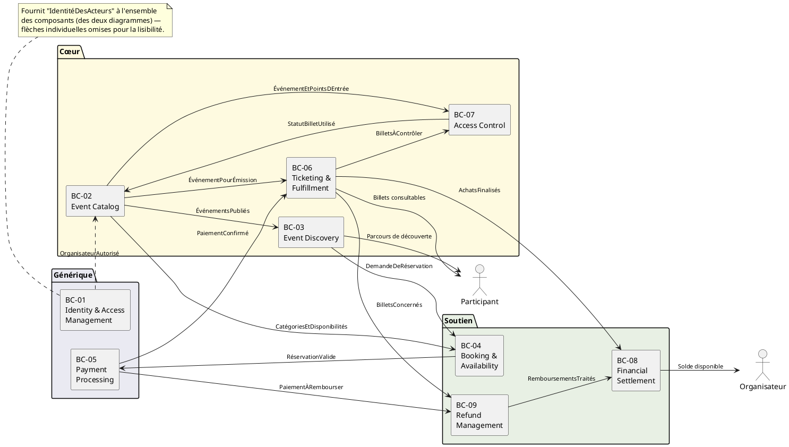
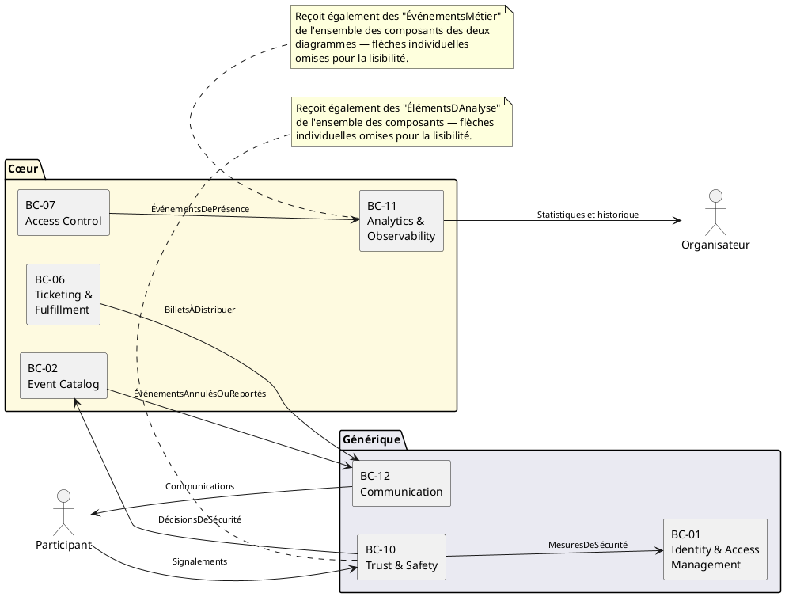
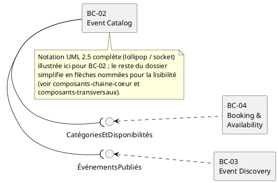

# Diagrammes de Composants — Eventix

| Champ | Valeur |
|---|---|
| **Phase** | 06 — Modélisation UML |
| **Projet** | Eventix |
| **Périmètre** | MVP |
| **Marché initial** | Cameroun |
| **Source** | `diagrammes-de-classes.md` (phase 06), `bounded-contexts.md` (phase 05) |
| **Notation** | PlantUML — UML 2.5 (component diagrams) |
| **Statut** | Version de référence — à valider par l'équipe |

---

## Table des matières

1. [Objectif et portée](#1-objectif-et-portée)
2. [Notation et conventions](#2-notation-et-conventions)
3. [Composants et agrégats regroupés](#3-composants-et-agrégats-regroupés)
4. [Diagramme 1 — Chaîne cœur du parcours commercial](#4-diagramme-1--chaîne-cœur-du-parcours-commercial)
5. [Diagramme 2 — Composants transversaux](#5-diagramme-2--composants-transversaux)
6. [Diagramme 3 — Notation UML 2.5 complète (illustration)](#6-diagramme-3--notation-uml-25-complète-illustration)
7. [Table de traçabilité des interfaces](#7-table-de-traçabilité-des-interfaces)
8. [Incohérence détectée dans les sources](#8-incohérence-détectée-dans-les-sources)
9. [Note d'architecture](#9-note-darchitecture)
10. [Cas limites et évolutivité](#10-cas-limites-et-évolutivité)
11. [Hypothèses retenues](#11-hypothèses-retenues)
12. [Points à clarifier avec le client / product owner](#12-points-à-clarifier-avec-le-client--product-owner)
13. [Statut](#13-statut)

---

## 1. Objectif et portée

Ce document regroupe les classes déjà établies dans `diagrammes-de-classes.md` en **composants**, un composant par bounded context, conformément aux frontières déjà délimitées dans `bounded-contexts.md`. C'est un alignement volontairement strict et sans réinterprétation : les douze composants de ce document portent exactement les douze identifiants `BC-01` à `BC-12` déjà établis, et les relations entre composants reprennent exactement les colonnes « Reçoit de » / « Fournit à » déjà documentées pour chacun.

Ce document ne redéfinit ni les responsabilités de chaque contexte (déjà dans `bounded-contexts.md`), ni les attributs des classes qu'il contient (déjà dans `diagrammes-de-classes.md`). Il ajoute la seule chose que ni l'un ni l'autre ne montre : **la frontière physique de déploiement potentielle**, matérialisée par des interfaces nommées entre composants.

**Sur l'absence de décision technique :** comme le rappelle `bounded-contexts.md` (§11), une frontière de bounded context ne préjuge d'aucune architecture technique. Un composant UML n'en préjuge pas non plus : il peut être un module dans un monolithe, un microservice, ou toute autre unité de déploiement. Ce choix reste entièrement ouvert pour `diagrammes-de-deploiement.md`, le prochain document de ce dossier.

---

## 2. Notation et conventions

| Élément UML 2.5 | Usage |
|---|---|
| `[Composant]` | Un bounded context complet (BC-01 à BC-12) |
| `package` | Regroupement visuel par catégorie de différenciation (Cœur / Soutien / Générique), repris tel quel de `bounded-contexts.md` §4 |
| Interface nommée (lollipop `-(` / socket `..>`) | Le contrat exposé par un composant, nommé d'après la donnée ou la capacité qu'il transmet |
| Flèche simple étiquetée | Simplification pragmatique de la paire lollipop/socket, utilisée partout sauf dans le diagramme d'illustration (§6) |
| Note ancrée | Signale une simplification délibérée ou une incohérence de source |

**Convention de lecture des flèches :** dans ce document, `A --> B : X` se lit *« A fournit X à B »* — c'est-à-dire que la flèche part du **fournisseur** vers le **consommateur**, et non l'inverse. Ce choix suit directement le vocabulaire déjà utilisé dans `bounded-contexts.md` (« Fournit à »), pour que chaque flèche du diagramme soit vérifiable mot pour mot contre sa source.

**Sur la notation lollipop/socket complète :** l'UML 2.5 distingue formellement une interface *fournie* (lollipop, `-(`) d'une interface *requise* (socket, `)-`). Cette notation est illustrée explicitement dans le diagramme 3 (§6) pour un cas représentatif (BC-02). Le reste du dossier la simplifie en flèches nommées directes, pour la même raison de lisibilité déjà invoquée dans tous les diagrammes précédents de ce dossier : avec plus de vingt relations documentées entre douze composants, la notation complète rendrait l'ensemble illisible sans ajouter d'information — le nom de l'interface porte déjà tout le contrat.

---

## 3. Composants et agrégats regroupés

Cette table est la traçabilité directe demandée : quelles classes de `diagrammes-de-classes.md` vivent dans quel composant.

| Composant | Bounded Context | Catégorie | Agrégats et entités regroupés |
|---|---|---|---|
| **BC-01** | Identity & Access Management | Générique | Utilisateur, Compte participant, Compte organisateur, Organisation |
| **BC-02** | Event Catalog | Cœur | Événement, Espace, Zone, Catégorie de billet, Historique de configuration |
| **BC-03** | Event Discovery | Cœur | Catalogue (vue), Recherche |
| **BC-04** | Booking & Availability | Soutien | Réservation, Disponibilité |
| **BC-05** | Payment Processing | Générique | Paiement, Réconciliation |
| **BC-06** | Ticketing & Fulfillment | Cœur | Achat, Billet, Transfert |
| **BC-07** | Access Control | Cœur | Point d'entrée, Contrôle, Présence |
| **BC-08** | Financial Settlement | Soutien | Clôture, Solde organisateur, Retrait |
| **BC-09** | Refund Management | Soutien | Obligation de remboursement, Remboursement |
| **BC-10** | Trust & Safety | Générique | Signalement, Mesure de sécurité |
| **BC-11** | Analytics & Observability | Cœur | Événement métier, Statistique, Historique |
| **BC-12** | Communication | Générique | Distribution, Notification |

Ce regroupement est **exhaustif** : les 34 entités et objets de valeur de `diagrammes-de-classes.md` sont couverts par exactement un composant chacun, sans chevauchement — cohérence directe avec le principe D2 (« un agrégat appartient à un seul bounded context ») déjà établi en amont.

---

## 4. Diagramme 1 — Chaîne cœur du parcours commercial

**Lecture :** ce diagramme réunit dans une seule vue les trois catégories de `bounded-contexts.md` (Générique, Cœur, Soutien) précisément parce que le parcours commercial les traverse toutes — la preuve visuelle que « cœur » ne signifie pas « isolé du reste » : BC-06 (cœur) dépend directement de BC-05 (générique) et alimente BC-08/BC-09 (soutien).

---

## 5. Diagramme 2 — Composants transversaux

**Lecture :** ce second diagramme isole les trois composants dont la vocation est justement de **traverser** tous les autres (Identity, Trust & Safety, Analytics) plutôt que de s'insérer dans un seul maillon de la chaîne — les séparer du diagramme 1 est ce qui rend les deux lisibles, plutôt qu'un unique diagramme à vingt-cinq flèches.

---

## 6. Diagramme 3 — Notation UML 2.5 complète (illustration)

**Pourquoi cette troisième vue existe :** pour respecter la notation UML 2.5 à la lettre au moins une fois dans ce dossier, sans l'imposer partout où elle nuirait à la lisibilité — le même compromis pragmatique que celui déjà assumé pour les objets de valeur dans `diagrammes-de-classes.md` §5.

---

## 7. Table de traçabilité des interfaces

| Interface | Fournisseur | Consommateur | Ligne source dans `bounded-contexts.md` |
|---|---|---|---|
| OrganisateurAutorisé | BC-01 | BC-02 | §5.1 « Reçoit de : BC-01 (organisateur autorisé) » |
| ÉvénementsPubliés | BC-02 | BC-03 | §5.2 « Reçoit de : BC-02 (événements publiés) » |
| CatégoriesEtDisponibilités | BC-02 | BC-04 | §6.1 « Reçoit de : BC-02 (disponibilités) » |
| DemandeDeRéservation | BC-03 | BC-04 | §5.2 « Fournit à : BC-04 (demande de réservation) » |
| RéservationValide | BC-04 | BC-05 | §6.1 « Fournit à : BC-05 (réservation valide à payer) » |
| PaiementConfirmé | BC-05 | BC-06 | §5.3 « Reçoit de : BC-05 (paiement confirmé) » |
| ÉvénementPourÉmission | BC-02 | BC-06 | §5.3 « Reçoit de : BC-02 (événement et catégorie) » |
| BilletsÀContrôler | BC-06 | BC-07 | §5.4 « Reçoit de : BC-06 (billets émis) » |
| ÉvénementEtPointsDEntrée | BC-02 | BC-07 | §5.4 « Reçoit de : BC-02 (événement et points d'entrée) » |
| StatutBilletUtilisé | BC-07 | BC-02 | §5.4 « Fournit à : BC-02 (statut des billets utilisés) » — voir incohérence §8 |
| PaiementÀRembourser | BC-05 | BC-09 | §7.2 « Fournit à : BC-09 (paiement à rembourser) » |
| BilletsConcernés | BC-06 | BC-09 | §6.3 « Reçoit de : BC-06 (billets concernés) » |
| AchatsFinalisés | BC-06 | BC-08 | §6.2 « Reçoit de : BC-06 (achats finalisés) » |
| RemboursementsTraités | BC-09 | BC-08 | §6.2 « Reçoit de : BC-09 (remboursements traités) » |
| MesuresDeSécurité | BC-10 | BC-01 | §7.1 « Reçoit de : BC-10 (mesures de sécurité) » |
| DécisionsDeSécurité | BC-10 | BC-02 | §5.1 « Reçoit de : BC-10 (décisions de sécurité) » |
| ÉvénementsDePrésence | BC-07 | BC-11 | §5.5 « Reçoit de : tous » ; relation nommée en §9.3 |
| BilletsÀDistribuer | BC-06 | BC-12 | §7.4 « Reçoit de : BC-06 (billets émis) » ; relation nommée en §9.3 |
| ÉvénementsAnnulésOuReportés | BC-02 | BC-12 | §7.4 « Reçoit de : BC-02 (événements annulés ou reportés) » |

Chaque interface nommée dans les diagrammes 1 et 2 a donc une ligne source vérifiable — aucune n'a été inventée pour les besoins de la mise en forme.

---

## 8. Incohérence détectée dans les sources

**`StatutBilletUtilisé` (BC-07 → BC-02) semble mal dirigée.** `bounded-contexts.md` §5.4 affirme que BC-07 (Access Control) « fournit à BC-02 » le statut des billets utilisés. Or, `diagrammes-de-classes.md` §7 établit sans ambiguïté que l'attribut `ÉtatBillet` appartient à l'**Agrégat Billet**, lui-même dans **BC-06** (Ticketing & Fulfillment) — pas dans BC-02. `diagrammes-d-etat.md` confirme : c'est l'événement `BilletUtilisé`, consommé par l'agrégat Billet, qui fait cette transition, sans jamais toucher l'Agrégat Événement.

Deux lectures sont possibles :
1. Il s'agit d'une erreur de rédaction dans `bounded-contexts.md`, et la flèche devrait être **BC-07 → BC-06** (le contrôle informe le Billet de son utilisation, pas l'Événement).
2. BC-02 a effectivement besoin d'une information dérivée (ex. un compteur de billets utilisés par événement, pour l'affichage organisateur), auquel cas l'interface devrait être renommée pour refléter cela (ex. `CompteurDeBilletsUtilisés`) plutôt que de laisser penser que BC-02 modifie l'état d'un Billet qu'il ne possède pas.

Ce document a conservé la flèche telle qu'écrite dans la source (BC-07 → BC-02) par fidélité à la traçabilité, mais la signale explicitement plutôt que de la corriger silencieusement — voir clarification n°1.

---

## 9. Note d'architecture

**Pourquoi un composant par bounded context, ni plus fin ni plus grossier ?**
Un grain plus fin (un composant par agrégat, par exemple) romprait l'unité de déploiement déjà justifiée par le principe de cohérence métier de `bounded-contexts.md` §3.1 — deux agrégats du même contexte (ex. Réservation et Disponibilité dans BC-04) sont conçus pour évoluer et se déployer ensemble, même s'ils restent des frontières de cohérence internes séparées. Un grain plus grossier (un composant par catégorie Cœur/Soutien/Générique) romprait l'principe de frontière explicite (§3.5) : "Soutien", par exemple, contiendrait alors Booking, Finance et Refund, trois responsabilités métier sans langage commun, recréant exactement la fragmentation que `bounded-contexts.md` cherche à éviter.

**Interface Segregation, sans POO :** chaque interface nommée dans ce document porte **une seule capacité** (`RéservationValide`, `PaiementConfirmé`...), jamais une interface fourre-tout du type `ServiceBC04`. C'est l'équivalent structurel du principe d'Interface Segregation (SOLID) : un composant consommateur ne dépend que de ce dont il a réellement besoin, jamais de la totalité des capacités d'un autre composant. Cette discipline n'a rien d'orienté objet — c'est une question de contrat entre systèmes, aussi valable pour des files de messages ou des appels HTTP que pour des interfaces de classes.

**Sur la simplification des composants transversaux (BC-01, BC-10, BC-11) :** ces trois composants auraient nécessité, en toute rigueur, une flèche vers ou depuis chacun des neuf autres composants — soit vingt-sept flèches supplémentaires rien que pour eux. Les représenter comme des notes plutôt que comme un maillage complet est une décision de lisibilité, pas une perte d'information : la table de traçabilité (§7) et `bounded-contexts.md` restent la référence exhaustive.

---

## 10. Cas limites et évolutivité

| Cas d'évolution futur | Impact sur ces diagrammes | Pourquoi la modélisation actuelle l'absorbe |
|---|---|---|
| Un bounded context est scindé en deux composants de déploiement distincts (ex. BC-02 séparé en configuration et lecture) | Ajout d'un composant et d'une interface interne | Le principe de frontière minimale de `bounded-contexts.md` rend ce scénario improbable au MVP, mais la structure en composants nommés l'absorbe sans redessiner l'ensemble |
| Ajout d'un nouveau bounded context (ex. revente de billets, hors MVP) | Nouveau composant, nouvelles interfaces vers BC-06/BC-08 | N'affecte aucune interface existante — strictement additif |
| Passage de BC-11 d'un modèle "push" (chaque composant lui envoie ses événements) à un modèle "pull" (BC-11 interroge chaque composant) | Sens des flèches inversé pour les interfaces liées à BC-11 | Les interfaces restent nommées de la même façon ; seul le sens de la dépendance technique change, une décision differée à `diagrammes-de-deploiement.md` |

---

## 11. Hypothèses retenues

1. **Chaque agrégat appartient à exactement un composant**, sans partage — cohérent avec le principe D2 déjà établi et avec §3.1 de `bounded-contexts.md`.
2. **Les interfaces transversales de BC-01, BC-10 et BC-11** sont représentées par des notes plutôt que par un maillage complet, une simplification de présentation qui n'omet aucune relation documentée dans `bounded-contexts.md`.
3. **La flèche `StatutBilletUtilisé` (BC-07 → BC-02)** est reproduite telle quelle malgré l'incohérence relevée en section 8, en attendant l'arbitrage du product owner.

---

## 12. Points à clarifier avec le client / product owner

| # | Question | Pourquoi c'est important |
|---|---|---|
| 1 | La relation `StatutBilletUtilisé` (BC-07 → BC-02) doit-elle être corrigée en BC-07 → BC-06, ou BC-02 a-t-il réellement besoin d'une donnée dérivée du contrôle d'accès ? | Impacte directement la frontière entre BC-02 et BC-06 ainsi que le futur diagramme de déploiement |
| 2 | Les composants transversaux (BC-01, BC-10, BC-11) seront-ils déployés comme des services partagés uniques, ou dupliqués/répliqués par souci de résilience ? | Question à trancher explicitement dans `diagrammes-de-deploiement.md`, mais qui peut influencer le découpage des interfaces dès ce stade |

---

## 13. Statut

| Champ | Valeur |
|---|---|
| Document | diagrammes-de-composants.md |
| Version | 1.0 |
| Statut | À valider par l'équipe |
| Périmètre | MVP Eventix |
| Marché | Cameroun |
| Notation | PlantUML — UML 2.5 |
| Composants couverts | 12/12 (`bounded-contexts.md`) |
| Diagramme suivant | `diagrammes-de-deploiement.md` |
