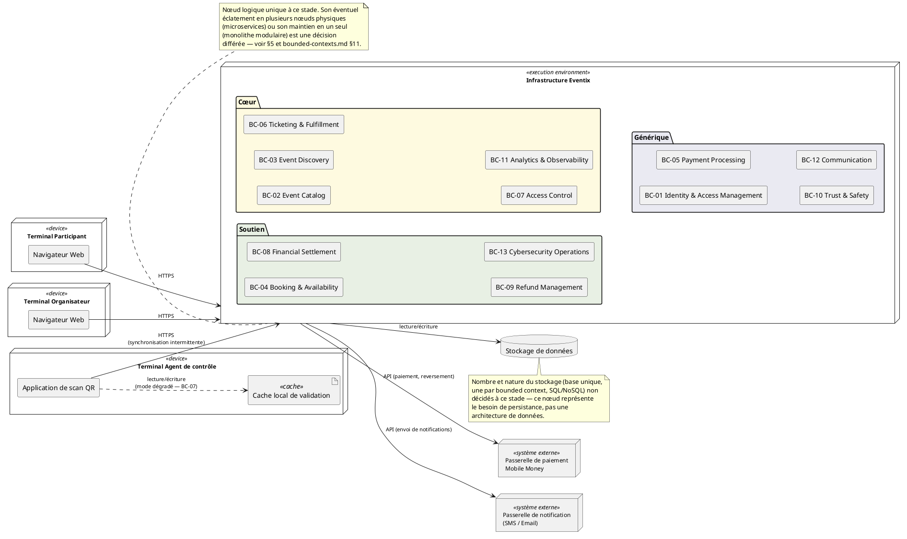

# Diagramme de Déploiement — Eventix

| Champ | Valeur |
|---|---|
| **Phase** | 06 — Modélisation UML |
| **Projet** | Eventix |
| **Périmètre** | MVP |
| **Marché initial** | Cameroun |
| **Source** | `diagrammes-de-composants.md` (phase 06) |
| **Notation** | PlantUML — UML 2.5 (deployment diagram) |
| **Statut** | Version de référence — à valider par l'équipe |

---

## Table des matières

1. [Objectif et portée — une tension à résoudre explicitement](#1-objectif-et-portée--une-tension-à-résoudre-explicitement)
2. [Notation et conventions](#2-notation-et-conventions)
3. [Diagramme de déploiement](#3-diagramme-de-déploiement)
4. [Lecture détaillée par nœud](#4-lecture-détaillée-par-nœud)
5. [Ce que ce diagramme décide, et ce qu'il ne décide pas](#5-ce-que-ce-diagramme-décide-et-ce-quil-ne-décide-pas)
6. [Le cas du mode dégradé (BC-07)](#6-le-cas-du-mode-dégradé-bc-07)
7. [Note d'architecture](#7-note-darchitecture)
8. [Cas limites et évolutivité](#8-cas-limites-et-évolutivité)
9. [Hypothèses retenues](#9-hypothèses-retenues)
10. [Points à clarifier avec le client / product owner](#10-points-à-clarifier-avec-le-client--product-owner)
11. [Statut](#11-statut)

---

## 1. Objectif et portée — une tension à résoudre explicitement

Un diagramme de déploiement est, par définition UML, le diagramme le plus proche de l'implémentation physique : il place des artefacts sur des nœuds matériels ou des environnements d'exécution. C'est en tension directe avec un principe répété dans toutes les sources de ce dossier — `bounded-contexts.md` §11 : « la délimitation des bounded contexts ne préjuge pas de l'architecture technique » ; `services-de-domaine.md` : « aucune décision technique n'est prise ou implicite » ; `diagrammes-de-composants.md` §1 : la frontière entre composants « peut être un module dans un monolithe, un microservice, ou toute autre unité de déploiement ».

Ce document résout cette tension de la seule façon cohérente avec tout ce qui précède : il modélise une **infrastructure préliminaire**, au grain le plus grossier qui reste honnête — qui parle à qui, par quel canal, avec quelle contrainte connue (connectivité, mode dégradé) — sans jamais descendre au niveau où une décision d'architecture (nombre de serveurs, type de base de données, monolithe ou microservices) serait implicitement prise. Chaque fois qu'une question technique se pose, ce document la nomme explicitement comme non tranchée plutôt que de la trancher silencieusement par la forme du diagramme.

---

## 2. Notation et conventions

| Élément UML 2.5 | Usage |
|---|---|
| `node` stéréotypé `<<device>>` | Un terminal physique contrôlé par l'utilisateur (ordinateur, téléphone) |
| `node` stéréotypé `<<execution environment>>` | Un environnement d'exécution logique, volontairement sans précision de nombre de machines physiques |
| `node` stéréotypé `<<système externe>>` | Un système hors du périmètre de déploiement d'Eventix |
| `database` | Un besoin de persistance, sans présager de sa technologie ni de son unicité |
| `artifact` | Un élément déployé concret (ex. un cache local) |
| Chemin de communication étiqueté | Le protocole ou la nature de l'échange, quand elle est déjà contrainte par le métier (ex. "synchronisation intermittente" pour le contrôle d'accès) ; jamais un choix technique non justifié par une source |

---

## 3. Diagramme de déploiement

BC-13 apparaît ici comme capacité logique incluse dans l'environnement Eventix uniquement pour assurer la traçabilité du modèle. Ce diagramme ne décide pas qu'il s'agit d'un service séparé, d'un outil externe ou d'un nœud dédié ; le mode de déploiement doit être arbitré en phases 09–10.

---

## 4. Lecture détaillée par nœud

| Nœud | Stéréotype | Rôle | Ce qu'il contient |
|---|---|---|---|
| Terminal Participant | `<<device>>` | Poste du participant (MVP web only) | Navigateur Web |
| Terminal Organisateur | `<<device>>` | Poste de l'organisateur (MVP web only) | Navigateur Web |
| Terminal Agent de contrôle | `<<device>>` | Appareil de scan à l'entrée de l'événement | Application de scan QR, cache local de validation |
| Infrastructure Eventix | `<<execution environment>>` | Hébergement des douze composants (bounded contexts) | Les composants groupés par catégorie, repris tels quels de `diagrammes-de-composants.md` |
| Stockage de données | `database` | Besoin de persistance pour l'ensemble des agrégats | Non détaillé — voir §5 |
| Passerelle de paiement Mobile Money | `<<système externe>>` | Même système que celui déjà identifié dans `diagramme-de-contexte.md` | Hors périmètre de déploiement Eventix |
| Passerelle de notification | `<<système externe>>` | Même système que celui déjà identifié dans `diagramme-de-contexte.md` | Hors périmètre de déploiement Eventix |

Les trois derniers nœuds (hormis le stockage) referment exactement la boucle ouverte par `diagramme-de-contexte.md`, premier document de ce dossier : les acteurs et systèmes externes identifiés au tout début s'y retrouvent inchangés, preuve que la cohérence du dossier tient de bout en bout.

---

## 5. Ce que ce diagramme décide, et ce qu'il ne décide pas

| Décidé par ce diagramme | Non décidé — volontairement laissé ouvert |
|---|---|
| Il existe trois types de terminaux distincts côté client (Participant, Organisateur, Agent de contrôle) | Le nombre de serveurs physiques ou de conteneurs derrière "Infrastructure Eventix" |
| L'Agent de contrôle a besoin d'un stockage local pour fonctionner en mode dégradé | Si l'infrastructure applicative est un monolithe modulaire ou des microservices indépendants par bounded context |
| Les communications avec le Prestataire de paiement et la Passerelle de notification passent par l'infrastructure applicative, jamais directement depuis un terminal client | Le nombre et la technologie des bases de données (une base unique, une par bounded context, SQL ou NoSQL) |
| Le canal avec le scanner QR est intermittent, pas garanti en continu | Le mécanisme technique garantissant l'idempotence déjà signalé comme ouvert dans `diagrammes-de-sequence.md` §18 (file de messages, verrou, clé d'idempotence) |
| Aucune communication directe entre deux terminaux clients n'existe | La présence ou non d'une passerelle API, d'un load balancer, ou d'un CDN |

Cette double colonne est le vrai livrable de ce document : elle rend explicite la frontière entre ce qui est déjà une contrainte métier connue (colonne de gauche) et ce qui reste un choix d'ingénierie à faire plus tard (colonne de droite) — exactement l'esprit du mot « préliminaire » dans la consigne de ce livrable.

---

## 6. Le cas du mode dégradé (BC-07)

C'est le seul endroit de ce diagramme où une contrainte de déploiement est non seulement autorisée, mais **nécessaire** : `bounded-contexts.md` §10.2 classe explicitement le mode dégradé (`SD-07-3`) comme un sous-domaine cœur local, justifié par « les contraintes de connectivité locales » du marché camerounais, et `diagrammes-d-activite.md` (ACT-04b) modélise déjà le comportement métier correspondant. Un diagramme de déploiement qui omettrait le cache local sur le Terminal Agent de contrôle laisserait une exigence métier déjà actée sans aucune traduction physique — ce serait une omission, pas de la prudence.

Ce cache reste volontairement non spécifié dans sa technologie (base embarquée, fichier local, stockage navigateur) : seule son **existence** est une conséquence directe du métier, pas sa forme technique.

---

## 7. Note d'architecture

**Monolithe modulaire ou microservices : pourquoi ce document ne tranche pas, et pourquoi c'est la bonne décision à ce stade.**
Les deux options restent cohérentes avec tout ce qui a été modélisé jusqu'ici. Un monolithe modulaire déploierait les douze composants de `diagrammes-de-composants.md` comme des modules internes d'un seul processus, communiquant par appel de fonction ; des microservices les déploieraient comme des processus indépendants, communiquant par réseau. Dans les deux cas, les interfaces déjà nommées (`RéservationValide`, `PaiementConfirmé`...) restent valides — seule leur nature technique change (appel direct vs appel réseau). C'est précisément la garantie qu'offre un bon découpage en bounded contexts : la décision de déploiement peut être prise, changée, ou migrée progressivement (un monolithe modulaire bien découpé peut être éclaté composant par composant plus tard) sans remettre en cause le travail de modélisation déjà produit dans ce dossier.

**Sur le choix de ne montrer qu'un seul nœud applicatif plutôt que douze :** douze nœuds séparés avec leurs chemins de communication respectifs auraient implicitement représenté une architecture microservices — exactement le type de décision technique que les sources interdisent de préjuger. Un seul nœud "Infrastructure Eventix" reste correct dans les deux scénarios et évite ce biais visuel.

**Lien avec l'idempotence (déjà signalée dans `diagrammes-de-sequence.md`) :** ce diagramme ne résout pas cette question ouverte — il la rend simplement visible une fois de plus, au niveau où elle devra être tranchée (une file de messages impliquerait un nœud supplémentaire ; une clé d'idempotence en base n'en impliquerait aucun). C'est un signal volontaire que ce chantier reste à faire, pas un oubli.

---

## 8. Cas limites et évolutivité

| Cas d'évolution futur | Impact sur ce diagramme | Pourquoi la modélisation actuelle l'absorbe |
|---|---|---|
| Passage à une application mobile native pour le Participant (au-delà du MVP web only) | Un nouveau type de terminal `<<device>>` à ajouter, communiquant de la même façon avec "Infrastructure Eventix" | La frontière entre terminaux clients et infrastructure applicative reste la même |
| Décision ultérieure de microservices | "Infrastructure Eventix" se décompose en plusieurs nœuds, un par composant ou groupe de composants | Les interfaces déjà nommées dans `diagrammes-de-composants.md` deviennent directement les contrats réseau entre les nouveaux nœuds |
| Ajout d'un agrégateur de paiement (remplaçant un accès direct aux API MTN/Orange) | Le nœud "Passerelle de paiement Mobile Money" reste inchangé en façade, seul son contenu interne change | Cohérent avec la décision déjà prise dans `diagramme-de-contexte.md` de traiter ce système comme une boîte noire unique |
| Montée en charge nécessitant une réplication de "Infrastructure Eventix" | Ajout de nœuds répliqués et d'un mécanisme de répartition de charge | Non représenté ici par choix — une décision de dimensionnement n'a pas sa place dans une infrastructure encore préliminaire |

---

## 9. Hypothèses retenues

1. **Le MVP reste web only côté Participant et Organisateur**, conformément à la clarification déjà actée en tout début de dossier (`diagramme-de-contexte.md`) — seul l'Agent de contrôle dispose d'un terminal dédié (application de scan QR), également déjà acté.
2. **Un seul nœud applicatif logique** représente l'ensemble des douze composants, sans préjuger du nombre de machines physiques qui l'exécuteront réellement.
3. **Le cache local de l'Agent de contrôle** est présenté comme une conséquence directe du mode dégradé déjà modélisé (BC-07), pas comme une anticipation technique nouvelle.

---

## 10. Points à clarifier avec le client / product owner

| # | Question | Pourquoi c'est important |
|---|---|---|
| 1 | Le choix monolithe modulaire vs microservices est-il à trancher avant le développement du MVP, ou peut-il rester ouvert et être décidé en cours de route ? | Conditionne directement l'organisation de l'équipe de développement et l'outillage à mettre en place |
| 2 | Le mécanisme technique d'idempotence (file de messages, verrou, clé d'idempotence en base) déjà signalé comme ouvert dans `diagrammes-de-sequence.md` a-t-il été tranché depuis ? | Impacterait directement ce diagramme (ajout potentiel d'un nœud de type file de messages) |
| 3 | Le cache local de l'Agent de contrôle doit-il survivre à une réinstallation de l'application (persistance longue) ou seulement à une coupure réseau ponctuelle (persistance courte) ? | Impacte le choix technologique du cache, même si ce choix reste hors du périmètre de ce document |

---

## 11. Statut

| Champ | Valeur |
|---|---|
| Document | diagrammes-de-deploiement.md |
| Version | 1.0 |
| Statut | À valider par l'équipe |
| Périmètre | MVP Eventix |
| Marché | Cameroun |
| Notation | PlantUML — UML 2.5 |
| Décisions techniques prises | Aucune — infrastructure préliminaire, voir §5 |
| Diagramme suivant | `README.md` (sommaire et vue d'ensemble du dossier) |
