# Diagrammes de Séquence — Eventix

| Champ | Valeur |
|---|---|
| **Phase** | 06 — Modélisation UML |
| **Projet** | Eventix |
| **Périmètre** | MVP |
| **Marché initial** | Cameroun |
| **Source** | `diagrammes-de-cas-d-utilisation.md` (phase 06), `services-de-domaine.md` (phase 05), `diagrammes-de-classes.md` (phase 06) |
| **Notation** | PlantUML — UML 2.5 |
| **Statut** | Version de référence — à valider par l'équipe |

---

## Table des matières

1. [Objectif et portée](#1-objectif-et-portée)
2. [Notation et conventions](#2-notation-et-conventions)
3. [Pourquoi un diagramme par service, pas par cas d'usage](#3-pourquoi-un-diagramme-par-service-pas-par-cas-dusage)
4. [SEQ-01 — Vérification et publication](#4-seq-01--vérification-et-publication)
5. [SEQ-02 — Expiration des réservations](#5-seq-02--expiration-des-réservations)
6. [SEQ-03 — Finalisation d'achat](#6-seq-03--finalisation-dachat)
7. [SEQ-04 — Réconciliation des paiements tardifs](#7-seq-04--réconciliation-des-paiements-tardifs)
8. [SEQ-05 — Annulation d'événement](#8-seq-05--annulation-dévénement)
9. [SEQ-06 — Report d'événement](#9-seq-06--report-dévénement)
10. [SEQ-07 — Contrôle d'accès et mode dégradé](#10-seq-07--contrôle-daccès-et-mode-dégradé)
11. [SEQ-08 — Clôture financière](#11-seq-08--clôture-financière)
12. [SEQ-09 — Application d'une mesure de sécurité](#12-seq-09--application-dune-mesure-de-sécurité)
13. [SEQ-10 — Contre-exemple : une opération sans service](#13-seq-10--contre-exemple--une-opération-sans-service)
14. [Table de traçabilité](#14-table-de-traçabilité)
15. [Note d'architecture](#15-note-darchitecture)
16. [Cas limites et évolutivité](#16-cas-limites-et-évolutivité)
17. [Hypothèses retenues](#17-hypothèses-retenues)
18. [Points à clarifier avec le client / product owner](#18-points-à-clarifier-avec-le-client--product-owner)
19. [Statut](#19-statut)

---

## 1. Objectif et portée

Ce document détaille l'enchaînement d'appels pour les opérations d'Eventix qui traversent plusieurs agrégats — c'est-à-dire, très précisément, les **dix services de domaine** déjà catalogués dans `services-de-domaine.md`. Chaque service y était défini par *ce qu'il coordonne et pourquoi* ; ce document montre *dans quel ordre et avec quels messages*.

Ce n'est pas une redite : `services-de-domaine.md` interdit explicitement de reprendre les définitions d'agrégats ou de processus métier, et ce principe de faible couplage documentaire est conservé ici. Chaque diagramme référence les identifiants (`UC-xxx`, `PM-xx`, `Sx`) déjà établis, sans reformuler leur contenu.

**Sur l'absence de POO :** les messages de ces diagrammes sont formulés comme des **actions métier** ("Confirmer la réservation", "Décrémenter la quantité disponible"), jamais comme des appels de méthode au sens objet (`reservation.confirm()`). Un diagramme de séquence reste pertinent hors du paradigme objet : il répond à la question *"qui parle à qui, dans quel ordre"*, ce qui est une question d'orchestration métier, indépendante du style d'implémentation retenu.

---

## 2. Notation et conventions

| Élément UML 2.5 | Usage |
|---|---|
| `actor` | Acteur humain ou système déclencheur (repris de `diagrammes-de-cas-d-utilisation.md`) |
| `participant` stéréotypé `<<service de domaine>>` | Le service qui orchestre l'enchaînement (repris de `services-de-domaine.md`) |
| `participant` stéréotypé `<<agrégat>>` | Une racine d'agrégat, jamais un objet interne (cohérent avec `diagrammes-de-classes.md`, règle D2 : accès aux agrégats uniquement par leur racine) |
| Message synchrone (`->`) | Une action demandée |
| Message de retour (`-->`, pointillé) | Le résultat renvoyé |
| `alt` / `else` | Embranchement conditionnel (issues mutuellement exclusives) |
| `loop` | Répétition sur un ensemble (ex. plusieurs billets, plusieurs réservations expirées) |
| Note ancrée | Traçabilité vers les UC/règles source, jamais une redite de leur contenu |

**Ce qui n'apparaît jamais dans ces diagrammes, par choix :** une couche technique (contrôleur, repository, file de messages) — ces éléments relèveraient d'une décision d'implémentation, que `services-de-domaine.md` interdit explicitement de préjuger à ce stade (« aucune décision technique n'est prise ou implicite »). Les diagrammes de composants et de déploiement, plus tard dans ce dossier, sont l'endroit approprié pour cela.

---

## 3. Pourquoi un diagramme par service, pas par cas d'usage

Sur les 37 Use Cases de `diagrammes-de-cas-d-utilisation.md`, la grande majorité (`UC-001` Découvrir, `UC-004` Récupérer un billet, `UC-007` Consulter ses événements, `UC-008` Gérer les prix, `UC-009`/`UC-010` Statistiques, `UC-019` Auditer une décision...) ne concernent qu'**un seul agrégat**. Leur séquence se limite à "l'acteur interroge ou modifie une racine" — un aller-retour trivial qui n'apporte aucune valeur de modélisation à diagrammer individuellement (sur-engineering évité).

Les séquences qui méritent d'être détaillées sont exactement celles où **plusieurs agrégats doivent rester cohérents ensemble** — c'est-à-dire les dix services de domaine. Ce document en fournit donc un diagramme par service (`SEQ-01` à `SEQ-09`, `SEQ-07` en couvrant deux car ils partagent le même contexte BC-07), plus **un contre-exemple** (`SEQ-10`) qui montre à quoi ressemble une opération à agrégat unique, pour que la distinction reste visible plutôt qu'implicite.

---

## 4. SEQ-01 — Vérification et publication

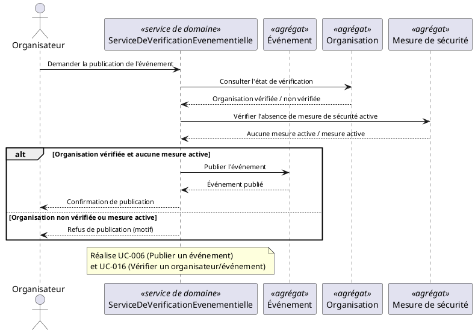

**Choix de modélisation :** la vérification de l'Organisation et l'absence de mesure de sécurité active sont deux consultations **en lecture seule**, effectuées avant toute transition sur l'Événement — c'est ce qui garantit qu'« un événement refusé ne peut pas être publié » (règle de `services-de-domaine.md` §5.1) sans que l'Agrégat Événement n'ait à connaître l'état d'Organisation ou de Mesure de sécurité.

---

## 5. SEQ-02 — Expiration des réservations

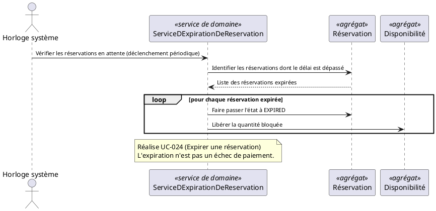

**Choix de modélisation :** la transition d'état de la Réservation et la libération de la Disponibilité sont deux appels distincts du service, jamais une opération unique — c'est la conséquence directe de la séparation de ces deux agrégats déjà justifiée dans `diagrammes-de-classes.md` §6 (isolement de l'invariant à forte contention).

---

## 6. SEQ-03 — Finalisation d'achat

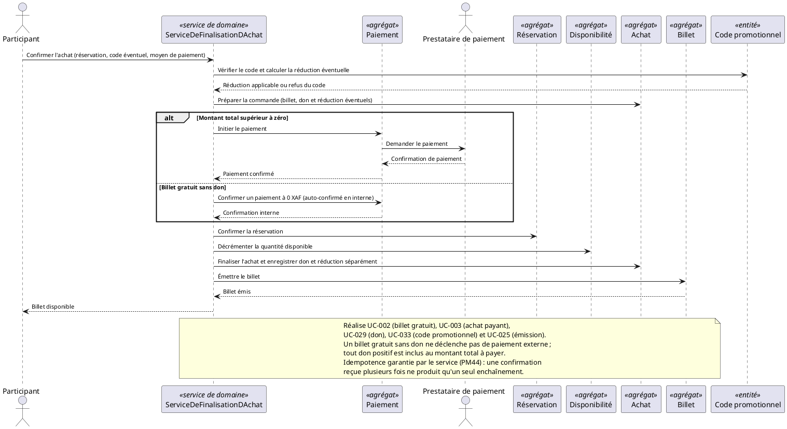

**Choix de modélisation :** l'ordre des cinq derniers messages (Réservation → Disponibilité → Achat → Billet) reprend **exactement** l'ordre de coordination fixé dans `services-de-domaine.md` §6.1 — ce n'est pas un choix de présentation, c'est une contrainte métier : chaque étape doit laisser sa frontière consistante avant que la suivante ne commence. C'est aussi le diagramme où l'exigence d'idempotence (§6.2 de la source) a le plus de poids : c'est explicitement noté, car aucun agrégat seul ne peut la garantir.

---

## 7. SEQ-04 — Réconciliation des paiements tardifs

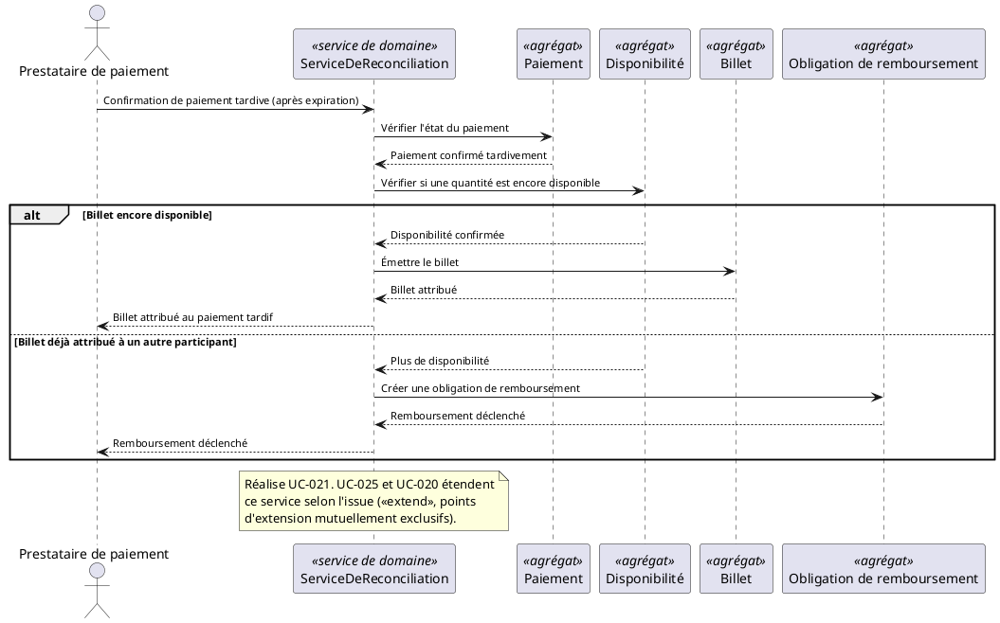

**Choix de modélisation :** le bloc `alt` traduit directement les deux extensions mutuellement exclusives déjà identifiées dans `diagrammes-de-cas-d-utilisation.md` §11 (`UC-025` et `UC-020` étendant `UC-021`). Aucune des deux branches ne modifie le Paiement une deuxième fois — seule la première vérification le fait — ce qui respecte la garantie « un paiement tardif n'est jamais ignoré » sans jamais dupliquer d'effet.

---

## 8. SEQ-05 — Annulation d'événement

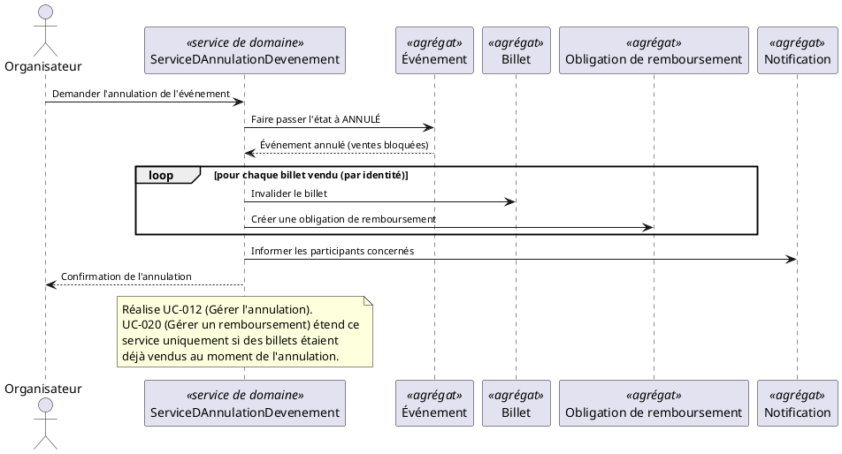

**Choix de modélisation :** l'ordre est figé par `services-de-domaine.md` §6.1 (Événement → Billets → Obligations de remboursement → Notifications). Bloquer les ventes **avant** d'invalider les billets évite une fenêtre où un nouveau billet pourrait être vendu pour un événement déjà en cours d'annulation. Le `loop` est vide (zéro itération) si aucun billet n'a été vendu — c'est précisément ce qui rend `UC-020` conditionnel (`<<extend>>`) plutôt que systématique.

---

## 9. SEQ-06 — Report d'événement

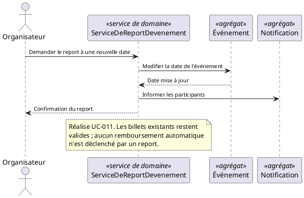

**Choix de modélisation :** volontairement le plus court des dix — `services-de-domaine.md` le décrit lui-même comme presque interne à l'Événement, le service n'existant que pour la coordination avec la Notification. C'est un exemple utile de service "minimal", à mi-chemin entre une opération d'agrégat unique et une orchestration complexe.

---

## 10. SEQ-07 — Contrôle d'accès et mode dégradé

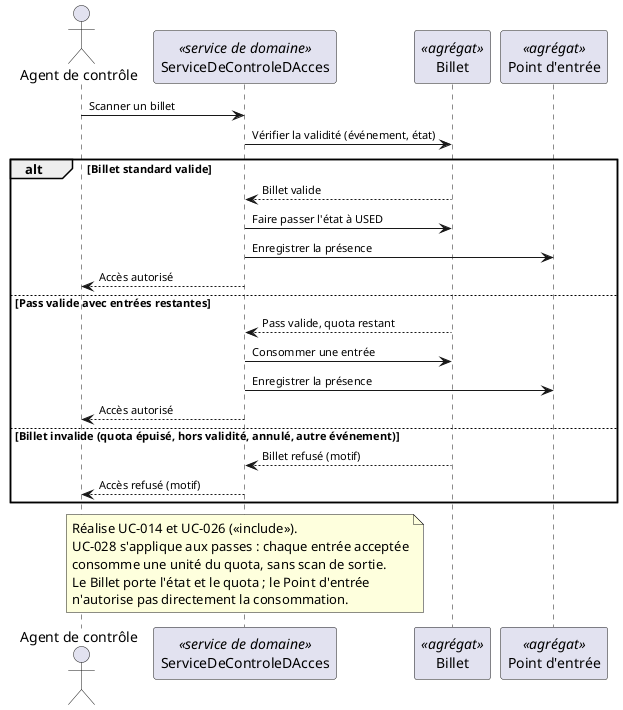

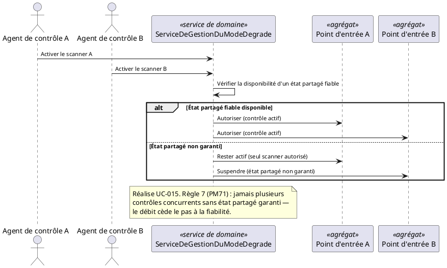

**Choix de modélisation :** deux diagrammes séparés plutôt qu'un seul surchargé, exactement comme `services-de-domaine.md` les traite comme deux services distincts (§5.7) bien qu'ils partagent le même BC-07. `SEQ-07a` place systématiquement la décision sur le Billet — jamais sur le Point d'entrée, qui ne fait qu'enregistrer un fait accompli. `SEQ-07b` illustre un arbitrage de premier ordre : en l'absence d'état partagé fiable entre scanners, Eventix choisit explicitement la fiabilité au détriment du débit (un seul scanner reste actif), conformément à la Règle 7.

---

## 11. SEQ-08 — Clôture financière

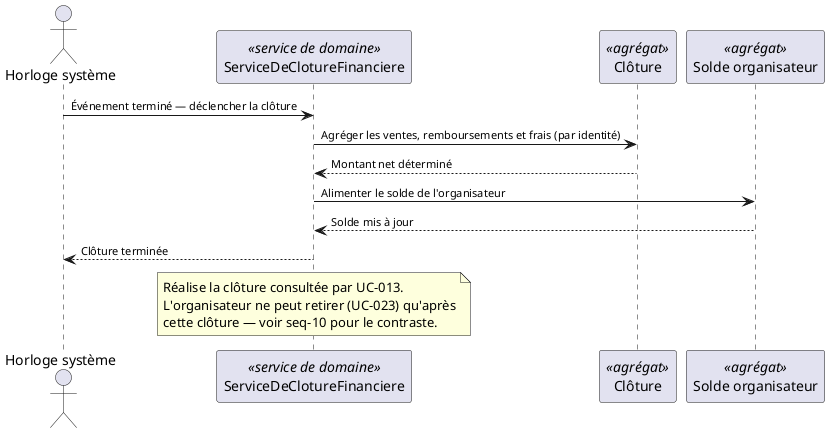

**Choix de modélisation :** la Clôture agrège des données par identité (ventes, remboursements, frais) **avant** de transmettre un montant net unique au Solde — le Solde n'a donc jamais à connaître le détail de l'activité commerciale, exactement comme le justifie `services-de-domaine.md` §5.8.

---

## 12. SEQ-09 — Application d'une mesure de sécurité

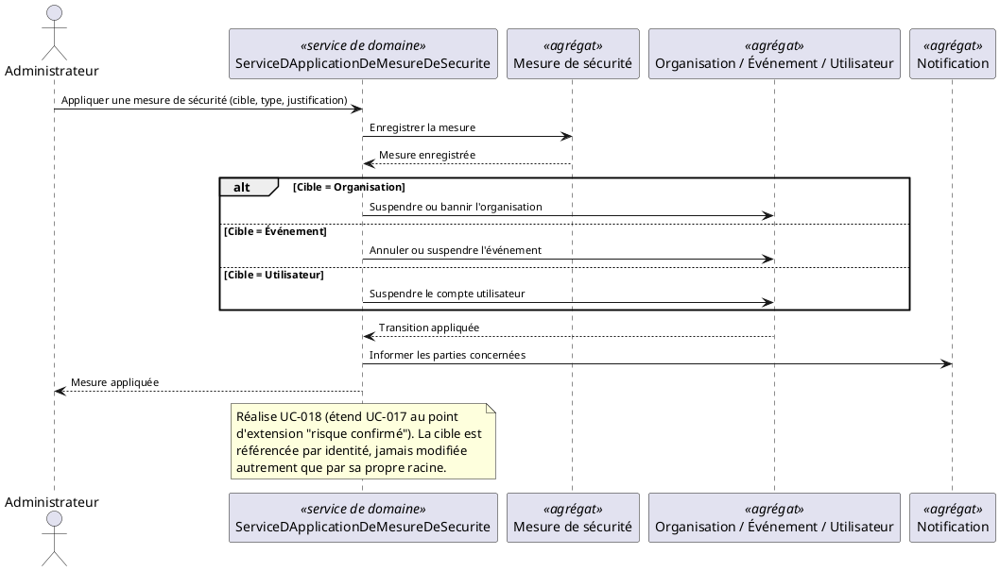

**Choix de modélisation :** les trois branches du `alt` sont représentées explicitement — une par type de cible possible — plutôt que par un participant générique auquel on prêterait un comportement polymorphe. C'est cohérent avec l'absence de POO : sans notion de polymorphisme objet, chaque cas concret doit être écrit noir sur blanc.

---

## 13. SEQ-10 — Contre-exemple : une opération sans service

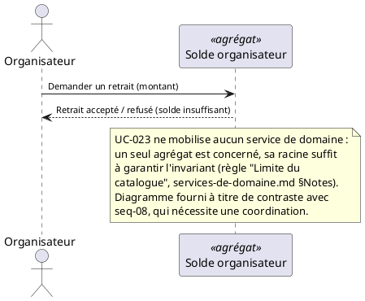

**Pourquoi ce diagramme existe :** il ne réalise aucun service — c'est précisément son intérêt pédagogique. `UC-023` (Effectuer un retrait) suit immédiatement `UC-013`/`SEQ-08` dans le parcours de l'Organisateur, mais contrairement à la Clôture, le Retrait est une opération interne à l'Agrégat Solde organisateur (`agregats.md` en fait un membre en composition — voir `diagrammes-de-classes.md` §9). Sans ce contre-exemple, la distinction "quand un service est-il nécessaire" resterait implicite.

---

## 14. Table de traçabilité

| Diagramme | Service de domaine | UC réalisé(s) | Agrégats coordonnés |
|---|---|---|---|
| SEQ-01 | ServiceDeVerificationEvenementielle | UC-006, UC-016 | Événement, Organisation, Mesure de sécurité |
| SEQ-02 | ServiceDExpirationDeReservation | UC-024 | Réservation, Disponibilité |
| SEQ-03 | ServiceDeFinalisationDAchat | UC-002, UC-003, UC-025, UC-029, UC-033 | Code promotionnel, Paiement, Réservation, Disponibilité, Achat, Billet |
| SEQ-04 | ServiceDeReconciliation | UC-021, UC-025 (extend), UC-020 (extend) | Paiement, Disponibilité, Billet, Obligation de remboursement |
| SEQ-05 | ServiceDAnnulationDevenement | UC-012, UC-020 (extend) | Événement, Billet (n instances), Obligation de remboursement, Notification |
| SEQ-06 | ServiceDeReportDevenement | UC-011 | Événement, Notification |
| SEQ-07a | ServiceDeControleDAcces | UC-014, UC-026, UC-028 (include) | Billet, Point d'entrée |
| SEQ-07b | ServiceDeGestionDuModeDegrade | UC-015 | Point d'entrée (× n scanners) |
| SEQ-08 | ServiceDeClotureFinanciere | UC-013 (lecture) | Clôture, Solde organisateur |
| SEQ-09 | ServiceDApplicationDeMesureDeSecurite | UC-018 (extend de UC-017) | Mesure de sécurité, Organisation/Événement/Utilisateur, Notification |
| SEQ-10 | *(aucun — contre-exemple)* | UC-023 | Solde organisateur |

Les 10 services de `services-de-domaine.md` §7 sont ainsi tous couverts par un diagramme.

---

## 15. Note d'architecture

**Pourquoi le service est toujours le seul participant à parler à plusieurs agrégats ?**
C'est la traduction directe de la règle S5 (« le service ne modifie jamais un agrégat autrement que par sa racine ») et de D2 (référence inter-agrégats par identité). Dans chaque diagramme, aucun agrégat n'envoie jamais de message à un autre agrégat directement — tout passe par le service. C'est l'équivalent structurel du principe d'inversion de dépendance déjà évoqué dans `diagrammes-de-classes.md` §13 : les agrégats ne se connaissent pas entre eux, seul le service connaît l'enchaînement complet.

**Sur l'ordre des messages :** dans chaque diagramme où `services-de-domaine.md` §6.1 fixait un ordre de coordination explicite (`SEQ-03`, `SEQ-05`, `SEQ-08`), cet ordre a été repris à l'identique. Ce n'est jamais un choix de present­ation : c'est ce qui garantit qu'aucune frontière n'est laissée incohérente entre deux étapes — si le service s'interrompt après l'étape 2 sur 5, seules les deux premières frontières ont changé d'état, jamais un état intermédiaire incohérent au sein d'une même frontière.

**Sur l'idempotence (SEQ-03 et SEQ-04) :** ces deux diagrammes portent une exigence explicitement documentée dans `services-de-domaine.md` §6.2. Elle n'est pas représentée par un mécanisme UML dédié (UML n'en propose pas), mais signalée par une note ancrée — cette exigence devra être creusée plus concrètement dans les diagrammes d'activité (gestion des cas d'erreur et de répétition) et de composants (mécanisme technique retenu).

---

## 16. Cas limites et évolutivité

| Cas d'évolution futur | Impact sur ces diagrammes | Pourquoi la modélisation actuelle l'absorbe |
|---|---|---|
| Ajout d'un nouveau moyen de paiement (carte internationale) | Aucun changement à SEQ-03 | Le message "Demander le paiement" au Prestataire de paiement reste inchangé, seul son destinataire technique varie |
| Passage à un vrai multi-scanners simultané (au-delà du MVP) | SEQ-07b s'enrichit d'autant de branches `Point d'entrée` que de scanners | La structure alt/loop absorbe un nombre variable de scanners sans changement de principe |
| Annulation partielle d'un événement (une seule catégorie de billets, pas tout l'événement) | Nouveau service à ajouter, hors périmètre actuel de `services-de-domaine.md` | SEQ-05 reste valide pour le cas d'annulation totale déjà spécifié |
| Automatisation complète de SEQ-09 (mesures de sécurité algorithmiques) | Le déclencheur devient un acteur système plutôt que l'Administrateur | Le corps du diagramme (enregistrement, transition, notification) reste identique |

---

## 17. Hypothèses retenues

1. **L'émission de billet pour un événement gratuit** passe par le même `ServiceDeFinalisationDAchat` qu'un achat payant, avec un paiement à 0 FCFA auto-confirmé — cohérent avec l'hypothèse déjà posée dans `diagramme-de-contexte.md` §9.
2. **SEQ-08 est déclenché par l'Horloge système**, cohérent avec l'acteur déjà introduit dans `diagrammes-de-cas-d-utilisation.md` pour `UC-022`, en l'absence de confirmation sur le caractère automatique ou supervisé de la clôture (clarification déjà ouverte, non résolue).
3. **UC-023 (retrait) ne mobilise aucun service** — hypothèse directement tirée de la note "Limite du catalogue" de `services-de-domaine.md`, aucune réinterprétation.

---

## 18. Points à clarifier avec le client / product owner

| # | Question | Pourquoi c'est important |
|---|---|---|
| 1 | Le mécanisme technique garantissant l'idempotence de `ServiceDeFinalisationDAchat` et `ServiceDeReconciliation` (SEQ-03, SEQ-04) est-il déjà envisagé (clé d'idempotence, verrou, file de messages) ? | Impacte directement le diagramme de composants à venir |
| 2 | En mode dégradé (SEQ-07b), le scanner suspendu doit-il afficher un message explicite à l'Agent de contrôle, ou simplement refuser silencieusement les scans ? | Impacte le diagramme d'activité du contrôle d'accès |
| 3 | `ServiceDeClotureFinanciere` (SEQ-08) est-il strictement automatique dès la fin de l'événement, ou existe-t-il un délai de sûreté avant clôture (ex. attendre l'expiration de tous les délais de contestation) ? | Impacte le diagramme d'état de l'agrégat Clôture |

---

## 19. Statut

| Champ | Valeur |
|---|---|
| Document | diagrammes-de-sequence.md |
| Version | 1.0 |
| Statut | À valider par l'équipe |
| Périmètre | MVP Eventix |
| Marché | Cameroun |
| Notation | PlantUML — UML 2.5 |
| Services couverts | 10/10 (`services-de-domaine.md`) |
| Diagramme suivant | `diagrammes-d-etat.md` |
