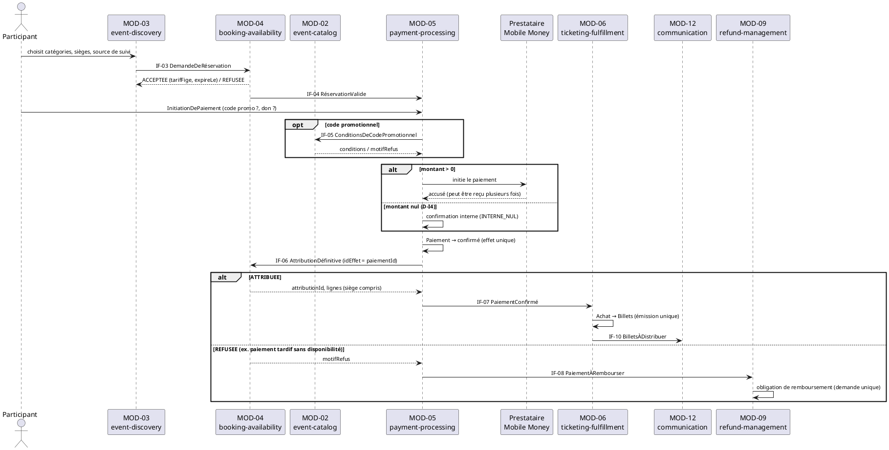
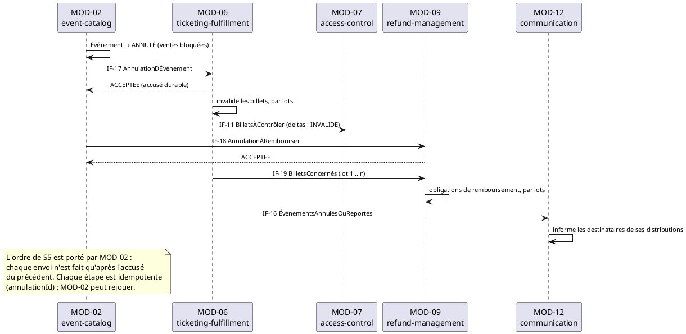
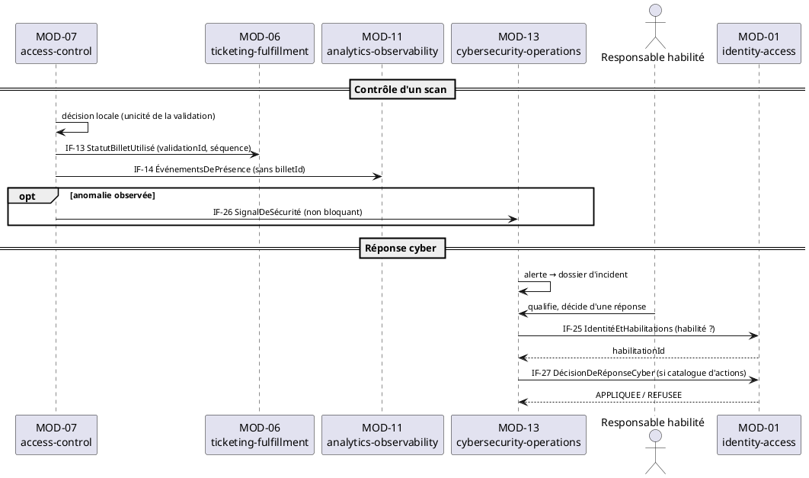

# Interfaces entre modules — Eventix

| Champ | Valeur |
|---|---|
| **Phase** | 07 — Architecture logique |
| **Projet** | Eventix |
| **Périmètre** | MVP |
| **Marché initial** | Cameroun |
| **Sources** | `modules.md` (13 modules, EF-001 → EF-147, arbitrage C1 du 07/10/2026), `responsabilites.md` (v1.1, synchronisée avec `modules.md`) |
| **Notation** | PlantUML — UML 2.5 ; contrats décrits par tableaux de champs logiques |
| **Statut** | Proposition — à valider par l'équipe |
| **Verdict** | **VALIDÉ SOUS CONDITIONS** (voir §15) |

---

## Table des matières

1. [Objectif et portée](#1-objectif-et-portée)
2. [Synchronisation avec les sources modifiées](#2-synchronisation-avec-les-sources-modifiées)
3. [Décisions de conception des contrats](#3-décisions-de-conception-des-contrats)
4. [Règles d'interface et types logiques](#4-règles-dinterface-et-types-logiques)
5. [Catalogue des contrats](#5-catalogue-des-contrats)
6. [Fiches de contrats](#6-fiches-de-contrats)
7. [Contrats conditionnels, non comptés au graphe](#7-contrats-conditionnels-non-comptés-au-graphe)
8. [Scénarios : les contrats en séquence](#8-scénarios--les-contrats-en-séquence)
9. [Impact sur le graphe de dépendances](#9-impact-sur-le-graphe-de-dépendances)
10. [Exigences de livraison pour `communication.md`](#10-exigences-de-livraison-pour-communicationmd)
11. [Écarts relevés dans les sources](#11-écarts-relevés-dans-les-sources)
12. [Interfaces acteur : périmètre](#12-interfaces-acteur--périmètre)
13. [Hypothèses retenues](#13-hypothèses-retenues)
14. [Ce que ce document ne préjuge pas](#14-ce-que-ce-document-ne-préjuge-pas)
15. [Points à clarifier avec le client / product owner](#15-points-à-clarifier-avec-le-client--product-owner)
16. [Statut](#16-statut)

---

## 1. Objectif et portée

`modules.md` a posé les contrats par leur **nom et leur capacité** (hypothèse H2 : « les schémas relèvent de `interfaces.md` »). `responsabilites.md` a dit **qui décide quoi**. Ce document répond à la question suivante :

> **Pour chaque échange entre modules, quelles données circulent, avec quelles garanties, quelles erreurs métier possibles, et quelle idempotence ?**

Il est **neutre vis-à-vis de la technologie** : un contrat est décrit par des champs logiques, des types abstraits, des pré- et post-conditions. Le transport (synchrone ou asynchrone, protocole, sérialisation) relève de `communication.md`. Ce document exprime seulement le **besoin** de couplage temporel de chaque contrat (§10).

Les règles R1 à R8 de `modules.md` et RA1 à RA5 de `responsabilites.md` sont **opposables** à chaque contrat.

---

## 2. Synchronisation avec les sources modifiées

Ce document se fonde sur la version actuelle de `modules.md`. Elle diffère de celle sur laquelle `responsabilites.md` s'appuyait au départ ; `responsabilites.md` est resynchronisé en v1.1 (journal en §17 de ce fichier).

### 2.1. Changements de `modules.md` et leur effet sur les contrats

| Changement | Effet sur les contrats |
|---|---|
| **MOD-13** `cybersecurity-operations` (BF-13/BC-13), EF-145 à EF-147 | 8 relations nouvelles : `IdentitéEtHabilitations`, `DécisionDeRéponseCyber` (×2), `SignalDeSécurité` (×5) — IF-25 à IF-27 |
| Passes avec validité et quota (EF-130 à EF-133) | Champs de pass portés par `ÉvénementPourÉmission`, `BilletsÀContrôler`, `StatutBilletUtilisé` |
| Dons (EF-134 à EF-136) | Ventilation du montant dans `PaiementConfirmé` et `AchatsFinalisés` |
| Modes d'accès sur place, direct, VOD (EF-138, EF-139) | Champs `modesDAcces` ; informations d'accès en ligne dans `BilletsÀDistribuer` |
| Codes promotionnels (EF-140, EF-144) | Nouveau contrat `ConditionsDeCodePromotionnel` (IF-05) — G10 |
| Plan de salle et sièges numérotés (EF-142, EF-143) | Champ `siegeId` propagé de bout en bout — G9 |
| Liens de suivi (EF-141) | Champ `sourceDeSuivi` propagé ; faits `VisiteDeLien` et `AchatFinalisé` — G11 |
| EF-137 (statistiques, MOD-11) | Aucun contrat spécifique : l'intitulé de l'exigence n'est pas dans les sources (CI-13) |
| `StatutBilletUtilisé` arbitré MOD-07 → MOD-06 (C1) | IF-13 sans ambiguïté de cible |
| Faits MOD-11 et éléments MOD-10 « autorisés » au lieu de « tous les modules » | Catalogues explicites de faits (§6.6) |

### 2.2. Correspondance des numéros de flux manquants

`modules.md` a attribué G9 à G12 à de nouveaux flux. Dans `responsabilites.md` v1.0, G9 et G10 désignaient deux autres flux : ils sont **renumérotés G13 et G14**.

| Flux manquant | Contrat ou traitement dans ce document |
|---|---|
| G1 — invalidation des billets après annulation | **IF-17** `AnnulationDÉvénement` (candidat) |
| G2 — remboursements après annulation | **IF-18** `AnnulationÀRembourser` (candidat) |
| G3 — événement gratuit, dons | **D-I4** : parcours unique par MOD-04 puis MOD-05 (proposition) |
| G4 — réservation devenue attribution | **IF-06** `AttributionDéfinitive` (candidat) |
| G5 — billets attribués pour EF-024 | **IF-C2** conditionnel (§7) |
| G6 — exécution des remboursements et retraits | **IF-C1** conditionnel (§7) |
| G7, G8 | Hors contrat : questions de métier toujours ouvertes |
| G9 — sièges numérotés | Champ `siegeId` dans IF-02, IF-03, IF-04, IF-06, IF-07, IF-09, IF-10, IF-11 |
| G10 — codes promotionnels | **IF-05** `ConditionsDeCodePromotionnel` (candidat) |
| G11 — liens de suivi | Champ `sourceDeSuivi` ; faits dans le catalogue §6.6 |
| G12 — supervision cyber | **Résolu** par MOD-13 : IF-25 à IF-27 |
| G13 — frais de la clôture financière | Ouvert (CI-12) : aucun contrat sans propriétaire |
| G14 — information après mesure de sécurité | **IF-C3** conditionnel (§7) |

> **Limite de lecture :** `exigences-fonctionnelles.md`, `agregats.md` et `processus-metier.md` ne figurent pas dans les sources. Les exigences sont citées par leur numéro et par le sens que `modules.md` leur donne. Aucun champ n'est déduit d'un intitulé d'exigence que ces sources ne contiennent pas.

---

## 3. Décisions de conception des contrats

### D-I1 — Quatre natures de contrat

| Nature | Définition | Direction de la décision |
|---|---|---|
| **Commande** | Demande de transition adressée au **propriétaire** de l'agrégat. Peut être refusée (RI8). | L'appelant demande, le propriétaire décide (RA2) |
| **Requête** | Lecture ponctuelle avec réponse, sans effet de bord. | — |
| **Fait** | Publication **immuable** d'une transition déjà effectuée (RI9). L'émetteur ignore ses consommateurs. | L'émetteur a déjà décidé |
| **Instantané** | État dérivé, daté et versionné, republié à chaque changement pertinent. Jamais autoritaire (R7). | — |

### D-I2 — Deux familles de contrats : collaboration et observation

| Axe | Contenu |
|---|---|
| **Décision** | Les échanges nécessaires à un traitement métier (IF-01 à IF-24) sont des **contrats de collaboration** point à point. Les échanges destinés à MOD-10, MOD-11 et MOD-13 sont des **faits d'observation** distincts, minimisés (IF-26, IF-28, IF-29). Un module n'utilise jamais un contrat d'observation pour déclencher un traitement métier chez un autre. |
| **Raisonnement** | R5 interdit qu'une décision métier dépende de MOD-11. `modules.md` impose à MOD-13 des « faits minimaux et filtrés » et à MOD-10 / MOD-11 des éléments « autorisés ». Un contrat de collaboration porte ce dont le destinataire a besoin pour agir ; un fait d'observation ne porte que ce qu'il faut pour compter ou analyser. |
| **Avantages** | Minimisation des données (P7). L'indisponibilité d'un module d'observation ne bloque aucun parcours. Les contrats de collaboration restent stables, car ils ne sont pas élargis pour servir l'analytique. |
| **Inconvénients** | Un même événement métier peut être publié deux fois : en contrat de collaboration (par exemple `PaiementConfirmé` vers MOD-06) et en fait d'observation (`PaiementConfirmé` minimisé vers MOD-11). |
| **Risques** | Divergence entre les deux représentations. Garde-fou : les deux partent du **même** `idEffet`, et le fait d'observation est un sous-ensemble du contrat de collaboration. |
| **Alternative rejetée** | Un seul flux de faits consommé par tous : couplerait les contrats de collaboration aux besoins d'analytique et de sécurité, et exposerait aux modules d'observation des données dont ils n'ont pas besoin. |

### D-I3 — L'attribution (siège compris) est relayée par `PaiementConfirmé`

| Axe | Contenu |
|---|---|
| **Décision** | Le résultat de `AttributionDéfinitive` (lignes attribuées, siège numéroté) est relayé par MOD-05 à MOD-06 dans `PaiementConfirmé`. MOD-04 n'envoie aucun contrat direct à MOD-06. |
| **Raisonnement** | `responsabilites.md` D-R2 a établi que MOD-06 ne parle jamais à MOD-04. Un contrat direct MOD-04 → MOD-06 obligerait MOD-06 à **corréler** deux messages indépendants (`PaiementConfirmé` et l'attribution) avant d'émettre. Le relais produit un seul message auto-suffisant. |
| **Avantages** | Une seule entrée pour l'émission, une seule clé d'idempotence. Pas de jointure ni de problème d'ordre entre deux flux. |
| **Inconvénients** | MOD-05 transporte des champs qu'il ne consulte pas (siège, catégorie). Écart avec le tableau §9 de `modules.md`, qui nomme MOD-06 consommateur de « l'attribution à émettre » de MOD-04 : voir §11, E1. |
| **Risques** | MOD-05 pourrait devenir tentant comme « relais universel ». Garde-fou : seuls des **identifiants opaques** et des quantités sont relayés (R3). |
| **Alternative rejetée** | Contrat direct MOD-04 → MOD-06 `AttributionÀÉmettre` : ajouterait une arête et une jointure sans bénéfice métier. |

### D-I4 — Un seul parcours d'achat, gratuit ou payant (proposition, G3)

| Axe | Contenu |
|---|---|
| **Décision** | Toute commande, y compris gratuite, suit la chaîne MOD-03 → MOD-04 → MOD-05 → MOD-06. Une commande à montant nul est confirmée **en interne** par MOD-05 (`modePaiement = INTERNE_NUL`), sans appel au prestataire. |
| **Raisonnement** | `modules.md` §7.5 établit que le parcours existant « confirme toujours un montant nul en interne, sans appel au prestataire ». Faire passer le gratuit par la même chaîne préserve l'arbitrage de capacité de MOD-04 (EF-034) et unifie l'idempotence. Un don positif sur un billet gratuit (EF-135) devient un cas ordinaire de montant non nul. |
| **Avantages** | Aucun contournement de MOD-04, donc pas de survente sur les événements gratuits. Un seul chemin d'émission. |
| **Inconvénients** | Un événement gratuit traverse MOD-05, qui n'encaisse rien. |
| **Risques** | Les fiches actuelles mentionnent une entrée « achat gratuit (participant) » directe dans MOD-06 : à retirer si D-I4 est validée (§11, E2). |
| **Alternative rejetée** | Entrée directe participant → MOD-06 pour le gratuit : contourne MOD-04 et recrée le risque de survente (G3). |
| **Statut** | **Proposition**, conditionnée à la réponse à C2 de `modules.md` (CI-1). |

---

## 4. Règles d'interface et types logiques

### 4.1. Règles d'interface

| # | Règle | Origine |
|---|---|---|
| **RI1** | **Identifiants opaques.** Un contrat ne contient aucune entité d'un autre module, seulement des identifiants que le module propriétaire a émis. | R3 |
| **RI2** | **Identifiant d'effet.** Tout contrat à effet critique (confirmation, émission, remboursement, retrait, validation d'entrée, attribution) porte un `idEffet` unique par effet. Le récepteur déduplique sur le couple (émetteur, `idEffet`) et renvoie le **même résultat** à un rejeu. | R6, EF-127 |
| **RI3** | **Une capacité par contrat.** Un contrat ne combine pas deux intentions. | R4 |
| **RI4** | **Instantanés datés.** Un instantané porte `version` croissante par clé. Le consommateur garde la plus haute version reçue et ignore une version plus ancienne. | R7 |
| **RI5** | **Évolution compatible.** Ajouter un champ optionnel est compatible ; supprimer, renommer ou changer la sémantique d'un champ est une **nouvelle version majeure**, publiée en parallèle de l'ancienne. Le consommateur ignore les champs inconnus. | P8 |
| **RI6** | **Minimisation.** Aucune donnée de paiement hors MOD-05, aucun secret, aucune donnée personnelle non nécessaire au destinataire. | P7 |
| **RI7** | **Erreurs typées.** Un **refus métier** (définitif, ne doit pas être rejoué) est distinct d'une **erreur transitoire** (peut être rejouée). | EF-127 |
| **RI8** | **Le propriétaire peut refuser.** Une commande ne contourne jamais l'invariant du destinataire. | S5, RA2 |
| **RI9** | **Faits immuables.** Un fait n'est publié qu'après la transition effective. Une correction est un **nouveau** fait. | P5 |
| **RI10** | **Autorisation par contrat.** Chaque fiche déclare l'**émetteur autorisé** : le moindre privilège s'applique entre modules. | P7 |
| **RI11** | **Pas d'accès aux données d'autrui.** Un contrat n'expose pas le stockage interne, seulement ce qui est publié dans l'`api`. | R2 |

### 4.2. Enveloppe commune

Tout contrat porte, en plus de son corps :

| Champ | Type | Obl. | Règle |
|---|---|---|---|
| `versionContrat` | Version | oui | Version majeure.mineure du contrat (RI5) |
| `emetteur` | Identifiant de module | oui | Ex. `MOD-05` ; vérifié contre l'émetteur autorisé (RI10) |
| `emisLe` | Horodatage | oui | Instant d'émission |
| `idEffet` | IdEffet | si effet critique | Voir RI2 ; indiqué « **oui** » dans chaque fiche concernée |

Les tableaux de §6 ne listent que le **corps**.

### 4.3. Types logiques

| Type | Définition |
|---|---|
| `Id` | Identifiant opaque émis par le module propriétaire |
| `IdEffet` | Identifiant unique d'un effet, fourni par l'émetteur (RI2) |
| `Horodatage` | Instant précis, indépendant du fuseau |
| `Montant` | `{ valeur : entier ≥ 0, devise : code }` ; XAF au MVP (hypothèse H3) |
| `Quantite` | Entier ≥ 1 |
| `LigneAttribuee` | `{ categorieId : Id, quantite : Quantite, siegeId : Id? }` ; `siegeId` présent si la catégorie est à places numérotées |
| `Enum` | Valeur d'un ensemble fermé, listé dans la fiche |

> Les noms de champs sont en français sans accents (ex. `evenementId`). La convention de nommage du code est une question ouverte (C8 de `modules.md`).

---

## 5. Catalogue des contrats

`Statut` : **E** = nommé dans `modules.md` (contenu précisé ici) · **C** = candidat introduit par `responsabilites.md` ou ce document · **T** = transversal.

| ID | Contrat | Nature | Émetteur → Récepteur | Statut | Besoin de couplage | Effet critique |
|---|---|---|---|---|---|---|
| IF-01 | `ÉvénementsPubliés` | Instantané | MOD-02 → MOD-03 | E | Asynchrone toléré | non |
| IF-02 | `CatégoriesEtDisponibilités` | Instantané | MOD-02 → MOD-04 | E | Asynchrone toléré | non |
| IF-03 | `DemandeDeRéservation` | Commande | MOD-03 → MOD-04 | E | Réponse attendue | **oui** |
| IF-04 | `RéservationValide` | Fait | MOD-04 → MOD-05 | E | Livraison au moins une fois | **oui** |
| IF-05 | `ConditionsDeCodePromotionnel` | Requête | MOD-02 → MOD-05 | C | Réponse attendue | non |
| IF-06 | `AttributionDéfinitive` | Commande | MOD-05 → MOD-04 | C | Réponse attendue | **oui** |
| IF-07 | `PaiementConfirmé` | Fait | MOD-05 → MOD-06 | E | Livraison au moins une fois | **oui** |
| IF-08 | `PaiementÀRembourser` | Fait | MOD-05 → MOD-09 | E | Livraison au moins une fois | **oui** |
| IF-09 | `ÉvénementPourÉmission` | Instantané | MOD-02 → MOD-06 | E | Asynchrone toléré | non |
| IF-10 | `BilletsÀDistribuer` | Fait | MOD-06 → MOD-12 | E | Livraison au moins une fois | **oui** |
| IF-11 | `BilletsÀContrôler` | Instantané + deltas | MOD-06 → MOD-07 | E | Asynchrone, ordre par billet | non |
| IF-12 | `ÉvénementEtPointsDEntrée` | Instantané | MOD-02 → MOD-07 | E | Asynchrone toléré | non |
| IF-13 | `StatutBilletUtilisé` | Fait | MOD-07 → MOD-06 | E (arbitré C1) | Livraison au moins une fois, ordre par billet | **oui** |
| IF-14 | `ÉvénementsDePrésence` | Fait | MOD-07 → MOD-11 | E | Asynchrone toléré | non |
| IF-15 | `OrganisateurAutorisé` | Requête | MOD-01 → MOD-02 | E | Réponse attendue | non |
| IF-16 | `ÉvénementsAnnulésOuReportés` | Fait | MOD-02 → MOD-12 | E | Livraison au moins une fois | **oui** |
| IF-17 | `AnnulationDÉvénement` | Commande | MOD-02 → MOD-06 | C | Accusé attendu | **oui** |
| IF-18 | `AnnulationÀRembourser` | Commande | MOD-02 → MOD-09 | C | Accusé attendu | **oui** |
| IF-19 | `BilletsConcernés` | Fait (par lots) | MOD-06 → MOD-09 | E | Livraison au moins une fois | **oui** |
| IF-20 | `AchatsFinalisés` | Fait | MOD-06 → MOD-08 | E | Livraison au moins une fois | **oui** |
| IF-21 | `RemboursementsTraités` | Fait | MOD-09 → MOD-08 | E | Livraison au moins une fois | **oui** |
| IF-22 | `MesuresDeSécurité` | Commande | MOD-10 → MOD-01 | E | Accusé attendu | **oui** |
| IF-23 | `DécisionsDeSécurité` | Commande | MOD-10 → MOD-02 | E | Accusé attendu | **oui** |
| IF-24 | `IdentitéDesActeurs` | Requête (vues) | MOD-01 → tous | T | Réponse attendue | non |
| IF-25 | `IdentitéEtHabilitations` | Requête | MOD-01 → MOD-13 | E | Réponse attendue | non |
| IF-26 | `SignalDeSécurité` | Fait minimisé | MOD-01, 02, 05, 06, 07 → MOD-13 | E | Non bloquant | non |
| IF-27 | `DécisionDeRéponseCyber` | Commande | MOD-13 → MOD-01, MOD-02 | E | Accusé attendu | **oui** |
| IF-28 | `FaitMétier` | Fait minimisé | MOD-01 à 12 → MOD-11 | T | Non bloquant | non |
| IF-29 | `ÉlémentDAnalyse` | Fait minimisé | modules concernés → MOD-10 | T | Non bloquant | non |

**Bilan :** 27 relations nommées par `modules.md` (IF-01 à IF-04, 07 à 16, 19 à 23, 25 à 27, dont IF-26 ×5 et IF-27 ×2) auxquelles s'ajoutent **4 candidats** (IF-05, IF-06, IF-17, IF-18) = **31 relations**. IF-24, IF-28, IF-29 sont transversaux, non comptés (`modules.md` §8).

---

## 6. Fiches de contrats

Convention de lecture des fiches : **Propriétaire** = module dont l'`api` publie le contrat (R3). Les erreurs sont des codes logiques. Les contrats se lisent avec l'enveloppe de §4.2.

### 6.1. Chaîne d'achat

#### IF-01 — `ÉvénementsPubliés`

| Champ | Valeur |
|---|---|
| **Nature / sens** | Instantané · MOD-02 → MOD-03 |
| **Propriétaire / émetteur autorisé** | MOD-02 |
| **Objet** | Exposer les événements publiés à la découverte |
| **Déclencheur** | Publication, modification pertinente, retrait de publication, annulation, report |
| **Services** | S1 (publication), S5, S6 |
| **Exigences** | EF-025 à EF-029, EF-138, EF-142 |

| Champ | Type | Obl. | Règle |
|---|---|---|---|
| `evenementId` | Id | oui | |
| `version` | entier | oui | Croissant par événement (RI4) |
| `etat` | Enum | oui | `PUBLIE`, `VENTES_ARRETEES`, `ANNULE`, `REPORTE`, `RETIRE` |
| `titre`, `description`, `debut`, `fin`, `lieu` | texte / Horodatage | oui | Données d'affichage |
| `modesDAcces` | liste d'Enum | oui | `SUR_PLACE`, `DIRECT`, `VOD` (EF-138) |
| `categories` | liste | oui | `{ categorieId, libelle, tarif : Montant, disponibiliteIndicative : Enum? }` |
| `planDeSalleDisponible` | booléen | oui | Indique des places numérotées (EF-142) |
| `donsSuggeres` | booléen | oui | Activation des dons (EF-134) |

**Garanties :** un événement non publié n'apparaît jamais ; la disponibilité est **indicative** et n'engage pas MOD-04 (`responsabilites.md` §6.3). **Erreurs :** aucune (diffusion).

#### IF-02 — `CatégoriesEtDisponibilités`

| Champ | Valeur |
|---|---|
| **Nature / sens** | Instantané · MOD-02 → MOD-04 |
| **Propriétaire / émetteur autorisé** | MOD-02 |
| **Objet** | Donner à MOD-04 la capacité configurée par catégorie, le tarif et le plan de salle |
| **Déclencheur** | Création, modification de capacité, modification de plan |
| **Exigences** | EF-016 à EF-024, EF-119, EF-142, EF-143 |

| Champ | Type | Obl. | Règle |
|---|---|---|---|
| `evenementId`, `version` | Id, entier | oui | |
| `venteOuverte` | booléen | oui | Faux dès annulation ou arrêt des ventes |
| `categories` | liste | oui | `{ categorieId, capacite : entier, tarif : Montant, numerotee : booléen }` |
| `plan` | liste | si `numerotee` | `{ categorieId, sieges : liste de { siegeId, zoneId? } }` |

**Garanties :** MOD-04 ne vend jamais plus que `capacite` (EF-034). Une réduction de capacité sous l'attribué est refusée par MOD-02 (EF-024) : elle suppose de connaître l'attribué (IF-C2, §7).

#### IF-03 — `DemandeDeRéservation`

| Champ | Valeur |
|---|---|
| **Nature / sens** | Commande · MOD-03 → MOD-04 |
| **Propriétaire / émetteur autorisé** | MOD-04 · MOD-03 |
| **Objet** | Demander l'attribution **temporaire** d'unités |
| **Services** | Amont de S3 |
| **Exigences** | EF-030 à EF-034, EF-143 |
| **idEffet** | **oui** (une demande rejouée ne crée pas deux réservations) |

| Champ | Type | Obl. | Règle |
|---|---|---|---|
| `evenementId` | Id | oui | |
| `acheteurId` | Id | oui | Via `IdentitéDesActeurs` (CI-10) |
| `lignes` | liste de `{ categorieId, quantite, siegeId? }` | oui | `siegeId` obligatoire si catégorie numérotée |
| `sourceDeSuivi` | Id? | non | Propagée telle quelle (EF-141) |

**Réponse :** `ACCEPTEE` avec `reservationId`, `tarifFige : Montant` par ligne et `expireLe : Horodatage` ; ou `REFUSEE`.
**Refus métier :** `PLUS_DE_DISPONIBILITE`, `SIEGE_INDISPONIBLE`, `VENTE_FERMEE`, `QUANTITE_INVALIDE`. Une demande est **tout ou rien** (CI-3).
**Garantie :** une seule réservation concurrente d'un même siège aboutit (EF-143).

#### IF-04 — `RéservationValide`

| Champ | Valeur |
|---|---|
| **Nature / sens** | Fait · MOD-04 → MOD-05 |
| **Propriétaire / émetteur autorisé** | MOD-04 |
| **Objet** | Annoncer une réservation payable, avec le tarif figé |
| **Services** | S3 (début) |
| **idEffet** | **oui** |

| Champ | Type | Obl. | Règle |
|---|---|---|---|
| `reservationId`, `evenementId`, `acheteurId` | Id | oui | |
| `lignes` | liste de `{ categorieId, quantite, siegeId?, tarifFige : Montant }` | oui | Tarif **figé à la réservation** (H4) |
| `expireLe` | Horodatage | oui | |
| `sourceDeSuivi` | Id? | non | |

**Garantie :** MOD-05 peut initier le paiement sans interroger MOD-02 ni MOD-04 sur le prix. **Note :** MOD-04 transporte des montants sans les calculer ni les interpréter.

#### IF-05 — `ConditionsDeCodePromotionnel` (candidat, G10)

| Champ | Valeur |
|---|---|
| **Nature / sens** | Requête · MOD-02 → MOD-05 (MOD-05 interroge, MOD-02 répond) |
| **Propriétaire / émetteur autorisé** | MOD-02 · MOD-05 |
| **Objet** | Fournir les conditions d'un code, **sans jamais calculer** la réduction |
| **Exigences** | EF-140, EF-144 |

| Champ de la demande | Type | Obl. | Règle |
|---|---|---|---|
| `evenementId`, `code` | Id, texte | oui | |
| `categorieIds` | liste d'Id | oui | Pour tester l'applicabilité |
| `momentLe` | Horodatage | oui | Pour la fenêtre de validité |

| Champ de la réponse | Type | Règle |
|---|---|---|
| `applicable` | booléen | |
| `conditions` | structure | `{ typeReduction : Enum (POURCENTAGE, MONTANT_FIXE), valeur, categoriesVisees, fenetre, plafondUtilisations? }` |
| `motifRefus` | Enum | `CODE_INCONNU`, `HORS_FENETRE`, `NON_APPLICABLE`, `EPUISE` |

**Répartition :** MOD-02 reste propriétaire de la configuration ; MOD-05 reste responsable du montant à payer (G10). **Point ouvert :** le décompte des utilisations (cumul, plafond) n'a pas de propriétaire (CI-5).

#### IF-06 — `AttributionDéfinitive` (candidat, G4)

| Champ | Valeur |
|---|---|
| **Nature / sens** | Commande · MOD-05 → MOD-04 |
| **Propriétaire / émetteur autorisé** | MOD-04 · MOD-05 |
| **Objet** | Transformer une réservation en attribution définitive, ou en obtenir une nouvelle si la réservation a expiré |
| **Services** | S3 (hôte MOD-05), S4 |
| **Décision** | D-R2 de `responsabilites.md` |
| **Exigences** | EF-032, EF-033, EF-034, EF-041, EF-042, EF-143 |
| **idEffet** | **oui** (valeur : `paiementId`) |

| Champ de la demande | Type | Obl. | Règle |
|---|---|---|---|
| `paiementId`, `reservationId` | Id | oui | MOD-04 retrouve les lignes dans sa propre réservation |

| Champ de la réponse | Type | Règle |
|---|---|---|
| `resultat` | Enum | `ATTRIBUEE` ou `REFUSEE` |
| `attributionId` | Id | si `ATTRIBUEE` |
| `lignes` | liste de `LigneAttribuee` | si `ATTRIBUEE` |
| `origine` | Enum | `RESERVATION_VALIDE` ou `NOUVELLE_ATTRIBUTION` (informatif) |
| `motifRefus` | Enum | `PLUS_DE_DISPONIBILITE`, `SIEGE_INDISPONIBLE`, `VENTE_FERMEE`, `RESERVATION_INCONNUE` |

**Préconditions :** le paiement est confirmé dans MOD-05.
**Postconditions :** si `ATTRIBUEE`, la disponibilité est définitivement consommée, la réservation est close et **n'expirera plus**. Si `REFUSEE`, rien n'est consommé.
**Idempotence :** un rejeu avec le même `idEffet` renvoie le **même** résultat, sans nouvelle consommation.
**Règle :** MOD-04 répond **seulement** sur la disponibilité ; l'issue (billet ou remboursement) est décidée par MOD-05 (`responsabilites.md` §8).
**Erreur transitoire :** `INDISPONIBLE_TEMPORAIREMENT` (rejouable). Un refus métier n'est jamais rejoué.

#### IF-07 — `PaiementConfirmé`

| Champ | Valeur |
|---|---|
| **Nature / sens** | Fait · MOD-05 → MOD-06 |
| **Propriétaire / émetteur autorisé** | MOD-05 |
| **Objet** | Déclencher **une seule** émission, avec l'attribution déjà garantie |
| **Services** | S3 (fin de la séquence MOD-05, début de celle de MOD-06) |
| **Exigences** | EF-038, EF-039, EF-042 à EF-044, EF-052, EF-131, EF-135, EF-136, EF-143, EF-144 |
| **idEffet** | **oui** (valeur : `paiementId`) |

| Champ | Type | Obl. | Règle |
|---|---|---|---|
| `paiementId`, `attributionId`, `reservationId` | Id | oui | |
| `evenementId`, `acheteurId` | Id | oui | |
| `lignes` | liste de `LigneAttribuee` | oui | Relayées de IF-06 (D-I3) |
| `montantBillets` | Montant | oui | Après réduction |
| `reduction` | Montant | oui | 0 si aucune (EF-144) |
| `don` | Montant | oui | 0 si aucun ; **conservé séparément** (EF-135, EF-136) |
| `montantTotal` | Montant | oui | `montantBillets + don` |
| `modePaiement` | Enum | oui | `MOBILE_MONEY` ou `INTERNE_NUL` (D-I4) |
| `sourceDeSuivi` | Id? | non | |
| `confirmeLe` | Horodatage | oui | |

**Invariant :** jamais publié avant que MOD-04 ait répondu `ATTRIBUEE`.
**Idempotence :** MOD-06 émet **au plus un** achat et un jeu de billets par `paiementId`, même si ce fait est reçu plusieurs fois ou si l'émission a échoué techniquement et est rejouée (EF-052).
**Pas de réponse attendue :** l'échec d'émission est un problème interne de MOD-06, qui doit pouvoir rejouer sans perdre le fait (§10).

#### IF-08 — `PaiementÀRembourser`

| Champ | Valeur |
|---|---|
| **Nature / sens** | Fait · MOD-05 → MOD-09 |
| **Propriétaire / émetteur autorisé** | MOD-05 |
| **Objet** | Constater qu'un paiement confirmé ne peut pas devenir un billet |
| **Services** | S4 |
| **Exigences** | EF-041, EF-081 |
| **idEffet** | **oui** (valeur : `paiementId`) |

| Champ | Type | Obl. | Règle |
|---|---|---|---|
| `paiementId`, `evenementId`, `acheteurId` | Id | oui | |
| `montantPaye` | Montant | oui | Total payé, don compris |
| `motif` | Enum | oui | `PAIEMENT_TARDIF_SANS_DISPONIBILITE`, `ATTRIBUTION_REFUSEE` |
| `constateLe` | Horodatage | oui | |

**Règle :** MOD-05 **constate**, MOD-09 **possède l'obligation** et le montant de référence (T2 de `responsabilites.md`). **Garantie :** un paiement tardif n'est jamais ignoré (EF-041).

#### IF-09 — `ÉvénementPourÉmission`

| Champ | Valeur |
|---|---|
| **Nature / sens** | Instantané · MOD-02 → MOD-06 |
| **Propriétaire / émetteur autorisé** | MOD-02 |
| **Objet** | Fournir à MOD-06 ce qui figure sur le billet et ce qui conditionne l'émission |
| **Exigences** | EF-042, EF-130, EF-131, EF-138 |

| Champ | Type | Obl. | Règle |
|---|---|---|---|
| `evenementId`, `version` | Id, entier | oui | Republié à chaque report ou annulation (RI4) |
| `organisateurId` | Id | oui | |
| `etat` | Enum | oui | Comme IF-01 |
| `debut`, `fin`, `titre`, `lieu` | Horodatage / texte | oui | |
| `categories` | liste | oui | `{ categorieId, libelle, modesDAcces, pass? : { validiteDebut, validiteFin, quotaInitial : entier } }` |

**Garantie :** un report met à jour `version` sans invalider les billets (S6, EF-078).

#### IF-10 — `BilletsÀDistribuer`

| Champ | Valeur |
|---|---|
| **Nature / sens** | Fait · MOD-06 → MOD-12 |
| **Propriétaire / émetteur autorisé** | MOD-06 |
| **Objet** | Faire parvenir un billet émis ou transféré à son titulaire |
| **Exigences** | EF-050, EF-121 à EF-123, EF-139 |
| **idEffet** | **oui** (valeur : `billetId` + numéro de titulaire) |

| Champ | Type | Obl. | Règle |
|---|---|---|---|
| `billetId`, `achatId`, `evenementId` | Id | oui | |
| `titulaireId` | Id | oui | Actuel propriétaire actif ; nouveau fait à chaque transfert |
| `modeDAcces` | Enum | oui | `SUR_PLACE`, `DIRECT`, `VOD` |
| `siegeId` | Id? | non | |
| `affichage` | structure | oui | `{ titre, debut, lieu }` : instantané d'affichage |
| `referenceDeConsultation` | Id | oui | Pour que le participant ouvre son billet |
| `informationsAccesEnLigne` | structure? | si `DIRECT` ou `VOD` | Source et sensibilité à confirmer (CI-7) |

**Règle :** MOD-12 retient les destinataires de ses propres distributions : il en déduit qui informer en cas d'annulation ou de report (`IF-16`). **Garantie :** un échec d'envoi n'invalide pas le billet.

### 6.2. Contrôle d'accès

#### IF-11 — `BilletsÀContrôler`

| Champ | Valeur |
|---|---|
| **Nature / sens** | Instantané complet **puis deltas** · MOD-06 → MOD-07 |
| **Propriétaire / émetteur autorisé** | MOD-06 |
| **Objet** | Donner à MOD-07 ce qu'il faut pour décider d'un scan, y compris hors connexion |
| **Exigences** | EF-057, EF-058 à EF-071, EF-130 à EF-133 |

| Champ | Type | Obl. | Règle |
|---|---|---|---|
| `evenementId`, `version` | Id, entier | oui | Version croissante par événement |
| `type` | Enum | oui | `INSTANTANE` ou `DELTA` |
| `billets` | liste | oui | Voir ci-dessous |

Élément de `billets` :

| Champ | Type | Règle |
|---|---|---|
| `billetId` | Id | |
| `empreinteDeCode` | texte | Représentation **non réversible** du code présenté au scan (RI6) |
| `categorieId`, `siegeId?` | Id | |
| `etat` | Enum | `VALIDE`, `INVALIDE`, `UTILISE`, `EPUISE` |
| `pass?` | structure | `{ validiteDebut, validiteFin, quotaRestantConnu }` |

**Contraintes :** l'instantané est **paginé** (volume inconnu, H6) ; les deltas sont **ordonnés par `version`**. MOD-07 peut recevoir un instantané périmé : en mode dégradé, la réintégration réconcilie (EF-071).
**Pas de donnée personnelle :** MOD-07 n'a pas besoin du nom du titulaire.

#### IF-12 — `ÉvénementEtPointsDEntrée`

| Champ | Valeur |
|---|---|
| **Nature / sens** | Instantané · MOD-02 → MOD-07 |
| **Propriétaire / émetteur autorisé** | MOD-02 |
| **Objet** | Donner à MOD-07 le cadre du contrôle |
| **Exigences** | EF-057, EF-138 |

| Champ | Type | Obl. | Règle |
|---|---|---|---|
| `evenementId`, `version` | Id, entier | oui | |
| `etat` | Enum | oui | Un événement annulé interdit tout accès |
| `ouvertureDebut`, `ouvertureFin` | Horodatage | oui | |
| `modesDAcces` | liste d'Enum | oui | Seul `SUR_PLACE` appelle un contrôle |
| `zonesDAcces` | liste | oui | `{ zoneId, libelle, categoriesAutorisees : liste d'Id }` |

**Point ouvert :** `zonesDAcces` est la matière à partir de laquelle MOD-07 forme ses points d'entrée ; l'origine exacte de l'agrégat Point d'entrée reste à trancher (CR8 de `responsabilites.md`).

#### IF-13 — `StatutBilletUtilisé` (arbitré C1)

| Champ | Valeur |
|---|---|
| **Nature / sens** | Fait · MOD-07 → MOD-06 |
| **Propriétaire / émetteur autorisé** | MOD-06 (api) · MOD-07 émetteur |
| **Objet** | Informer MOD-06 qu'une entrée a été **acceptée** par MOD-07 |
| **Services** | S7 |
| **Décision** | T1 : MOD-07 décide l'unicité de la validation, MOD-06 écrit l'état du billet |
| **Exigences** | EF-066, EF-067, EF-070, EF-071, EF-132, EF-133 |
| **idEffet** | **oui** (valeur : `validationId`, unique par entrée acceptée) |

| Champ | Type | Obl. | Règle |
|---|---|---|---|
| `validationId` | Id | oui | |
| `billetId`, `evenementId`, `pointDEntreeId` | Id | oui | |
| `sequence` | entier | oui | Strictement croissant **par billet**, attribué par MOD-07 |
| `validePar` | Id? | non | Opérateur ou scanner, référence opaque |
| `valideLe` | Horodatage | oui | Instant du scan (horloge du scanner) |
| `modeDegrade` | booléen | oui | Vrai si validé hors connexion (EF-070) |
| `quotaRestant` | entier? | si pass | Après décrément (EF-132) |

**Règles de réception par MOD-06 :** un billet simple passe à `UTILISE`. Un pass passe à `EPUISE` quand `quotaRestant = 0`. Un rejeu (même `validationId`) est ignoré.
**Ne jamais rejeter :** MOD-06 **enregistre** toujours le fait. L'entrée a déjà eu lieu physiquement. Si le billet était déjà invalidé dans MOD-06 (annulation intervenue hors connexion), MOD-06 conserve le fait et publie un `SignalDeSécurité` d'anomalie (IF-26).
**Risque connu :** MOD-06 est en retard sur le scan. Entre les deux, un transfert du billet pourrait être accepté (CI-6, CR1 de `responsabilites.md`).

#### IF-14 — `ÉvénementsDePrésence`

| Champ | Valeur |
|---|---|
| **Nature / sens** | Fait · MOD-07 → MOD-11 |
| **Propriétaire / émetteur autorisé** | MOD-11 (api) · MOD-07 émetteur |
| **Objet** | Alimenter les statistiques de présence (EF-103) |

| Champ | Type | Obl. | Règle |
|---|---|---|---|
| `validationId` | Id | oui | Même valeur que IF-13 : corrélation sans copie |
| `evenementId`, `pointDEntreeId`, `categorieId` | Id | oui | |
| `valideLe` | Horodatage | oui | |
| `modeDegrade` | booléen | oui | |

**Règle :** ni `billetId` ni identité du titulaire (RI6). MOD-11 compte, il ne décide pas (R5).

### 6.3. Cycle de vie de l'événement

#### IF-15 — `OrganisateurAutorisé`

| Champ | Valeur |
|---|---|
| **Nature / sens** | Requête · MOD-01 → MOD-02 |
| **Propriétaire / émetteur autorisé** | MOD-01 |
| **Objet** | Dire si un acteur peut créer ou publier pour une organisation, et dans quel état de vérification |
| **Services** | S1 |
| **Exigences** | EF-005, EF-006, EF-014, EF-015 |

| Demande | Réponse |
|---|---|
| `acteurId`, `organisationId?` | `autorise : booléen` · `organisationVerifiee : booléen?` · `motifRefus : Enum` (`NON_ORGANISATEUR`, `ORGANISATION_NON_VERIFIEE`, `COMPTE_SUSPENDU`) |

**Règle :** MOD-01 **fournit l'état** ; MOD-02 **décide** de la publication (S1). La réponse reflète l'état au moment de la demande ; elle n'est jamais mise en cache comme vérité (R7).

#### IF-16 — `ÉvénementsAnnulésOuReportés`

| Champ | Valeur |
|---|---|
| **Nature / sens** | Fait · MOD-02 → MOD-12 |
| **Propriétaire / émetteur autorisé** | MOD-02 |
| **Objet** | Déclencher l'information des participants |
| **Services** | S5, S6 |
| **Exigences** | EF-072, EF-073, EF-075, EF-077 à EF-079 |
| **idEffet** | **oui** |

| Champ | Type | Obl. | Règle |
|---|---|---|---|
| `evenementId` | Id | oui | |
| `nature` | Enum | oui | `ANNULE` ou `REPORTE` |
| `annulationId` | Id | si `ANNULE` | Lie à IF-17 et IF-18 |
| `nouveauDebut`, `nouvelleFin` | Horodatage | si `REPORTE` | |
| `effectueLe` | Horodatage | oui | |

**Garantie :** un report ne déclenche **aucun** remboursement (EF-078). MOD-12 retrouve les destinataires dans ses propres distributions (IF-10).

#### IF-17 — `AnnulationDÉvénement` (candidat, G1)

| Champ | Valeur |
|---|---|
| **Nature / sens** | Commande · MOD-02 → MOD-06 |
| **Propriétaire / émetteur autorisé** | MOD-06 · MOD-02 |
| **Objet** | Demander l'invalidation de **tous** les billets d'un événement annulé |
| **Services** | S5 (hôte MOD-02) |
| **Exigences** | EF-074 |
| **idEffet** | **oui** (valeur : `annulationId`) |

| Champ | Type | Obl. | Règle |
|---|---|---|---|
| `annulationId`, `evenementId` | Id | oui | |
| `motif` | Enum | oui | `DEMANDE_ORGANISATEUR`, `DECISION_DE_SECURITE` ; extensible |
| `annuleLe` | Horodatage | oui | |

**Réponse :** `ACCEPTEE` (prise en compte **durable**, pas achèvement). MOD-06 invalide ensuite les billets **par lots**, sans limite de nombre.
**Ordre de S5 porté par MOD-02 :** l'événement est annulé d'abord, puis IF-17 est envoyée, et IF-18 puis IF-16 ne partent qu'après son accusé.
**Idempotence :** un rejeu ne réinvalide rien et ne réémet pas de `BilletsConcernés` déjà publiés.
**Reprise :** MOD-02 **rejoue** tant qu'il n'a pas reçu l'accusé. Chaque étape est idempotente, donc aucun suivi persistant d'avancement n'est requis dans l'hôte (hypothèse H4 de `responsabilites.md`, à valider en CR4).

#### IF-18 — `AnnulationÀRembourser` (candidat, G2)

| Champ | Valeur |
|---|---|
| **Nature / sens** | Commande · MOD-02 → MOD-09 |
| **Propriétaire / émetteur autorisé** | MOD-09 · MOD-02 |
| **Objet** | Ouvrir le traitement des obligations de remboursement d'un événement annulé |
| **Services** | S5 |
| **Exigences** | EF-076, EF-080, EF-086 |
| **idEffet** | **oui** (valeur : `annulationId`) |

| Champ | Type | Obl. | Règle |
|---|---|---|---|
| `annulationId`, `evenementId` | Id | oui | |
| `motif` | Enum | oui | Comme IF-17 |
| `annuleLe` | Horodatage | oui | |

**Réponse :** `ACCEPTEE`. MOD-09 **ne reçoit ni liste d'achats ni montants** : il les obtient par IF-19, et le montant de référence est sa décision (EF-082).
**Règle :** MOD-02 déclenche, MOD-09 possède les obligations.

### 6.4. Boucle financière

#### IF-19 — `BilletsConcernés`

| Champ | Valeur |
|---|---|
| **Nature / sens** | Fait par **lots** · MOD-06 → MOD-09 |
| **Propriétaire / émetteur autorisé** | MOD-09 (api) · MOD-06 émetteur |
| **Objet** | Dire à MOD-09 quels achats sont concernés par une annulation |
| **Services** | S5 |
| **Exigences** | EF-076, EF-086 |
| **idEffet** | **oui** (valeur : `annulationId` + numéro de lot) |

| Champ | Type | Obl. | Règle |
|---|---|---|---|
| `annulationId`, `evenementId` | Id | oui | |
| `lot`, `lotsTotal` | entier | oui | |
| `achats` | liste | oui | `{ achatId, paiementId, acheteurId, montantPaye : Montant, don : Montant, billetsInvalides : entier }` |

**Règle :** MOD-09 traite chaque lot **sans état global bloquant** (EF-086). Les lots sont indépendants et rejouables. **Aucune donnée de prestataire** n'y figure (RI6).

#### IF-20 — `AchatsFinalisés`

| Champ | Valeur |
|---|---|
| **Nature / sens** | Fait · MOD-06 → MOD-08 |
| **Propriétaire / émetteur autorisé** | MOD-08 (api) · MOD-06 émetteur |
| **Objet** | Fournir à la clôture les ventes à consolider |
| **Services** | S9 (lecture) |
| **Exigences** | EF-105 à EF-108 |
| **idEffet** | **oui** (valeur : `achatId`) |

| Champ | Type | Obl. | Règle |
|---|---|---|---|
| `achatId`, `paiementId`, `evenementId`, `organisateurId` | Id | oui | |
| `montantBillets`, `reduction`, `don` | Montant | oui | Ventilation de IF-07 |
| `finaliseLe` | Horodatage | oui | |

**Point ouvert :** la destination du don (organisateur ou plateforme) et les **frais** n'ont pas de propriétaire : G13, CI-12. Aucun champ « frais » n'est inventé ici.

#### IF-21 — `RemboursementsTraités`

| Champ | Valeur |
|---|---|
| **Nature / sens** | Fait · MOD-09 → MOD-08 |
| **Propriétaire / émetteur autorisé** | MOD-08 (api) · MOD-09 émetteur |
| **Objet** | Tenir compte des remboursements dans le solde |
| **Exigences** | EF-081 à EF-086, EF-109 |
| **idEffet** | **oui** (valeur : `remboursementId`) |

| Champ | Type | Obl. | Règle |
|---|---|---|---|
| `remboursementId`, `obligationId`, `paiementId`, `evenementId` | Id | oui | |
| `montantRembourse` | Montant | oui | |
| `issue` | Enum | oui | `EFFECTUE`, `ECHEC_DEFINITIF` |
| `traiteLe` | Horodatage | oui | |

**Cas limite :** un remboursement postérieur à la clôture est un fait ordinaire pour MOD-08 ; son traitement comptable reste à décider (CR6 de `responsabilites.md`).

### 6.5. Confiance, sécurité et identité

#### IF-22 — `MesuresDeSécurité`

| Champ | Valeur |
|---|---|
| **Nature / sens** | Commande · MOD-10 → MOD-01 |
| **Propriétaire / émetteur autorisé** | MOD-01 · MOD-10 |
| **Objet** | Faire appliquer une mesure à un compte ou à une organisation |
| **Services** | S10 |
| **Exigences** | EF-094 à EF-098 |
| **idEffet** | **oui** (valeur : `mesureId`) |

| Champ | Type | Obl. | Règle |
|---|---|---|---|
| `mesureId` | Id | oui | |
| `cible` | structure | oui | `{ type : Enum (COMPTE, ORGANISATION), id : Id }` |
| `nature` | Enum | oui | `SUSPENDRE`, `BANNIR`, `LEVER` |
| `decideLe` | Horodatage | oui | |

**Réponse :** `APPLIQUEE` ou `REFUSEE` (`CIBLE_INCONNUE`, `MESURE_DEJA_APPLIQUEE`). MOD-10 ne modifie jamais directement un compte (R1).

#### IF-23 — `DécisionsDeSécurité`

| Champ | Valeur |
|---|---|
| **Nature / sens** | Commande · MOD-10 → MOD-02 |
| **Propriétaire / émetteur autorisé** | MOD-02 · MOD-10 |
| **Objet** | Faire appliquer une décision à un événement |
| **Services** | S10, S1 |
| **Exigences** | EF-094 à EF-098 |
| **idEffet** | **oui** (valeur : `mesureId`) |

| Champ | Type | Obl. | Règle |
|---|---|---|---|
| `mesureId`, `evenementId` | Id | oui | |
| `nature` | Enum | oui | `REFUSER_PUBLICATION`, `RETIRER_PUBLICATION`, `DEMANDER_ANNULATION` |
| `decideLe` | Horodatage | oui | |

**Réponse :** `APPLIQUEE`, `REFUSEE` (`ETAT_INCOMPATIBLE`, `EVENEMENT_INCONNU`), `EN_COURS`. **Règle :** MOD-10 évalue les événements **individuellement** avant toute demande d'annulation ; MOD-02 décide la transition et enchaîne S5 si l'annulation est retenue.

#### IF-24 — `IdentitéDesActeurs`

| Champ | Valeur |
|---|---|
| **Nature / sens** | Requête par **vues** · MOD-01 → tous |
| **Propriétaire / émetteur autorisé** | MOD-01 |
| **Objet** | Fournir à chaque consommateur **la vue minimale** dont il a besoin (ISP, RI6) |

| Vue | Champs | Consommateurs |
|---|---|---|
| `Reference` | `acteurId`, `capacites : liste (PARTICIPANT, ORGANISATEUR)`, `etat : Enum (ACTIF, SUSPENDU, BANNI)` | Tous |
| `Contact` | `acteurId`, `canaux : liste { type, valeur }` | **MOD-12 uniquement** |

**Règle :** un module ne reçoit que la vue que son rôle exige. Aucun mot de passe ni secret.

### 6.6. Supervision cyber (MOD-13)

#### IF-25 — `IdentitéEtHabilitations`

| Champ | Valeur |
|---|---|
| **Nature / sens** | Requête · MOD-01 → MOD-13 |
| **Propriétaire / émetteur autorisé** | MOD-01 |
| **Objet** | Dire qui est habilité à qualifier une alerte et à décider d'une réponse |
| **Exigences** | EF-145 à EF-147 |

| Demande | Réponse |
|---|---|
| `acteurId`, `action : Enum` (`QUALIFIER_ALERTE`, `DECIDER_REPONSE`) | `habilite : booléen` · `habilitationId : Id?` |

**Règle :** l'`habilitationId` est consigné par MOD-13 avec chaque décision (traçabilité). Les rôles sont définis par MOD-01 (moindre privilège).

#### IF-26 — `SignalDeSécurité`

| Champ | Valeur |
|---|---|
| **Nature / sens** | Fait **minimisé** · MOD-01, 02, 05, 06, 07 → MOD-13 |
| **Propriétaire / émetteur autorisé** | MOD-13 (api) · les cinq modules émetteurs |
| **Objet** | Signaler un fait de sécurité observé, sans exposer de donnée métier |
| **Exigences** | EF-145, EF-146 |
| **idEffet** | non (un doublon est toléré : il ne crée pas deux incidents) |

| Champ | Type | Obl. | Règle |
|---|---|---|---|
| `signalId` | Id | oui | |
| `sourceModule` | Id de module | oui | Doit être un des cinq émetteurs autorisés |
| `categorie` | Enum | oui | Catalogue à définir (CI-9) |
| `actifsConcernes` | liste d'Id | oui | **Références opaques** uniquement |
| `observeLe` | Horodatage | oui | |
| `indicateurs` | clés / valeurs | non | Bornés et **sans donnée personnelle, secret ni donnée de paiement** (RI6) |

**Règle :** un signal n'est **pas** une preuve (`modules.md` §7.13). Il est **non bloquant** : l'émetteur ne bloque jamais son traitement en attendant MOD-13, et la panne de MOD-13 ne gêne ni la vente ni le contrôle. Un signal non remis est tamponné côté émetteur plutôt que perdu (§10).
**Liste des sources :** les cinq modules sont ceux que `modules.md` représente ; la liste active reste à valider (CI-9).

#### IF-27 — `DécisionDeRéponseCyber`

| Champ | Valeur |
|---|---|
| **Nature / sens** | Commande · MOD-13 → MOD-01, MOD-13 → MOD-02 |
| **Propriétaire / émetteur autorisé** | MOD-01, MOD-02 (api) · MOD-13 émetteur |
| **Objet** | Demander au propriétaire d'un actif d'appliquer une réponse **autorisée par un humain habilité** |
| **Exigences** | EF-147 |
| **idEffet** | **oui** (valeur : `decisionId`) |

| Champ | Type | Obl. | Règle |
|---|---|---|---|
| `decisionId`, `incidentId` | Id | oui | |
| `actifCible` | Id | oui | Référence opaque |
| `actionDemandee` | Enum | oui | **Catalogue publié par le destinataire** (CI-9) |
| `habilitationId` | Id | oui | Issu de IF-25 ; sans lui, le destinataire **refuse** |
| `decideLe` | Horodatage | oui | |

**Réponse :** `APPLIQUEE`, `REFUSEE` (`ACTION_NON_SUPPORTEE`, `HABILITATION_ABSENTE`, `ETAT_INCOMPATIBLE`).
**Règles :** aucune commande n'est émise sans décision humaine (RM40, AC-118). Le destinataire reste libre de refuser (RI8). Le contrat n'existe que lorsqu'un catalogue d'actions est publié : tant qu'il ne l'est pas, la réponse relève d'une procédure opérationnelle contrôlée (`modules.md` §7.13).

### 6.7. Faits d'observation transversaux

#### IF-28 — `FaitMétier`

| Champ | Valeur |
|---|---|
| **Nature / sens** | Fait minimisé · MOD-01 à MOD-12 → MOD-11 |
| **Propriétaire / émetteur autorisé** | MOD-11 (api) · MOD-01 à 12 émetteurs |
| **Objet** | Alimenter statistiques et journal sans exposer de donnée métier superflue |
| **Exigences** | EF-099 à EF-104, EF-115 à EF-117, EF-137, EF-141 |

**Enveloppe du fait :**

| Champ | Type | Obl. | Règle |
|---|---|---|---|
| `faitId` | Id | oui | |
| `type` | Enum | oui | Voir catalogue ci-dessous |
| `sourceModule` | Id de module | oui | |
| `referencesOpaques` | clés → Id | oui | `evenementId`, `categorieId`, `achatId`... |
| `survenuLe` | Horodatage | oui | |
| `sourceDeSuivi` | Id? | non | Pour EF-141 |
| `valeurs` | clés → nombre | non | Quantités et montants agrégables, jamais de donnée personnelle |

**Catalogue initial.** Il est dérivé des sous-paquets et des transitions de `modules.md` ; chaque fait est publié **une fois** avec son `faitId`. Il est volontairement court (CI-8) :

| Module | Faits |
|---|---|
| MOD-01 | `CompteCree`, `OrganisationVerifiee` |
| MOD-02 | `EvenementPublie`, `EvenementAnnule`, `EvenementReporte`, `CapaciteModifiee` |
| MOD-03 | `VisiteDeLien` (visite attribuée à une `sourceDeSuivi`, EF-141) |
| MOD-04 | `ReservationCreee`, `ReservationExpiree`, `AttributionConfirmee` |
| MOD-05 | `PaiementConfirme`, `PaiementEchoue`, `PaiementTardifConstate` |
| MOD-06 | `AchatFinalise` (porte `sourceDeSuivi`, EF-141), `BilletEmis`, `BilletTransfere`, `BilletInvalide` |
| MOD-07 | (voir IF-14 `ÉvénementsDePrésence`) |
| MOD-08 | `ClotureEffectuee`, `RetraitEffectue` |
| MOD-09 | `RemboursementEffectue` |
| MOD-10 | `MesureDecidee` |
| MOD-12 | `NotificationEnvoyee`, `EnvoiEchoue` |

**Règles :** MOD-11 n'est jamais une source de vérité (R5). Les alertes, incidents et décisions cyber de MOD-13 **ne figurent pas** dans ce catalogue (`modules.md` §7.11). La règle d'attribution d'une commande à un lien de suivi reste à décider (QMO-051, CI-11) ; le contrat ne porte que la `sourceDeSuivi`, il n'attribue rien.

#### IF-29 — `ÉlémentDAnalyse`

| Champ | Valeur |
|---|---|
| **Nature / sens** | Fait minimisé · modules concernés → MOD-10 |
| **Propriétaire / émetteur autorisé** | MOD-10 (api) · modules **explicitement autorisés** |
| **Objet** | Donner à MOD-10 de quoi évaluer le risque d'un signalement |
| **Exigences** | EF-092, EF-093 |

| Champ | Type | Obl. | Règle |
|---|---|---|---|
| `elementId`, `sourceModule` | Id | oui | |
| `cible` | structure | oui | `{ type : Enum (COMPTE, ORGANISATION, EVENEMENT), id : Id }` |
| `indicateur` | Enum | oui | Catalogue à définir avec MOD-10 (CI-8) |
| `valeur` | nombre / Enum | oui | |
| `observeLe` | Horodatage | oui | |

**Règle :** la liste des modules émetteurs est celle que `modules.md` désigne par « modules concernés », encore à fixer (CI-8). Ce flux est **distinct** de IF-26 : il alimente la confiance métier (MOD-10), pas la supervision cyber (MOD-13), et MOD-10 n'ingère aucun signal cyber (`modules.md` §7.10).

---

## 7. Contrats conditionnels, non comptés au graphe

Ces contrats dépendent d'une décision du product owner. Ils sont décrits pour montrer leur forme, **sans être comptés** dans les 31 relations de §5.

### IF-C1 — Versements sortants : remboursements et retraits (G6)

Les remboursements (MOD-09) et les retraits (MOD-08) exigent un transfert réel vers l'extérieur. Les sources ne documentent le prestataire que pour l'encaissement.

| Axe | Contenu |
|---|---|
| **Option A** | Chaque module (MOD-08, MOD-09) a son propre port vers le prestataire. |
| **Option B** | MOD-08 et MOD-09 envoient un `OrdreDeVersement` à MOD-05, seule porte vers le prestataire ; MOD-05 renvoie un `VersementTraité`. |
| **Recommandation** | **Option B**, sous réserve de C9 de `modules.md` (même prestataire que l'encaissement). |
| **Raisonnement** | Les secrets et la corrélation avec le prestataire restent dans **un seul** module (P7). La réconciliation et l'idempotence vis-à-vis du prestataire sont écrites une seule fois. |
| **Avantages** | Un seul adaptateur à sécuriser et à maintenir. Aucune donnée prestataire dans MOD-06, MOD-08 ou MOD-09 (RI6). |
| **Inconvénients** | MOD-05 reçoit une responsabilité de versement, donc le texte de `responsabilites.md` §6.5 (« ne fait pas : exécuter un remboursement ») devrait être précisé : MOD-05 **transmet** au prestataire, MOD-09 **décide**. Deux nouvelles arêtes (09 → 05, 08 → 05). |
| **Risques** | Une boucle courte MOD-05 ↔ MOD-09 (déjà présente par IF-08), admise par D-M3. |
| **Alternative rejetée** | Option A : dupliquerait l'adaptateur, les secrets et la corrélation dans trois modules. |

Champs minimaux de `OrdreDeVersement` (si B est retenue) : `idEffet` (`remboursementId` ou `retraitId`), `paiementId?` (pour un remboursement), `beneficiaireId`, `montant : Montant`, `nature : Enum (REMBOURSEMENT, RETRAIT)`. Réponse asynchrone : `VersementTraite` avec `issue : Enum (EFFECTUE, ECHEC_DEFINITIF, ECHEC_TRANSITOIRE)`.

### IF-C2 — `QuantitéAttribuée` (G5, EF-024)

Requête MOD-04 → MOD-02 : `categorieId` → `quantiteAttribuee : entier`. Permet à MOD-02 de refuser une réduction de capacité sous l'attribué. Crée une boucle courte MOD-02 ↔ MOD-04, admise par D-M3. **Lecture seule** : MOD-02 ne décide pas de l'attribution.

### IF-C3 — Information des parties après une mesure (G14)

Deux formes possibles : un contrat direct MOD-10 → MOD-12 **ou** MOD-01 et MOD-02 déclenchent eux-mêmes l'information après application (IF-22, IF-23). La seconde garde MOD-12 sans nouvelle dépendance et fait décider l'information par le module qui a **appliqué** la mesure. À arbitrer (CI-4).

---

## 8. Scénarios : les contrats en séquence

### 8.1. Achat, paiement tardif et parcours gratuit

**Lecture :** les paiements dans les temps et tardifs suivent le même chemin ; MOD-04 est l'unique voix sur la disponibilité (D-R2). `IF-05` n'apparaît que si un code est saisi.

### 8.2. Annulation d'un événement

### 8.3. Contrôle d'accès et réponse cyber

---

## 9. Impact sur le graphe de dépendances

### 9.1. Couplage mis à jour (31 relations)

Convention de `modules.md` : une relation = une flèche du diagramme.

| Module | Publiés (fan-out) | Requis (fan-in) | Évolution depuis `modules.md` |
|---|---|---|---|
| MOD-01 | 3 | 2 | Inchangé |
| **MOD-02** | **9** | 3 | +3 : IF-05, IF-17, IF-18 |
| MOD-03 | 1 | 1 | Inchangé |
| MOD-04 | 1 | 3 | +1 reçu : IF-06 |
| MOD-05 | 4 | 2 | +1 émis : IF-06 ; +1 reçu : IF-05 |
| MOD-06 | 5 | 4 | +1 reçu : IF-17 |
| MOD-07 | 3 | 2 | Inchangé |
| MOD-08 | 0 | 2 | Inchangé |
| MOD-09 | 1 | 3 | +1 reçu : IF-18 |
| MOD-10 | 2 | 0 | Inchangé |
| MOD-11 | 0 | 1 | Inchangé |
| MOD-12 | 0 | 2 | Inchangé |
| MOD-13 | 2 | 6 | Inchangé |
| **Total** | **31** | **31** | +4 relations |

**Constat :** MOD-02 passe à **9 contrats émis**, le plus fort fan-out du système. Son `api` est le contrat le plus coûteux à faire évoluer. Garde-fous : chaque contrat de MOD-02 porte une seule capacité (RI3) et l'évolution suit RI5 (versions majeures parallèles).

### 9.2. Cycles

| Cycle | Origine | Statut |
|---|---|---|
| MOD-06 ↔ MOD-07 | IF-11 et IF-13 | Admis (D-M3), boucle naturelle |
| **MOD-04 ↔ MOD-05** | IF-04 et IF-06 | **Nouveau** : réserver, payer, confirmer la réservation. Admis par D-M3 |
| MOD-01 ↔ MOD-13, MOD-02 ↔ MOD-13 | IF-25/26/27 | Admis : les signaux sont **non bloquants**, la décision est unidirectionnelle par contrat |
| MOD-01 ↔ MOD-10, MOD-02 ↔ MOD-10 | IF-22, IF-23 et IF-29 | Apparents (D-M3) |

Aucun cycle de **code** n'est introduit : chaque `api` reste une feuille (R3, RI1).

---

## 10. Exigences de livraison pour `communication.md`

Ce document **exprime** des besoins ; il ne choisit aucun transport.

| Besoin | Contrats | Exigence |
|---|---|---|
| **Réponse attendue** | IF-03, IF-05, IF-06, IF-15, IF-24, IF-25 | L'appelant a besoin du résultat pour poursuivre. Un délai d'attente borné et une erreur transitoire explicite sont requis. |
| **Accusé attendu** | IF-17, IF-18, IF-22, IF-23, IF-27 | Prise en compte **durable** attendue, pas achèvement. À défaut d'accusé, l'émetteur peut **rejouer** (RI2). |
| **Livraison au moins une fois** | IF-04, IF-07, IF-08, IF-10, IF-13, IF-16, IF-19, IF-20, IF-21 | Aucun fait à effet critique n'est perdu. Le récepteur déduplique sur `idEffet`. En particulier **`PaiementConfirmé` ne doit jamais être perdu** (risque « attribué sans billet », D-R2). |
| **Ordre par clé** | IF-11 (par événement), IF-13 (par billet, via `sequence`) | Les deltas et statuts sont traités dans l'ordre de leur clé. |
| **Non bloquant** | IF-26, IF-28, IF-29 | La panne du récepteur ne ralentit ni la vente ni le contrôle. Un fait non remis est **tamponné** côté émetteur, jamais perdu silencieusement. Durée du tampon à fixer. |
| **Instantané versionné** | IF-01, IF-02, IF-09, IF-11, IF-12 | Le consommateur garde la plus haute `version` (RI4). Un instantané manqué est rattrapé à la version suivante. |
| **Clés d'idempotence** | Tous les contrats à effet critique | Rétention des clés au moins égale à la durée maximale de rejeu (CI-14). |

---

## 11. Écarts relevés dans les sources

| # | Écart | Source | Traitement ici |
|---|---|---|---|
| **E1** | `modules.md` §9 nomme MOD-06 consommateur de « l'attribution à émettre » de MOD-04, alors que D-R2 de `responsabilites.md` fait de MOD-06 un module aval qui ne parle jamais à MOD-04 | `modules.md` §9 · `responsabilites.md` §5.4 | **D-I3** : l'attribution est relayée par `PaiementConfirmé`. À corriger dans `modules.md` §9 si D-I3 est validée |
| **E2** | `modules.md` §7.6 donne à MOD-06 une entrée « achat gratuit (participant) » directe | `modules.md` §7.6 | **D-I4** la supprime au profit du parcours unique. À corriger si D-I4 est validée |
| **E3** | `D-M4` est citée en G12 et C14 (« Résolu par D-M4 ») mais **n'est définie nulle part** : seuls D-M1 à D-M3 existent. Le contenu est en D-M1 | `modules.md` §13.2, §15 | Les contrats MOD-13 s'appuient sur D-M1 et §7.13. Rédiger D-M4 ou corriger la référence |
| **E4** | Le contrat est nommé `SignalDeSécurité` en §7.13 et `SignauxDeSécurité` dans le diagramme §8.1 | `modules.md` | Ce document retient `SignalDeSécurité` (un fait = un signal) |
| **E5** | Le tableau §8.2 de `modules.md` dit que MOD-06 est « amont de 4 modules » alors que son fan-out est 5 depuis le signal cyber | `modules.md` §8.2 | Sans effet sur les contrats ; à corriger éditorialement |
| **E6** | Le diagramme §8.1 limite `DécisionDeRéponseCyber` à MOD-01 et MOD-02, la fiche §7.13 parle de « module propriétaire de l'actif concerné » | `modules.md` | Ce document retient MOD-01 et MOD-02, et n'ajoute un destinataire que par nouveau contrat (CI-9) |
| **E7** | `ÉlémentsDAnalyse` (ancienne formulation « tous les modules ») est remplacé dans `modules.md` par « éléments d'analyse métier autorisés ← modules concernés » sans liste | `modules.md` §7.10 | IF-29 conserve le nom au singulier ; la liste reste ouverte (CI-8) |

---

## 12. Interfaces acteur : périmètre

Les interfaces entre un **acteur** (participant, organisateur, responsable habilité) et un module ne sont pas des contrats inter-modules. Leur définition relève de l'API publique (phase suivante). Elles sont citées ici car certaines **conditionnent** des contrats :

| Interface acteur | Module | Pourquoi elle compte pour les contrats |
|---|---|---|
| `InitiationDePaiement` (participant → MOD-05) | MOD-05 | Porte le code promotionnel et le don (EF-135, EF-144) : entrée de IF-05 et de la ventilation de IF-07 |
| `Signalements` (participant → MOD-10) | MOD-10 | Entrée de l'analyse qui produit IF-22 et IF-23 |
| Décision de réponse (responsable habilité → MOD-13) | MOD-13 | Condition de IF-27 |
| Découverte, Billets consultables, Communications, Solde disponible, Statistiques | MOD-03, 06, 12, 08, 11 | Sorties vers l'acteur, sans effet sur les contrats entre modules |

---

## 13. Hypothèses retenues

| # | Hypothèse | Justification |
|---|---|---|
| **H1** | Un contrat de collaboration et son fait d'observation partagent le même `idEffet` (D-I2). | Corrélation sans copie |
| **H2** | Les noms de contrats gardent la forme de `modules.md` ; les noms de champs sont en français sans accents. | Cohérence ; convention définitive en suspens (C8) |
| **H3** | `Montant` = entier non négatif + code de devise ; XAF au MVP. | `modules.md` §7.5 cite « 0 XAF » ; unité mineure non établie |
| **H4** | Le **tarif est figé à la réservation** et voyage avec elle. Un changement de prix après la réservation ne s'applique pas. | Évite qu'un paiement soit calculé sur un prix différent de celui affiché |
| **H5** | Une demande de réservation et une attribution sont **tout ou rien**. | Évite de scinder une commande ; à confirmer (CI-2) |
| **H6** | Aucune volumétrie n'est disponible : la pagination de IF-11 et les lots de IF-19 n'ont aucune taille chiffrée. | Même limite que `modules.md` H5 |
| **H7** | Le destinataire d'une annulation ou d'un report est retrouvé par MOD-12 dans ses propres distributions (IF-10), y compris après transfert (nouveau fait par titulaire). | Évite un contrat « liste des titulaires » MOD-06 → MOD-12 |
| **H8** | Le code scanné n'est jamais transmis en clair à MOD-07 : seule une empreinte non réversible l'est. | RI6 ; mécanisme technique renvoyé aux phases suivantes |

---

## 14. Ce que ce document ne préjuge pas

- **Le transport et la sérialisation** : synchrone ou asynchrone, protocole, format, authentification entre modules (`communication.md`, phases de sécurité).
- **Le déploiement** des modules et le dimensionnement (phases 09 et 10).
- **Les technologies**, y compris la manière de produire l'empreinte de code (H8) et de tamponner les faits non remis.
- **Les règles métier internes** des modules : cumul de codes promotionnels, attribution des liens de suivi (QMO-051), politique de remboursement.
- **Les catalogues ouverts** : catégories de signal (CI-9), actions de réponse cyber (CI-9), indicateurs d'analyse (CI-8).
- **Les interfaces acteur** (§12).

---

## 15. Points à clarifier avec le client / product owner

Les questions C2 à C14 de `modules.md` et CR1 à CR8 de `responsabilites.md` restent ouvertes, sauf C1 (arbitrée) et C14 (portée par MOD-13). Celles-ci sont **nouvelles** ; les plus bloquantes sont en tête.

| # | Question | Pourquoi c'est important | Bloque |
|---|---|---|---|
| **CI-1** | **Parcours gratuit (D-I4)** : valide-t-on que tout achat, gratuit ou non, passe par MOD-04 puis MOD-05 (montant nul confirmé en interne) ? | Ferme G3. Sans cela, la capacité d'un événement gratuit n'est plus arbitrée | IF-03, IF-06, IF-07 |
| **CI-2** | **Attribution partielle** : une commande dont un siège n'est plus disponible est-elle refusée en entier (hypothèse H5) ou partiellement honorée ? | Détermine la forme de la réponse de IF-06 et l'écart de remboursement | IF-03, IF-06 |
| **CI-3** | **Versements sortants (IF-C1)** : même prestataire que l'encaissement ? Si oui, passe-t-on par MOD-05 (option B) ? | Ferme G6 ; conditionne la responsabilité de MOD-05 | IF-C1, `responsabilites.md` §6.5 |
| **CI-4** | **Information après mesure de sécurité (IF-C3)** : contrat direct MOD-10 → MOD-12, ou déclenchement par MOD-01 et MOD-02 ? | Ferme G14 | IF-C3 |
| **CI-5** | **Codes promotionnels** : règles de cumul, plafond d'utilisations ; qui **décompte** les utilisations (MOD-02, MOD-05) ? | Un compteur est une ressource contestée, comme la capacité | IF-05 |
| **CI-6** | **Quota de pass restant** : qui le possède (MOD-07 qui décrémente, ou MOD-06 qui détient le billet) ? Un pass partiellement utilisé est-il transférable ? | Fixe `quotaRestant` dans IF-11 et IF-13, et le risque de course avec un transfert (CR1) | IF-11, IF-13 |
| **CI-7** | **Accès en ligne (EF-139)** : d'où viennent les informations d'accès ? Sont-elles sensibles (lien d'un direct, d'une VOD) ? Qui les voit passer ? | Elles transitent par IF-10 ; l'intitulé de l'exigence n'est pas dans les sources | IF-10 |
| **CI-8** | **Catalogues d'observation** : valide-t-on le catalogue initial de `FaitMétier` (§6.7) ? Quels modules alimentent MOD-10, avec quels indicateurs ? | `modules.md` laisse ces listes à `interfaces.md` ; elles sont ici des propositions | IF-28, IF-29 |
| **CI-9** | **MOD-13** : catégories de `SignalDeSécurité`, liste active des sources (les cinq modules + quelle infrastructure ?), catalogue d'actions de `DécisionDeRéponseCyber` par destinataire, autres destinataires possibles | Sans catalogue d'actions, IF-27 reste une procédure opérationnelle | IF-26, IF-27 |
| **CI-10** | **Acheteur anonyme** : un acheteur est-il toujours un acteur identifié (`acheteurId`) ? | Plusieurs contrats portent `acheteurId` comme obligatoire | IF-03, IF-04, IF-07 |
| **CI-11** | **Liens de suivi (QMO-051)** : règle d'attribution d'une commande à une source ; qui possède le registre des liens (`modules.md` §9 l'attribue à MOD-11, ce que R5 interdit pour tout usage de décision) ? | Le contrat ne transporte qu'une `sourceDeSuivi` opaque | IF-03, IF-28 |
| **CI-12** | **Frais et dons (G13)** : où sont définis les frais ? À qui va un don ? | `AchatsFinalisés` ne peut pas porter un champ sans propriétaire | IF-20 |
| **CI-13** | **EF-137** : quel est son contenu exact (statistiques de MOD-11) ? | Aucun contrat n'a pu être déduit de son seul numéro | IF-28 |
| **CI-14** | **Rejeu** : durée maximale de rejeu, donc durée de rétention des clés d'idempotence ; durée du tampon des faits non bloquants | Dimensionne la déduplication | `communication.md` |

---

## 16. Statut

| Champ | Valeur |
|---|---|
| **Document** | `interfaces.md` |
| **Version** | 1.0 |
| **Statut** | Proposition — à valider par l'équipe |
| **Périmètre** | MVP Eventix |
| **Marché** | Cameroun |
| **Notation** | PlantUML — UML 2.5 |
| **Verdict** | **VALIDÉ SOUS CONDITIONS** |

| Élément | État |
|---|---|
| Contrats de `modules.md` définis | ✅ 27 relations (IF-01 à IF-04, 07 à 16, 19 à 23, 25 à 27) + 3 transversaux |
| Contrats candidats (G1, G2, G4, G10) | ⚠️ 4 définis (IF-05, IF-06, IF-17, IF-18), à valider |
| Conditionnels (G5, G6, G14) | ⚠️ 3 décrits (IF-C1 à IF-C3), décision requise |
| MOD-13 et EF-145 à EF-147 | ✅ IF-25 à IF-27, minimisation et décision humaine |
| EF-130 à EF-144 (passes, dons, accès, codes, sièges, suivi) | ✅ Champs propagés ; règles métier ouvertes (CI-5, CI-6, CI-7, CI-11) |
| Synchronisation `responsabilites.md` | ✅ v1.1 (G9 → G13, G10 → G14, MOD-13, EF-130 à EF-147) |
| Écarts de `modules.md` | ⚠️ E1 à E7 (D-M4 non définie) |
| Volumétrie | ⏳ Absente |
| Transport, déploiement, technologies | ⏳ NON PRÉJUGÉS |

**Conditions de validation :**

1. Valider **CI-1** (parcours unique, gratuit compris) : ferme G3 et l'invariant de non-survente.
2. Valider **IF-06** `AttributionDéfinitive` (CR3 de `responsabilites.md`) : ferme G4.
3. Trancher **CI-3** (versements sortants) : conditionne la responsabilité de MOD-05.
4. Trancher **CI-6** (quota de pass) avec **CR1** (validation d'entrée) : ils partagent la même fenêtre de course.
5. Corriger E1 à E3 dans `modules.md` (ou valider D-I3 et D-I4).

**Document suivant :** `communication.md`