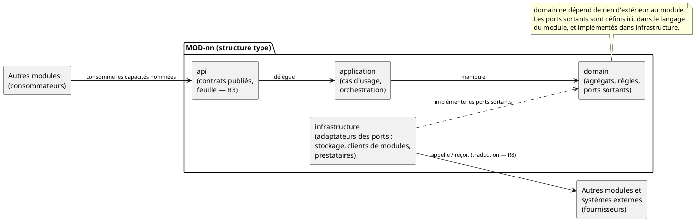
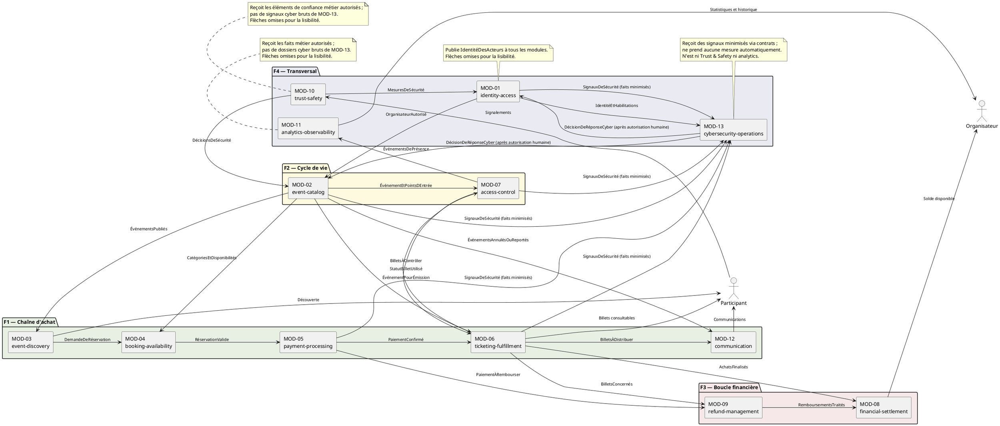

# Modules logiciels — Eventix

| Champ | Valeur |
|---|---|
| **Phase** | 07 — Architecture logique |
| **Projet** | Eventix |
| **Périmètre** | MVP |
| **Marché initial** | Cameroun |
| **Sources** | `decomposition-fonctionnelle.md` (phase 07), `diagrammes-de-composants.md` (phase 06) |
| **Notation** | PlantUML — UML 2.5 (diagrammes de composants), même choix que la phase 06 |
| **Statut** | Proposition — à valider par l'équipe |
| **Verdict** | **VALIDÉ SOUS CONDITIONS** (voir §15) |

---

## Table des matières

1. [Objectif et portée](#1-objectif-et-portée)
2. [Ce qui est hérité, ce qui est ajouté](#2-ce-qui-est-hérité-ce-qui-est-ajouté)
3. [Décision de grain : un module par bloc fonctionnel](#3-décision-de-grain--un-module-par-bloc-fonctionnel)
4. [Règles de modularité](#4-règles-de-modularité)
5. [Structure interne type d'un module](#5-structure-interne-type-dun-module)
6. [Catalogue des modules](#6-catalogue-des-modules)
7. [Fiches modules](#7-fiches-modules)
8. [Graphe de dépendances entre modules](#8-graphe-de-dépendances-entre-modules)
9. [Propriété des données et arbitres uniques](#9-propriété-des-données-et-arbitres-uniques)
10. [Traçabilité exigences ↔ modules](#10-traçabilité-exigences--modules)
11. [Principes SOLID et patterns retenus](#11-principes-solid-et-patterns-retenus)
12. [Cas limites et évolutivité](#12-cas-limites-et-évolutivité)
13. [Incohérence et flux manquants détectés](#13-incohérence-et-flux-manquants-détectés)
14. [Hypothèses retenues](#14-hypothèses-retenues)
15. [Points à clarifier avec le client / product owner](#15-points-à-clarifier-avec-le-client--product-owner)
16. [Ce que ce document ne préjuge pas](#16-ce-que-ce-document-ne-préjuge-pas)
17. [Statut](#17-statut)

---

## 1. Objectif et portée

`decomposition-fonctionnelle.md` a défini **ce que fait** Eventix (12 blocs fonctionnels `BF-nn`). Ce document répond à la question suivante :

> **Quels modules logiciels réalisent ces blocs, que possède chacun, que publie-t-il, que consomme-t-il, et quelles règles empêchent le système de devenir un enchevêtrement ?**

La décomposition fonctionnelle a explicitement renvoyé ces décisions ici : « un bloc fonctionnel sera implémenté par un ou plusieurs modules » (§13) et « la question se reposera dans `modules.md`, cette fois avec les contraintes d'implémentation en main » (notes de rédaction).

**Un module, au sens de ce document, est une unité logique de code** : un périmètre de propriété (agrégats, règles, données), une surface publique (contrats nommés) et des dépendances déclarées. Ce n'est pas une unité de déploiement. Ce choix est renvoyé aux phases 09 et 10 (voir §16).

---

## 2. Ce qui est hérité, ce qui est ajouté

| Élément | Origine | Traitement ici |
|---|---|---|
| 12 blocs `BF-01` à `BF-12`, 4 familles | `decomposition-fonctionnelle.md` §3–4 | Repris sans modification |
| Correspondance `BF-nn` = `BC-nn` | `decomposition-fonctionnelle.md` §3.1 | Prolongée : `MOD-nn` = `BF-nn` = `BC-nn` |
| Agrégats et entités par composant (34) | `diagrammes-de-composants.md` §3 | Repris : ils deviennent le périmètre de propriété du module |
| 19 interfaces nommées + interfaces transversales | `diagrammes-de-composants.md` §7 | Repris : elles deviennent les contrats publiés et requis |
| Exigences EF-001 → EF-147 par bloc | `decomposition-fonctionnelle.md` §10 | Reprises par les modules, dont MOD-13 pour EF-145 à EF-147 |
| Incohérence `StatutBilletUtilisé` | les deux sources | **Arbitrée : MOD-07 → MOD-06** (§13.1) |

**Ajouté par ce document :**

- la décision de grain des modules, justifiée contre les alternatives (§3), avec un module transversal MOD-13 en complément des douze contextes métier initiaux ;
- huit règles de modularité opposables (§4) ;
- une structure interne type et un modèle de dépendances (§5, §8) ;
- une analyse des cycles du graphe de dépendances, absente des sources (§8) ;
- une détection de **flux manquants** entre ce que les exigences demandent et ce que la context map documente (§13).

> **Limite de lecture :** `principes-architecturaux.md`, `bounded-contexts.md`, `context-map.md` et `exigences-fonctionnelles.md` ne figurent pas dans les sources fournies. Les principes P1 à P10 sont cités avec le libellé tel qu'il apparaît dans les deux sources, jamais redéfinis. Aucune exigence n'est reformulée au-delà de son intitulé court.

---

## 3. Décision de grain : un module par bloc fonctionnel

### D-M1 — Un module par bounded context, plus le contexte transversal cyber

| Axe | Contenu |
|---|---|
| **Décision** | MOD-01 à MOD-12 implémentent respectivement BF-01 à BF-12 / BC-01 à BC-12. MOD-13 implémente le nouveau BF-13 / BC-13 de supervision cybersécurité. Total : 13 modules logiques. |
| **Raisonnement** | Les douze frontières métier existantes restent inchangées. EF-145 à EF-147 ajoutent une responsabilité interne distincte : centraliser les signaux, qualifier les alertes/incidents et tracer la décision humaine sans reprendre les décisions métier de MOD-10 ni la restitution analytique de MOD-11. |
| **Avantages** | Traçabilité continue des exigences jusqu'au code. Chaque source de vérité (EF-128) a un propriétaire unique et nommé ; le service cyber a une frontière explicite sans fusion avec les responsabilités métier existantes. |
| **Inconvénients** | `MOD-02` (Event Catalog) concentre 27 exigences : c'est le module métier le plus lourd. `MOD-07` porte deux natures d'exécution possibles (contrôle en ligne, mode dégradé), voir §7.7. MOD-13 introduit une treizième frontière logique transversale à préciser en contrats. |
| **Risques** | Un module trop gros devient un goulot de modification. Atténuation : structure interne en sous-paquets (§5) qui permet une scission ultérieure sans casser les contrats. MOD-13 ne doit ni recevoir toutes les données brutes ni devenir un passage obligé synchrone pour les opérations métier. |

### Alternatives rejetées

| Alternative | Pourquoi rejetée |
|---|---|
| **Fusionner `BF-03` dans `BF-02`** (Discovery est une vue de Catalog et ne possède aucune donnée propre) | Viole la frontière « gérer ≠ exposer » (`decomposition-fonctionnelle.md` §11.2). Les deux ont des cadences de changement et des exigences de performance différentes (P10 sur la découverte mobile). Mélanger écriture de configuration et lecture publique couplerait deux rythmes d'évolution. |
| **Fusionner `BF-08` et `BF-09`** (boucle financière, F3) | Obligation de rembourser et solde organisateur sont deux cycles distincts (P2). `BF-09` alimente `BF-08` mais ne se confond pas avec lui. |
| **Un module par famille (4 modules)** | Les familles sont « un regroupement de lecture et de conception » qui « n'introduisent pas de nouvelle frontière technique » (`decomposition-fonctionnelle.md` §3.2). F1 mélangerait cinq contextes de catégories DDD différentes (Cœur, Soutien, Générique). |
| **Scinder `BF-05` : un module métier + un module « prestataire Mobile Money »** | Sur-engineering au MVP. Le prestataire est externe et unique (Mobile Money, seul moyen du MVP, EF-036). Un **port** dans `MOD-05` isole le prestataire sans module supplémentaire (§5). |
| **Scinder `BF-06` : émission / transferts** | Les trois agrégats (Achat, Billet, Transfert) partagent l'invariant d'unicité du propriétaire actif (EF-047). Les séparer créerait un invariant distribué sans gain. |
| **Scinder `BF-02` : configuration / lecture** | Déjà envisagé en phase 06 (§10 de `diagrammes-de-composants.md`) et jugé improbable au MVP. Le module reste scindable le jour venu grâce à sa structure interne. |

---

## 4. Règles de modularité

Ces règles sont opposables : toute proposition d'interface, de code ou de déploiement doit pouvoir être vérifiée contre elles.

| # | Règle | Principe servi | Vérification |
|---|---|---|---|
| **R1** | **Propriété unique.** Chaque agrégat, donnée et règle métier appartient à un seul module. Aucun autre module ne le lit ni ne le modifie directement. | EF-128, P4 | Table §9 : un seul propriétaire par donnée |
| **R2** | **Accès par `api` uniquement.** Un module n'accède à un autre que par les contrats publiés dans l'`api` de ce dernier. Pas d'accès à son domaine, à son stockage ni à ses types internes. | EF-129, P3 | Aucun import entre `domain` ou `application` de modules distincts |
| **R3** | **L'`api` est une feuille.** Un paquet `api` ne dépend d'aucun autre module. Les références croisées se font par **identifiant opaque** (ex. identifiant d'événement, de billet). Aucune entité d'un autre module n'apparaît dans un contrat. | P3 | Le graphe des `api` n'a aucune arête entre eux |
| **R4** | **Un module fournit des capacités nommées, pas un service global.** Un contrat porte une seule capacité (`PaiementConfirmé`, pas `ServicePaiement`). | EF-129, P3 | Ligne source dans la table des interfaces |
| **R5** | **Aucune décision métier ne dépend des modules d'observation.** `MOD-11` et `MOD-10` consomment des faits. Aucun autre module n'attend une réponse de `MOD-11` pour décider. `MOD-11` n'est jamais une source de vérité. | P5, P2, EF-104 | Aucun contrat requis depuis `MOD-11` dans la table §8 |
| **R6** | **Les contrats d'effet critique portent un identifiant d'effet unique.** Toute commande ou tout fait dont le doublon serait dangereux (confirmation de paiement, émission de billet, remboursement, retrait, validation d'entrée) inclut un identifiant permettant la détection de doublon chez le consommateur. Cette règle vaut quel que soit le mode de transport. | EF-127, P6 | Revue de `interfaces.md` |
| **R7** | **Un module ne stocke pas l'état du cycle d'un voisin.** Il peut conserver une référence ou un instantané daté, jamais l'état faisant autorité. | EF-126, P2 | Table §9 |
| **R8** | **Un module n'importe pas le langage d'un autre.** Les contrats consommés sont traduits à la frontière (`ports` sortants, §5) vers le langage du module consommateur. | P3, P8 | Revue de code |

---

## 5. Structure interne type d'un module

### D-M2 — Quatre paquets, des ports uniquement aux frontières

| Axe | Contenu |
|---|---|
| **Décision** | Chaque module a la même structure interne en quatre paquets : `api`, `application`, `domain`, `infrastructure`. Des **ports sortants** n'existent que là où le module consomme quelque chose d'extérieur (un autre module ou un système externe). |
| **Raisonnement** | R2 et R8 exigent une frontière nette. `domain` ne connaît ni les autres modules, ni les prestataires, ni le stockage. Les ports sortants sont le point de traduction (R8). |
| **Avantages** | Règles métier testables sans dépendance externe. Prestataire Mobile Money et canal email interchangeables (P9) sans toucher au domaine. Scission future d'un module facilitée. |
| **Inconvénients** | Plus de fichiers par module qu'une structure plate. Discipline à tenir par revue ou outillage de contrôle de dépendances (non choisi ici). |
| **Risques** | Dérive vers une abstraction pour l'abstraction. Garde-fou : **pas de port sans consommateur réel** (aucun port « au cas où »). |
| **Alternative rejetée** | Structure plate sans frontières internes : plus simple au départ, mais R2 et R8 ne seraient vérifiables que par convention. |

**Lecture :** les flèches de dépendance de code pointent vers `domain`. Seuls `api` et `infrastructure` touchent l'extérieur du module. Pour une dépendance entre modules, c'est l'adaptateur d'`infrastructure` du module consommateur qui s'appuie sur l'`api` du module fournisseur.

---

## 6. Catalogue des modules

| Module | Nom technique | Bloc / Contexte | Famille | Catégorie DDD | Agrégats et entités possédés |
|---|---|---|---|---|---|
| `MOD-01` | `identity-access` | BF-01 / BC-01 | F4 | Générique | Utilisateur, Compte participant, Compte organisateur, Organisation |
| `MOD-02` | `event-catalog` | BF-02 / BC-02 | F2 | Cœur | Événement, Espace, Zone, Catégorie de billet, Historique de configuration |
| `MOD-03` | `event-discovery` | BF-03 / BC-03 | F1 | Cœur | Catalogue (vue), Recherche |
| `MOD-04` | `booking-availability` | BF-04 / BC-04 | F1 | Soutien | Réservation, Disponibilité |
| `MOD-05` | `payment-processing` | BF-05 / BC-05 | F1 | Générique | Paiement, Réconciliation |
| `MOD-06` | `ticketing-fulfillment` | BF-06 / BC-06 | F1 | Cœur | Achat, Billet, Transfert |
| `MOD-07` | `access-control` | BF-07 / BC-07 | F2 | Cœur | Point d'entrée, Contrôle, Présence |
| `MOD-08` | `financial-settlement` | BF-08 / BC-08 | F3 | Soutien | Clôture, Solde organisateur, Retrait |
| `MOD-09` | `refund-management` | BF-09 / BC-09 | F3 | Soutien | Obligation de remboursement, Remboursement |
| `MOD-10` | `trust-safety` | BF-10 / BC-10 | F4 | Générique | Signalement, Mesure de sécurité |
| `MOD-11` | `analytics-observability` | BF-11 / BC-11 | F4 | Cœur | Événement métier, Statistique, Historique |
| `MOD-12` | `communication` | BF-12 / BC-12 | F1 | Générique | Distribution, Notification |
| `MOD-13` | `cybersecurity-operations` | BF-13 / BC-13 | Transversal | Soutien | Signal de sécurité, Alerte cyber, Dossier d'incident, Décision de réponse |

Les noms techniques reprennent les noms de bounded contexts déjà établis (hypothèse H1, §14). Les entités et objets de valeur du modèle sont couverts par exactement un module chacun.

MOD-13 est un module logique interne. Il ne présume pas d'un service déployé séparément ; il possède les alertes et dossiers d'incident cyber, tandis que chaque module métier reste propriétaire de ses propres données et transitions.

---

## 7. Fiches modules

Convention de lecture : « **Publie** » = contrats exposés dans l'`api`. « **Requiert** » = contrats consommés. Les flèches suivent la convention des sources : un contrat est **fourni par** le module qui le publie **à** celui qui le requiert. Les noms de contrats sont ceux de `diagrammes-de-composants.md` §7. Les sous-paquets internes sont des **noms de travail** dérivés des groupes de capacités de la décomposition fonctionnelle.

### 7.1. `MOD-01` — identity-access

| Champ | Valeur |
|---|---|
| **Responsabilité** | Identité des acteurs, capacités organisateur, organisations |
| **Publie** | `IdentitéDesActeurs` → tous les modules ; `OrganisateurAutorisé` → MOD-02 |
| **Requiert** | `MesuresDeSécurité` ← MOD-10 ; inscriptions et authentifications (acteurs) |
| **Sous-paquets** | `comptes` (EF-001 à 004, 007) · `capacite-organisateur` (EF-005, 006) · `organisations` (vérification, EF-014, 015) |
| **Exigences** | EF-001 → EF-007, EF-014, EF-015 |
| **Principe dominant** | P7 (moindre privilège) |

**Points d'attention :** module à plus fort nombre de consommateurs (tous). Son `api` doit rester minimale et stable : `IdentitéDesActeurs` ne doit exposer que ce dont les consommateurs ont besoin (R4). Un compte peut être à la fois participant et organisateur (EF-006) : la capacité organisateur est un attribut du compte, pas un second compte.

### 7.2. `MOD-02` — event-catalog

| Champ | Valeur |
|---|---|
| **Responsabilité** | Référentiel central : création, configuration et cycle de vie des événements |
| **Publie** | `ÉvénementsPubliés` → MOD-03 ; `CatégoriesEtDisponibilités` → MOD-04 ; `ÉvénementPourÉmission` → MOD-06 ; `ÉvénementEtPointsDEntrée` → MOD-07 ; `ÉvénementsAnnulésOuReportés` → MOD-12 |
| **Requiert** | `OrganisateurAutorisé` ← MOD-01 ; `DécisionsDeSécurité` ← MOD-10 |
| **Sous-paquets** | `configuration` (EF-008 à 011, 021 à 023, 130, 134, 138, 140, 142) · `cycle-de-vie` (EF-012, 013, 016 à 020, 072, 073, 077 à 079, 124, 125) · `historique` (Historique de configuration, P5) |
| **Exigences** | EF-008 → EF-013, EF-016 → EF-024, EF-072, EF-073, EF-077 → EF-079, EF-124, EF-125, EF-130, EF-134, EF-138, EF-140, EF-142 |
| **Principes dominants** | P5, P2, P8 |

**Points d'attention :**

- **Module pivot** : fan-out de 5, le plus élevé du système (§8). Son `api` est le contrat le plus coûteux à faire évoluer ; il doit être le plus stable.
- Source de vérité de la **configuration** (EF-128). Il ne possède ni l'attribution (MOD-04), ni le billet (MOD-06), ni la validation (MOD-07).
- EF-124/125 : un événement ayant des opérations irréversibles n'est jamais supprimé, il change d'état. Le modèle d'états est le seul mode de sortie, d'où le sous-paquet `cycle-de-vie` distinct.
- EF-130/134 : la configuration des passes (validité et quota) et l'activation des dons suggérés relève de la configuration de l'événement.
- EF-138/142 : les modes d'accès (sur place, direct, VOD) et le plan de salle numéroté relèvent de la configuration de l'événement.
- EF-140 : la configuration des codes promotionnels et de leurs conditions relève de ce module ; MOD-05 valide ensuite leur application à une commande.
- EF-024 (pas de réduction de capacité sous les billets attribués) exige une donnée que ce module ne possède pas. Voir flux manquant G5 (§13).

### 7.3. `MOD-03` — event-discovery

| Champ | Valeur |
|---|---|
| **Responsabilité** | Exposer aux participants les événements publiés |
| **Publie** | `DemandeDeRéservation` → MOD-04 ; parcours de découverte → participant |
| **Requiert** | `ÉvénementsPubliés` ← MOD-02 |
| **Sous-paquets** | `recherche` (EF-025, 028) · `consultation` (EF-026, 027, 029) |
| **Exigences** | EF-025 → EF-029 |
| **Principes dominants** | P1, P10 |

**Points d'attention :** ce module est une **projection en lecture** de MOD-02 (« BF-02 gère, BF-03 expose »). Il ne possède aucune donnée d'événement qui fasse autorité (R1, R7). La disponibilité qu'il présente (EF-029) est **indicative** : seul MOD-04 arbitre l'attribution. Une disponibilité affichée peut donc être périmée au moment de la demande de réservation, et c'est MOD-04 qui tranche. La fraîcheur de la projection est une décision de `communication.md`.

### 7.4. `MOD-04` — booking-availability

| Champ | Valeur |
|---|---|
| **Responsabilité** | Arbitre unique de l'attribution temporaire des disponibilités |
| **Publie** | `RéservationValide` → MOD-05 |
| **Requiert** | `CatégoriesEtDisponibilités` ← MOD-02 ; `DemandeDeRéservation` ← MOD-03 |
| **Sous-paquets** | `reservation` (EF-030, 032, 033, 143) · `disponibilite` (EF-031, 034, 119) |
| **Exigences** | EF-030 → EF-034, EF-119, EF-143 |
| **Principes dominants** | P2, P4 |

**Points d'attention :**

- **Invariant central** : le total attribué ne dépasse jamais la capacité (EF-034). Le module est l'unique arbitre, donc l'unique point de sérialisation des attributions concurrentes. La stratégie de verrouillage relève de phases ultérieures, mais le module doit rester un point unique.
- L'expiration à 5 minutes (EF-032, 033) est un processus piloté par le temps, indépendant de l'état du paiement (P2).
- L'attribution d'un siège numéroté passe par le même arbitre unique : une seule réservation concurrente de cette place peut aboutir (EF-143).
- Le module doit savoir quand une réservation débouche sur un billet pour ne pas libérer une disponibilité déjà consommée. Aucun contrat documenté ne le lui dit : flux manquant G4 (§13). Le parcours des événements gratuits pose une question voisine : G3.

### 7.5. `MOD-05` — payment-processing

| Champ | Valeur |
|---|---|
| **Responsabilité** | Traiter les paiements Mobile Money et leurs aléas |
| **Publie** | `PaiementConfirmé` → MOD-06 ; `PaiementÀRembourser` → MOD-09 |
| **Requiert** | `RéservationValide` ← MOD-04 ; accusés du prestataire Mobile Money (externe) |
| **Port sortant** | `PrestataireMobileMoney` (initiation de paiement ; réception d'accusés), adaptateur dans `infrastructure` |
| **Sous-paquets** | `initiation-suivi` (EF-035 à 037, 040, 135, 136, 144) · `confirmation` (EF-038, 039) · `reconciliation` (EF-041) |
| **Exigences** | EF-035 → EF-041, EF-135, EF-136, EF-144 |
| **Principes dominants** | P2, P6, P10 |

**Points d'attention :**

- `confirmation` est le chemin le plus sensible aux **doublons** : un même accusé du prestataire reçu deux fois doit produire un effet unique (EF-038, 039 ; R6).
- `reconciliation` traite le paiement tardif (EF-041) : ne jamais ignorer un paiement reçu, aboutir à un billet ou à un remboursement. Ce sous-paquet est la raison pour laquelle le module ne peut pas se contenter d'un modèle « paiement réussi / échoué ».
- Un don positif est intégré au montant total à payer et conservé séparément du montant du billet (EF-135, EF-136). Pour un billet gratuit sans don, le parcours existant confirme toujours un montant nul en interne, sans appel au prestataire.
- Le code promotionnel validé modifie le montant à payer selon les conditions configurées (EF-144) ; les règles de cumul et d'utilisation restent à préciser.
- Le prestataire est le seul système externe documenté. Le port isole le domaine (R8) : changer de prestataire ne touche que `infrastructure`.

### 7.6. `MOD-06` — ticketing-fulfillment

| Champ | Valeur |
|---|---|
| **Responsabilité** | Émettre les billets, gérer leur propriété et leurs transferts |
| **Publie** | `BilletsÀContrôler` → MOD-07 ; `BilletsÀDistribuer` → MOD-12 ; `AchatsFinalisés` → MOD-08 ; `BilletsConcernés` → MOD-09 ; billets consultables → participant |
| **Requiert** | `PaiementConfirmé` ← MOD-05 ; `ÉvénementPourÉmission` ← MOD-02 ; `StatutBilletUtilisé` ← MOD-07 (arbitré C1, §13.1) ; achat gratuit (participant) |
| **Sous-paquets** | `achat-emission` (EF-042 à 046, 051, 052, 131) · `propriete-transferts` (EF-047, 053 à 055) · `consultation` (EF-048, 049) · `invalidation` (EF-074) |
| **Exigences** | EF-042 → EF-049, EF-051 → EF-055, EF-074, EF-131 |
| **Principes dominants** | P2, P5, P6 |

**Points d'attention :**

- **Source de vérité du billet** (état, propriétaire actif). Le billet n'existe qu'à l'émission, jamais à la confirmation de paiement (« payer ≠ être titulaire »).
- **Émission unique** (EF-043, 044, 052 ; R6) : un même paiement confirmé ne produit jamais deux billets, même si la confirmation est livrée deux fois ou si l'émission a échoué techniquement et est relancée.
- Le quota initial du pass est conservé sur le billet émis (EF-131) ; sa consommation relève de MOD-07.
- **Unicité du propriétaire actif** (EF-047) : invariant interne au module, d'où le choix de ne pas scinder Billet et Transfert (§3).
- Historique des transferts conservé (EF-055, P5) : pas de réécriture.
- **Module à fort fan-out** (4) : c'est l'amont de MOD-07, MOD-08, MOD-09 et MOD-12.
- EF-074 (invalider les billets d'un événement annulé) suppose un contrat entrant depuis MOD-02 qui n'est pas documenté : flux manquant G1.

### 7.7. `MOD-07` — access-control

| Champ | Valeur |
|---|---|
| **Responsabilité** | Garantir l'entrée légitime et unique, y compris en mode dégradé |
| **Publie** | `ÉvénementsDePrésence` → MOD-11 ; `StatutBilletUtilisé` → MOD-06 (arbitré C1, §13.1) |
| **Requiert** | `BilletsÀContrôler` ← MOD-06 ; `ÉvénementEtPointsDEntrée` ← MOD-02 |
| **Sous-paquets** | `affectation` (EF-057) · `validation` (EF-058 à 068, 132, 133) · `multi-scanner` (EF-069) · `mode-degrade` (EF-070, 071) |
| **Exigences** | EF-057 → EF-071, EF-132, EF-133 |
| **Principes dominants** | P4, P6, P10 |

**Points d'attention :**

- **Une seule validation réussie par billet** (EF-067, R6) : MOD-07 est l'arbitre unique de la validation (EF-128).
- Pour un pass, chaque entrée acceptée décrémente le quota ; un pass épuisé ou hors de sa période de validité est refusé (EF-132, EF-133).
- `mode-degrade` est volontairement un **sous-paquet isolé** : le mode mono-scanner dégradé et sa resynchronisation (EF-070, 071) répondent à une connectivité variable (P10) et pourraient s'exécuter dans un environnement différent du reste du module (par exemple au plus près du point d'entrée). Ce n'est pas une décision, c'est une **contrainte de conception** : le code du mode dégradé ne doit dépendre que de `domain` et de ses propres ports, pour rester déplaçable. Le déploiement est tranché en phase 09/10 (§16).
- Le module consomme un instantané de `BilletsÀContrôler`. En mode dégradé, cet instantané peut être périmé, et la réintégration (EF-071) doit réconcilier les validations avec l'état du billet sans en perdre ni en dupliquer.

### 7.8. `MOD-08` — financial-settlement

| Champ | Valeur |
|---|---|
| **Responsabilité** | Clôture financière des événements, solde retirable de l'organisateur |
| **Publie** | solde disponible → organisateur |
| **Requiert** | `AchatsFinalisés` ← MOD-06 ; `RemboursementsTraités` ← MOD-09 |
| **Sous-paquets** | `cloture` (EF-105 à 108) · `solde-retraits` (EF-109 à 114) |
| **Exigences** | EF-105 → EF-114 |
| **Principes dominants** | P5, P6 |

**Points d'attention :**

- La clôture **consolide** des achats finalisés, elle ne les crée pas (« vendre ≠ encaisser »).
- Un retrait échoué est restitué au solde (EF-113) et plusieurs retraits successifs sont autorisés (EF-114), sans jamais dépasser le solde (EF-111). C'est un invariant de concurrence : deux retraits simultanés ne doivent pas dépasser le solde, et le solde est la ressource contestée.
- L'exécution réelle d'un retrait implique un canal de versement que les sources ne décrivent pas : flux manquant G6.

### 7.9. `MOD-09` — refund-management

| Champ | Valeur |
|---|---|
| **Responsabilité** | Déterminer, calculer et exécuter les remboursements |
| **Publie** | `RemboursementsTraités` → MOD-08 |
| **Requiert** | `PaiementÀRembourser` ← MOD-05 ; `BilletsConcernés` ← MOD-06 ; déclenchement après annulation (MOD-02, voir §13) |
| **Sous-paquets** | `obligation` (EF-076, 080, 087) · `execution` (EF-081 à 086) |
| **Exigences** | EF-076, EF-080 → EF-087 |
| **Principes dominants** | P6, P8 |

**Points d'attention :**

- **Une seule demande de remboursement par obligation** (EF-081, 085 ; R6).
- Le module ne traite que les **obligations** (annulation, réconciliation), jamais la convenance (EF-087).
- Traitement progressif à grande échelle (EF-086, P8) : une annulation d'événement peut déclencher un grand nombre de remboursements d'un coup. Le module doit pouvoir les traiter par lots sans état global bloquant.
- L'exécution réelle d'un remboursement implique le prestataire Mobile Money : flux manquant G6.

### 7.10. `MOD-10` — trust-safety

| Champ | Valeur |
|---|---|
| **Responsabilité** | Signalements, analyse du risque, décisions et traçabilité |
| **Publie** | `MesuresDeSécurité` → MOD-01 ; `DécisionsDeSécurité` → MOD-02 |
| **Requiert** | `Signalements` (participant) ; éléments d'analyse métier autorisés ← modules concernés ; aucune ingestion automatique des signaux/incidents cyber de MOD-13 |
| **Sous-paquets** | `signalements` (EF-088 à 091) · `analyse` (EF-092, 093) · `decisions` (EF-094 à 098) |
| **Exigences** | EF-088 → EF-098 |
| **Principes dominants** | P5, P7 |

**Points d'attention :** MOD-10 **agit** (bannir, bloquer, appliquer à des événements) sans posséder les entités visées : il émet des décisions que MOD-01 et MOD-02 appliquent. C'est le bon sens de dépendance (R1) : MOD-10 ne modifie jamais directement un compte ni un événement. Toute décision est tracée (EF-094, P5).

### 7.11. `MOD-11` — analytics-observability

| Champ | Valeur |
|---|---|
| **Responsabilité** | Collecter les faits, produire statistiques et journal des opérations |
| **Publie** | statistiques et historique → organisateur et pilotage Eventix |
| **Requiert** | `ÉvénementsDePrésence` ← MOD-07 ; faits métier autorisés ← MOD-01 à MOD-12 ; indicateurs agrégés de MOD-13 uniquement sur contrat validé |
| **Sous-paquets** | `collecte` (EF-099, 101, 102) · `statistiques` (EF-100, 103, 104, 137, 141) · `journal` (EF-115 à 117) |
| **Exigences** | EF-099 → EF-104, EF-115 → EF-117, EF-137, EF-141 |
| **Principe dominant** | P5 |

**Points d'attention :**

- **Consommateur transverse de faits métier, jamais source de vérité** (R5) : lecture seule stricte (EF-104). Les alertes, incidents et décisions cyber de MOD-13 ne sont pas collectés par défaut ; aucun module ne demande une donnée à MOD-11 pour décider.
- Journal préservé après modification des données d'origine (EF-117) : le journal conserve un **instantané contextuel** (EF-116), pas une référence vers l'état courant.
- Chaque module publie ses faits dans son `api` ; la liste des événements métier est à définir dans `interfaces.md`, sans invention ici.
- Les visites, commandes et montants attribués aux liens de suivi doivent être reportés par source (EF-141), avec une règle d'attribution à définir.

### 7.12. `MOD-12` — communication

| Champ | Valeur |
|---|---|
| **Responsabilité** | Transmettre billets et notifications aux participants |
| **Publie** | communications → participant |
| **Requiert** | `BilletsÀDistribuer` ← MOD-06 ; `ÉvénementsAnnulésOuReportés` ← MOD-02 ; `IdentitéDesActeurs` ← MOD-01 |
| **Port sortant** | `CanalDeDistribution` (email au MVP : EF-050, 122), adaptateur dans `infrastructure` |
| **Sous-paquets** | `distribution` (EF-050, 121, 122) · `notification` (EF-075, 123) |
| **Exigences** | EF-050, EF-075, EF-121 → EF-123, EF-139 |
| **Principes dominants** | P9, P10 |

**Points d'attention :** le canal est **interchangeable** (P9) : ajouter un canal ne modifie ni le domaine, ni les contrats consommés. L'envoi du billet par email est un **mode** de mise à disposition parmi d'autres (EF-121 : mise à disposition d'abord, distribution par email ensuite). Un échec d'envoi ne doit jamais invalider un billet déjà émis : le billet reste consultable (MOD-06).

### 7.13. `MOD-13` — cybersecurity-operations

| Champ | Valeur |
|---|---|
| **Responsabilité** | Centraliser les signaux de sécurité autorisés, gérer les alertes et dossiers cyber, et tracer les décisions humaines de réponse |
| **Publie** | `DécisionDeRéponseCyber` → module propriétaire de l'actif concerné, lorsqu'une décision humaine est autorisée et qu'un contrat d'action existe |
| **Requiert** | `SignalDeSécurité` ← modules Eventix et sources d'infrastructure explicitement autorisés ; identité et rôles via MOD-01 |
| **Sous-paquets** | `ingestion-signaux` · `triage-alertes` · `gestion-incidents` · `décisions-et-audit` |
| **Exigences** | EF-145 → EF-147 |
| **Principes dominants** | Moindre privilège, minimisation, traçabilité, séparation des décisions métier et cyber |

**Points d'attention :**

- MOD-13 est l'autorité pour l'état des alertes et dossiers d'incident cyber, pas pour les états des comptes, événements, billets ou paiements.
- Les alertes et scores automatisés déclenchent au plus une analyse/notification : aucune mesure de confinement ou sanction n'est lancée sans décision humaine habilitée (RM40, AC-118).
- Une décision consignée dans MOD-13 ne modifie pas directement les données d'un autre module. L'action doit être exécutée par son propriétaire au moyen d'un contrat autorisé ou par une procédure opérationnelle contrôlée.
- Les sources publient des faits minimaux et filtrés ; MOD-13 n'accède pas aux bases des modules, ne stocke pas de secrets ni de données de paiement inutiles.
- La disponibilité des flux, la couverture de détection, les délais de rétention, le mécanisme technique et le niveau de service restent des décisions ouvertes. Aucun fonctionnement 24/7 n'est présumé.

---

## 8. Graphe de dépendances entre modules

### 8.1. Diagramme

Convention des sources conservée : `A --> B : X` se lit « A fournit X à B », donc **B dépend du contrat X publié par A**. Le trait pointillé signale la relation contestée.

### 8.2. Couplage par module (27 relations de contrats représentées)

| Module | Contrats publiés (fan-out) | Contrats requis (fan-in) | Lecture |
|---|---|---|---|
| MOD-01 | 3 | 2 | Publie aussi identité/habilitations et signaux minimisés à MOD-13 |
| **MOD-02** | **6** | 3 | **Pivot du système** : `api` la plus coûteuse à changer |
| MOD-03 | 1 | 1 | Projection de MOD-02 |
| MOD-04 | 1 | 2 | Point de sérialisation des attributions |
| MOD-05 | 3 | 1 | Frontière avec l'externe ; publie un signal cyber minimisé |
| **MOD-06** | **5** | 3 | Amont de 4 modules : second point sensible ; publie un signal cyber minimisé |
| MOD-07 | 3 | 2 | Boucle naturelle avec MOD-06 (§8.3), plus signal cyber minimisé |
| MOD-08 | 0 | 2 | Puits de la chaîne financière |
| MOD-09 | 1 | 2 | |
| MOD-10 | 2 | 0 | Hors transversal (`ÉlémentsDAnalyse`), pur émetteur |
| MOD-11 | 0 | 1 | Hors transversal (`ÉvénementsMétier`), pur consommateur |
| MOD-12 | 0 | 2 | Puits de la chaîne de communication |
| MOD-13 | 2 | 6 | Deux contrats de réponse sortants ; identité et signaux entrants des sources candidates représentées |
| **Total** | **27** | **27** | Relations représentées ; la liste active des sources cyber reste à valider |

### 8.3. Analyse des cycles

La décomposition fonctionnelle et la phase 06 ne regardent pas le graphe sous l'angle des cycles. Voici ce qu'il révèle.

**La chaîne commerciale est acyclique** depuis l'arbitrage C1 (§13.1) : `StatutBilletUtilisé` vise désormais MOD-06.

| Cycle | Chemin | Cause | Statut |
|---|---|---|---|
| ~~C1 (direct)~~ | ~~MOD-02 → MOD-07 → MOD-02~~ | `ÉvénementEtPointsDEntrée` (02 → 07) et l'ancien `StatutBilletUtilisé` (07 → 02) | ✅ Supprimé par arbitrage C1 |
| ~~C1' (long)~~ | ~~MOD-02 → 03 → 04 → 05 → 06 → 07 → 02~~ | Le même flux, vu sur toute la chaîne d'achat | ✅ Supprimé par arbitrage C1 |
| **B1 (naturel)** | MOD-06 ↔ MOD-07 | `BilletsÀContrôler` (06 → 07) et `StatutBilletUtilisé` (07 → 06) | Admis — voir D-M3 |
| **C2** | MOD-01 ↔ MOD-10 | `MesuresDeSécurité` (10 → 01) et les faits de MOD-01 vers `ÉlémentsDAnalyse` | Apparent — voir D-M3 |
| **C3** | MOD-02 ↔ MOD-10 | `DécisionsDeSécurité` (10 → 02) et les faits de MOD-02 vers `ÉlémentsDAnalyse` | Apparent — voir D-M3 |

**Constat après arbitrage C1 :** la correction `MOD-07 → MOD-06` a supprimé le grand cycle de la chaîne d'achat (ancien C1'). Il reste une boucle courte MOD-06 ↔ MOD-07 : `BilletsÀContrôler` (06 → 07) et le statut d'utilisation (07 → 06). Cette boucle est **fonctionnellement naturelle** (posséder ≠ entrer, mais le billet doit apprendre qu'il a été utilisé).

**Pourquoi ces cycles sont acceptables, et à quelle condition :**

| Décision | D-M3 — Les cycles de **flux** sont admis, les cycles de **code** sont interdits |
|---|---|
| **Raisonnement** | Un flux dans les deux sens entre deux modules est parfois le modèle métier correct (06 ↔ 07). Ce qui est dangereux, c'est la dépendance de compilation ou de déploiement circulaire, qui empêche de comprendre, tester ou faire évoluer un module sans l'autre. R3 (`api` feuille) l'élimine : deux modules en cycle de flux ne dépendent que des `api` l'un de l'autre, et ces `api` ne dépendent de rien. Le graphe de dépendances de code reste donc acyclique. |
| **Avantages** | Pas de contorsion du modèle métier pour éviter une boucle légitime. Tests de chaque module isolables. |
| **Inconvénients** | R3 suppose une discipline : pas de types partagés ni d'entités dans les contrats, uniquement des identifiants opaques et des données simples. Cela impose une certaine duplication de données entre `api` (voir H3, §14). |
| **Risques** | Un cycle de flux synchrone entre deux modules peut produire un blocage mutuel ou une cascade de pannes. Le mode de communication de chaque flux du cycle est donc à décider **en tenant compte** de ce cycle (`communication.md`). |
| **Alternative rejetée** | Interdire tout cycle de flux. Rejetée : cela obligerait à fusionner MOD-06 et MOD-07 (viole « posséder ≠ entrer ») ou à déformer le modèle pour contourner un flux légitime. |

**C2 et C3 (modules d'observation et de sécurité)** sont des cycles apparents : MOD-10 et MOD-11 *reçoivent des faits* de tous. Selon R5, les autres modules ne dépendent pas de leur réponse. Les faits sont publiés sans que l'émetteur sache qui les consomme. Il n'y a donc pas de dépendance de l'émetteur vers MOD-10 ou MOD-11. Il reste seulement la dépendance de `MesuresDeSécurité` / `DécisionsDeSécurité` dans l'autre sens, qui est unidirectionnelle sur le plan des contrats.

MOD-13 suit le même principe d'ingestion de faits à sens unique pour `SignauxDeSécurité`. Une décision humaine peut ensuite demander une action au module propriétaire de l'actif ; elle ne constitue pas un accès direct ni une écriture dans ses données. Ces échanges doivent rester asynchrones ou découplés au niveau logique afin qu'une indisponibilité de la supervision ne bloque pas le parcours de vente ou de contrôle.

---

## 9. Propriété des données et arbitres uniques

`EF-128` exige un **arbitre unique par ressource critique**. Ce tableau précise pour chaque donnée importante son propriétaire et ses lecteurs légitimes. Il applique R1 et R7.

| Donnée | Module propriétaire (source de vérité) | Consommateurs (par contrat, jamais en accès direct) | Nature chez le consommateur |
|---|---|---|---|
| Compte, capacité organisateur, organisation | MOD-01 | tous (`IdentitéDesActeurs`), MOD-02 (`OrganisateurAutorisé`) | Identifiant opaque + capacité autorisée |
| Configuration de l'événement, catégories, capacités, modes d'accès, codes et plan de salle | MOD-02 | MOD-03, 04, 06, 07, 12 | Projection ou instantané daté, jamais autoritaire |
| Alertes, dossiers d'incident cyber et décisions de réponse enregistrées | MOD-13 | Analystes et responsables humains habilités ; modules cibles via contrats autorisés | Éléments minimisés, références opaques aux actifs ; ne remplace pas l'état détenu par la cible |
| Disponibilité, réservation et sièges numérotés | MOD-04 | MOD-05 (réservation valide), MOD-06 (attribution à émettre) | Référence de réservation et de siège |
| Paiement, réconciliation et réductions appliquées | MOD-05 | MOD-06, 09 | Référence + effet confirmé |
| **Billet** (état, propriétaire actif, accès, siège et historique de transferts) | MOD-06 | MOD-07, 08, 09, 12 | Instantané de contrôle, référence d'achat |
| **Validation d'entrée**, présence | MOD-07 | MOD-11 | Fait de présence |
| Obligation et exécution de remboursement | MOD-09 | MOD-08 | Remboursement traité |
| Clôture, solde, retrait | MOD-08 | organisateur | Lecture de solde |
| Signalement, mesure de sécurité | MOD-10 | MOD-01, 02 | Décision à appliquer |
| Statistique, journal et attribution des liens de suivi | MOD-11 | organisateur, pilotage | Lecture seule — **jamais** pour une décision métier (R5) |
| Distribution, notification et informations d'accès au contenu en ligne | MOD-12 | participant | — |

**Les quatre arbitres d'EF-128** : MOD-02 (configuration), MOD-04 (attribution), MOD-06 (billet), MOD-07 (validation). Aucune de ces ressources n'a un second écrivain.

---

## 10. Traçabilité exigences ↔ modules

Chaque module porte exactement les exigences de son bloc fonctionnel (`decomposition-fonctionnelle.md` §10). La traçabilité détaillée par capacité figure dans chaque fiche (§7).

| Module | Exigences | Nombre |
|---|---|---|
| MOD-01 | EF-001 → 007, 014, 015 | 9 |
| MOD-02 | EF-008 → 013, 016 → 024, 072, 073, 077 → 079, 124, 125, 130, 134, 138, 140, 142 | 27 |
| MOD-03 | EF-025 → 029 | 5 |
| MOD-04 | EF-030 → 034, 119, 143 | 7 |
| MOD-05 | EF-035 → 041, 135, 136, 144 | 10 |
| MOD-06 | EF-042 → 049, 051 → 055, 074, 131 | 15 |
| MOD-07 | EF-057 → 071, 132, 133 | 17 |
| MOD-08 | EF-105 → 114 | 10 |
| MOD-09 | EF-076, 080 → 087 | 9 |
| MOD-10 | EF-088 → 098 | 11 |
| MOD-11 | EF-099 → 104, 115 → 117, 137, 141 | 11 |
| MOD-12 | EF-050, 075, 121 → 123, 139 | 6 |
| **Sous-total modules** | | **140** |
| **MOD-13** | EF-145 → EF-147 — supervision et traitement des incidents cybersécurité | 3 |
| Famille F1 (bout en bout) | EF-118 | 1 |
| Architecture (règles R1 à R8) | EF-126 → 129 | 4 |
| Exclusions MVP | EF-056, EF-120 | 2 |
| **Total** | | **147** |

**Les quatre exigences transversales sont portées par les règles de ce document :**

**Affectation :** les exigences EF-145 à EF-147 sont affectées à MOD-13. La décision de frontière est prise au niveau logique ; les contrats, sources de signaux et mécanismes opérationnels restent à détailler avant l'implémentation.

| Exigence | Règle(s) de modularité | Vérification |
|---|---|---|
| EF-126 — Indépendance des cycles | R7 | Aucun module ne stocke l'état du cycle d'un voisin |
| EF-127 — Unicité des effets critiques | R6 | Identifiant d'effet dans chaque contrat critique |
| EF-128 — Source de vérité cohérente | R1, §9 | Un seul propriétaire par donnée, quatre arbitres nommés |
| EF-129 — Responsabilités internes non exposées | R2, R3, R4, R8 | Accès par `api`, contrats feuilles, une capacité par contrat |

**EF-118** (vendre un billet en ligne) est de bout en bout : elle traverse MOD-03, 04, 05, 06 et 12. Elle ne se vérifie pas dans un module mais par un test de parcours complet. **Les exclusions** (revente EF-056, vente physique EF-120) ne produisent aucun module au MVP (voir §12).

---

## 11. Principes SOLID et patterns retenus

| Principe / Pattern | Application ici | Pourquoi |
|---|---|---|
| **SRP** (responsabilité unique) | Un module = un bounded context, une raison de changer | Un changement de règle de remboursement ne doit pas toucher la billetterie |
| **ISP** (ségrégation des interfaces) | Un contrat = une capacité nommée (R4) | Un consommateur ne dépend que de ce qu'il utilise |
| **DIP** (inversion de dépendances) | `domain` définit les ports sortants, `infrastructure` les implémente (§5) | Le domaine ne dépend ni du prestataire, ni d'un autre module |
| **OCP** (ouvert/fermé) | Canal de distribution de MOD-12, prestataire de MOD-05 | Ajouter un canal ne modifie pas le domaine existant |
| **Published Language** | `api` de chaque module, en langage stable | Isole les évolutions internes des consommateurs |
| **Anti-Corruption Layer** | Adaptateurs d'`infrastructure` : prestataire Mobile Money, clients des `api` d'autres modules (R8) | Un changement de format externe n'atteint jamais `domain` |
| **Projection en lecture** | MOD-03 sur MOD-02 | Séparer gérer et exposer, sans dupliquer l'autorité |

**Patterns volontairement non retenus** (évite le sur-engineering) :

- **Pas de module « commun » métier** : aucun noyau partagé de classes métier. Le partage de domaine recréerait le couplage que la décomposition cherche à éviter. Voir H3 pour les types techniques minimaux.
- **Pas de bus ni de médiateur central dans ce document** : le mode de communication relève de `communication.md`. Ici, seuls les contrats sont posés.
- **Pas de couches supplémentaires** (CQRS, event sourcing, etc.) : aucune exigence ne les justifie au MVP. Les besoins de MOD-11 (journal) et MOD-02 (historique de configuration) sont couverts par un journal simple.

---

## 12. Cas limites et évolutivité

| Cas | Impact | Pourquoi le modèle l'absorbe |
|---|---|---|
| **Revente de billets** (hors MVP, EF-056) | Nouveau module `resale` ou extension de MOD-06 | MOD-06 ne propose que le transfert contrôlé. L'historique de transferts (EF-055) existe déjà. Un module de revente consommerait `BilletsConcernés`-like sans modifier les contrats existants (strictement additif). À arbitrer si l'invariant « un seul propriétaire actif » (EF-047) doit rester dans MOD-06 : il le doit. |
| **Vente en points physiques** (hors MVP, EF-120) | Nouveau consommateur de MOD-04 | MOD-04 est l'inventaire central (EF-119) et arbitre l'attribution quel que soit le canal de vente. Aucun changement de MOD-04 requis. |
| **Nouveau canal de communication** | Nouvel adaptateur dans MOD-12 | Port `CanalDeDistribution` (OCP). Aucun contrat modifié. |
| **Nouveau prestataire de paiement** | Nouvel adaptateur dans MOD-05 | Port `PrestataireMobileMoney`. EF-036 limite le MVP à Mobile Money, pas le modèle. |
| **Scission de MOD-02** (configuration / lecture à grande échelle) | Deux modules issus des sous-paquets `configuration` et `cycle-de-vie` | Les contrats publiés ne changent pas. Seul le propriétaire interne se divise. |
| **Annulation d'un événement populaire** | Pic de remboursements, d'invalidations et de notifications | MOD-09 traite progressivement (EF-086). MOD-06 et MOD-12 doivent traiter par lots. Le dimensionnement n'est pas évaluable sans volumétrie (voir C7). |
| **Double livraison d'un même fait** | Doublon d'émission, de remboursement ou de validation | R6 : identifiant d'effet chez le consommateur. Vaut quel que soit le transport. |
| **Réservation expirée mais paiement tardif** | Paiement reçu sans réservation valide | MOD-05 `reconciliation` (EF-041) : billet ou remboursement, jamais ignoré. |
| **Mode dégradé prolongé au contrôle d'accès** | Plusieurs contrôles hors ligne, puis resynchronisation | Sous-paquet `mode-degrade` isolé (§7.7). La réconciliation vise l'absence de perte et de doublon de validation. |
| **Suppression demandée sur un événement avec ventes** | Interdite (EF-124) | MOD-02 : gestion d'état à la place (EF-125). |

---

## 13. Incohérence et flux manquants détectés

### 13.1. Incohérence héritée : `StatutBilletUtilisé` — arbitré

Déjà signalée dans les deux sources : `bounded-contexts.md` §5.4 disait que BC-07 fournit à BC-02 le statut des billets utilisés, alors que l'état du billet appartient à l'agrégat Billet de BC-06 (`diagrammes-de-classes.md` §7). Les sources avaient conservé la flèche par fidélité.

**Arbitrage du product owner (07/10/2026) : le flux `StatutBilletUtilisé` est dirigé MOD-07 → MOD-06.**

Raisons retenues : la correction respecte l'invariant « MOD-06 est le seul arbitre du billet » (§9), supprime le grand cycle de la chaîne d'achat (§8.3), et correspond à ce que décrit `diagrammes-d-etat.md` (l'événement `BilletUtilisé` est consommé par l'agrégat Billet). Si MOD-02 a un jour besoin d'un compteur de billets utilisés, ce sera un contrat distinct et renommé (à rattacher à G5 si le besoin apparaît).

**Propagation de la décision :** `bounded-contexts.md` §5.3/§5.4, `context-map.md` §6.6/§6.7, `diagrammes-de-composants.md` (diagramme 1, table §7, §8, §11, §12), le `README.md` de la phase 06 (§7.3, §8) et `decomposition-fonctionnelle.md` (§5.4, §6.1, §6.2, §12.1) ont été corrigés en conséquence. `interfaces.md` définira le contrat sans ambiguïté de cible.

### 13.2. Flux manquants : exigences sans contrat documenté

En croisant les capacités des fiches (§7) avec les 19 interfaces de la phase 06, onze situations apparaissent où une exigence suppose un échange qu'aucune interface ne porte. **Aucune n'a été comblée par invention** : ce sont des questions à trancher avant `interfaces.md`.

| # | Exigence | Besoin | Ce que les sources documentent | Hypothèse de travail (non actée) |
|---|---|---|---|---|
| **G1** | EF-074 | MOD-06 invalide les billets d'un événement annulé « sur décision de BF-02 » | Aucun contrat MOD-02 → MOD-06 d'annulation. Seul `ÉvénementPourÉmission` existe. | Contrat dédié MOD-02 → MOD-06 (ex. annulation d'événement) |
| **G2** | EF-076 | MOD-09 reçoit l'éligibilité au remboursement après annulation | Aucun contrat MOD-02 → MOD-09. Le texte dit « déclenchée par le cycle d'annulation de BF-02 ». | Soit contrat direct MOD-02 → MOD-09, soit déclenchement indirect via MOD-06 (`BilletsConcernés`) |
| **G3** | EF-051, EF-034, EF-135 | Un billet gratuit sans don conserve le parcours interne à 0 XAF ; avec un don positif, la commande doit passer par MOD-05. Le parcours gratuit passe-t-il par MOD-04 ? | MOD-04 ne fournit `RéservationValide` qu'à MOD-05. Le contrat transmettant le montant du don et permettant ensuite l'émission par MOD-06 n'est pas précisé. | Le parcours gratuit doit préserver l'arbitrage de capacité par MOD-04. Le passage d'une commande gratuite avec don par MOD-05 et son lien avec MOD-06 restent à définir dans `interfaces.md`. |
| **G4** | EF-032, 033, 042 | Comment MOD-04 apprend qu'une réservation a abouti à un billet, pour ne pas la libérer à l'expiration ? | Aucun contrat MOD-05 ou MOD-06 → MOD-04. | Contrat de conversion (ex. attribution définitive) vers MOD-04. À défaut, risque de libération puis de survente. |
| **G5** | EF-024 | MOD-02 doit connaître les billets attribués pour refuser une réduction de capacité incompatible | MOD-02 ne reçoit rien de MOD-04 ni de MOD-06 sur les quantités attribuées. | Requête de lecture de MOD-02 vers MOD-04 (propriétaire de la disponibilité). À arbitrer avec la question de §13.1 sur le compteur. |
| **G6** | EF-081 à 084, EF-110 à 113 | MOD-09 exécute des remboursements et MOD-08 des retraits : un transfert réel vers l'extérieur est nécessaire | Le seul système externe documenté est le prestataire Mobile Money, pour MOD-05. | Chaque module définit son propre port (R8). L'implémentation technique peut réutiliser un même client. À confirmer. |
| **G7** | EF-014, 015 | Qui effectue la « vérification » d'une organisation ou d'un événement (EF-013) : un acteur interne Eventix ? | Aucun acteur « administrateur Eventix » dans les diagrammes de composants. Seuls Participant et Organisateur y figurent. | Acteur interne à ajouter au modèle ; les contrats `VérificationOrganisation` / `VérificationÉvénement` seraient alors à définir. |
| **G8** | EF-004, EF-007 | « Fournir les historiques » (MOD-01) | Aucun contrat de lecture de l'historique d'achats ou d'événements vers MOD-01. | Intitulé ambigu : peut-être l'historique propre au compte. À clarifier. |
| **G9** | EF-142, EF-143 | Le plan de salle et la disponibilité des sièges doivent parvenir au parcours de réservation, puis le siège attribué au billet émis | Les interfaces actuelles ne décrivent pas la réservation d'un siège individuel ni la transmission de son identité au module d'émission. | Définir les contrats de lecture du plan et de réservation d'un siège, puis l'attribution du siège au billet, sans déplacer l'arbitrage de disponibilité hors de MOD-04. |
| **G10** | EF-140, EF-144 | MOD-05 doit vérifier un code promotionnel et calculer la réduction | Aucun contrat MOD-02 → MOD-05 ne fournit le code, ses conditions et son applicabilité à la commande. | Définir une capacité de validation du code et de calcul de réduction, en conservant MOD-02 comme propriétaire de la configuration et MOD-05 comme responsable du montant à payer. |
| **G11** | EF-141 | La source du lien doit suivre le participant jusqu'à la commande finalisée et aux statistiques | Aucun contrat ne décrit la propagation d'une source de suivi depuis la découverte jusqu'à l'achat et l'analytique. | Définir le passage de l'identifiant de source et les faits publiés à MOD-11, en respectant la règle d'attribution à décider (QMO-051). |
| **G12** | EF-145 à EF-147 | Les signaux cyber doivent être présentés et qualifiés par le service de supervision, puis conduire à une décision humaine traçable | Aucun propriétaire n'était initialement désigné ; MOD-10 et MOD-11 ont des responsabilités distinctes. | **Résolu par D-M4** : création de BF-13/BC-13/MOD-13, module logique interne dédié. MOD-10 reste propriétaire des décisions Trust & Safety ; MOD-11 reste en lecture analytique. |

**Pourquoi c'est important :** G3, G4 et G9 touchent l'**invariant central du système** (pas de survente, EF-034). Les laisser en l'état exposerait un risque de double attribution ou de libération prématurée, précisément ce que MOD-04 doit empêcher.

---

## 14. Hypothèses retenues

| # | Hypothèse | Justification |
|---|---|---|
| **H1** | Les noms techniques des modules reprennent les noms de bounded contexts (anglais, kebab-case). Les sous-paquets internes sont des noms de travail en français. | Cohérence avec les sources. Convention de nommage définitive à confirmer (C8). |
| **H2** | Les contrats d'`api` sont décrits ici par leur **nom et leur capacité**, pas par leur schéma. | Les schémas relèvent de `interfaces.md` (§1 de la décomposition). |
| **H3** | Un petit ensemble de **types purement techniques** (identifiant opaque, montant, horodatage) peut être partagé, sans règle métier. À défaut, chaque `api` redéfinit les siens. | Évite à la fois un noyau partagé de domaine (couplage) et une duplication excessive. À confirmer (C6). |
| **H4** | Les modules transversaux MOD-10 et MOD-11 reçoivent des faits publiés par chaque module sans que l'émetteur ne les connaisse. | Conforme à R5 et aux notes des diagrammes de composants (« reçoit de tous »). Le transport est renvoyé à `communication.md`. |
| **H5** | Aucune volumétrie n'étant disponible dans les sources, ce document ne donne **aucune estimation chiffrée** (p95, débit, stockage). | Estimer sans donnée serait inventer. Une volumétrie cible est nécessaire avant les phases d'infrastructure (C7). |
| **H6** | Le mode dégradé du contrôle d'accès peut s'exécuter hors du reste du module. Il est donc isolé dès maintenant en sous-paquet. | Coût nul aujourd'hui, coût élevé à rattraper plus tard. |
| **H7** | Un contrat consommé par un module est traduit dans un `port` sortant, uniquement s'il existe au moins un consommateur réel (« pas de port au cas où »). | Évite le sur-engineering (§5). |

---

## 15. Points à clarifier avec le client / product owner

| # | Question | Pourquoi c'est important | Bloque |
|---|---|---|---|
| **C1** | ~~`StatutBilletUtilisé` : MOD-07 → MOD-06, ou MOD-02 a-t-il réellement besoin d'une donnée dérivée ?~~ **✅ Arbitré le 07/10/2026 : MOD-07 → MOD-06** (§13.1) | Supprime le grand cycle de la chaîne d'achat. Fixe la frontière 02 / 06. | ✅ Levé |
| **C2** | Le parcours d'un événement gratuit passe-t-il par MOD-04 (réservation) ? (G3) | Sans cela, la capacité d'un événement gratuit n'est plus arbitrée ; avec un don positif, l'articulation MOD-04 / MOD-05 / MOD-06 doit également être définie. | `interfaces.md` |
| **C3** | Comment une réservation est-elle convertie en attribution définitive et par quel module ? (G4) | Évite la libération prématurée d'une disponibilité déjà vendue. | `interfaces.md` |
| **C4** | Comment MOD-06 et MOD-09 apprennent-ils l'annulation d'un événement ? (G1, G2) | EF-074 et EF-076 n'ont aucun contrat porteur aujourd'hui. | `interfaces.md` |
| **C5** | Qui vérifie une organisation et un événement (EF-013, 014, 015) ? Y a-t-il un acteur interne Eventix ? (G7) | Acteur absent du modèle ; contrats de vérification à définir. | Reprise éventuelle de `diagrammes-de-cas-d-utilisation.md` |
| **C6** | Faut-il un paquet de types techniques partagés (identifiants, montants), ou chaque `api` redéfinit-elle les siens ? (H3) | Arbitrage entre couplage et duplication. | Conventions de code |
| **C7** | Quelle volumétrie cible (événements, billets par événement, pics de ventes, scans par minute) ? (H5) | Aucune évaluation de performance n'est possible sans elle, notamment pour MOD-04 (concurrence) et MOD-07 (scans). | Phases 08 et suivantes |
| **C8** | Convention de nommage du code : noms de modules et d'agrégats en français (langage ubiquitaire) ou en anglais ? (H1) | Impacte les contrats et la lisibilité à long terme. | Conventions de code |
| **C9** | L'exécution des remboursements (MOD-09) et des retraits (MOD-08) passe-t-elle par le même prestataire Mobile Money que les paiements ? (G6) | Détermine les ports sortants de MOD-08 et MOD-09. | `interfaces.md` |
| **C10** | Les composants transversaux (MOD-01, 10, 11) seront-ils des services partagés uniques ou répliqués ? (question héritée de la phase 06) | Influence `communication.md`, et les contrats de MOD-01 en particulier. | `communication.md`, phases 09/10 |
| **C11** | Comment la place choisie et réservée dans MOD-04 est-elle transmise à MOD-06 pour figurer sur le billet ? (G9) | Le siège doit rester protégé contre la double vente et être porté par le billet émis. | `interfaces.md` |
| **C12** | Comment MOD-05 obtient-il de MOD-02 la configuration nécessaire pour valider les codes promotionnels ? (G10) | Évite une copie de la configuration ou une décision de remise fondée sur des données périmées. | `interfaces.md` |
| **C13** | Comment la source d'un lien de suivi est-elle propagée puis attribuée à une commande ? (G11) | Nécessaire aux rapports par partenaire et à la règle d'attribution définie dans QMO-051. | `interfaces.md`, `communication.md` |
| **C14** | Quel contexte ou composant possède la supervision cybersécurité MVP (EF-145–EF-147), et comment échange-t-il avec les modules métier ? | Une affectation implicite confondrait réponse aux intrusions avec Trust & Safety métier ou analytics. | **Résolu par D-M4** : MOD-13 reçoit des signaux minimisés, possède les alertes/incidents et transmet une décision humaine par contrat au propriétaire de l'actif. Les contrats détaillés, la couverture et les mécanismes restent à spécifier. |

---

## 16. Ce que ce document ne préjuge pas

- **Le déploiement** : monolithe modulaire, services séparés ou combinaison. Les règles R1 à R8 (accès par `api`, propriété unique, contrats feuilles) préservent *toutes* ces options sans en choisir une. La décision relève des phases 09 et 10.
- **Les schémas de contrats** (`interfaces.md`), **les modes de communication** synchrone ou asynchrone (`communication.md`), **les flux métier détaillés** (`flux-metier.md`).
- **Les technologies**, bases de données, protocoles, outils de contrôle de dépendances et infrastructure.
- **L'ordre d'implémentation** des modules (roadmap, phase 17).
- **La volumétrie et le dimensionnement** (H5).

---

## 17. Statut

| Champ | Valeur |
|---|---|
| **Document** | `modules.md` |
| **Version** | 1.0 |
| **Statut** | Proposition — à valider par l'équipe |
| **Périmètre** | MVP Eventix |
| **Marché** | Cameroun |
| **Notation** | PlantUML — UML 2.5 |
| **Verdict** | **VALIDÉ SOUS CONDITIONS** |

| Élément | État |
|---|---|
| Modules définis | ✅ 13/13 (`MOD-01` à `MOD-12` alignés sur les contextes initiaux ; `MOD-13` sur BC-13) |
| Entités attribuées | ✅ 40/40, un seul module propriétaire chacune |
| Règles de modularité | ✅ R1 à R8 |
| Traçabilité EF | ✅ 147/147 (140 modules, 1 famille, 4 architecture, 2 exclusions) |
| Supervision cybersécurité | ✅ MOD-13 désigné ; contrats et intégrations détaillés restent à concevoir |
| Cycles analysés | ✅ 4 identifiés, résolution par R3 (§8.3) |
| Incohérence `StatutBilletUtilisé` | ✅ Arbitrée : MOD-07 → MOD-06 (C1, 07/10/2026) |
| Flux manquants | ⚠️ 8 détectés, G3 et G4 critiques (C2, C3) |
| Volumétrie | ⏳ Absente, aucune estimation chiffrée |
| Décisions de déploiement et de technologie | ⏳ NON PRÉJUGÉES |

**Conditions de validation :**

1. ~~Arbitrer C1 (`StatutBilletUtilisé`) avant `interfaces.md`.~~ — ✅ Arbitré le 07/10/2026 : MOD-07 → MOD-06 (§13.1).
2. Trancher C2 et C3 (invariant de non-survente), qui sont les conditions les plus critiques.
3. Trancher C4 (annulation) pour que EF-074 et EF-076 aient un contrat porteur.
4. Obtenir une volumétrie cible (C7) avant de passer aux phases d'infrastructure.
