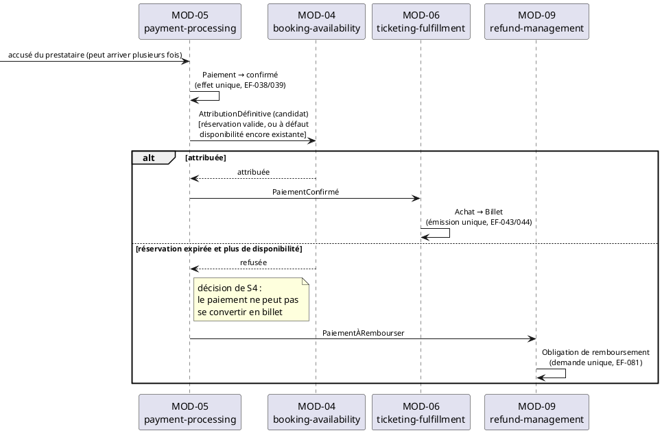

# Responsabilités des modules — Eventix

| Champ | Valeur |
|---|---|
| **Phase** | 07 — Architecture logique |
| **Projet** | Eventix |
| **Périmètre** | MVP |
| **Marché initial** | Cameroun |
| **Sources** | `modules.md` (phase 07, version intégrant l'arbitrage C1 du 07/10/2026), `services-de-domaine.md` (phase 05) |
| **Notation** | PlantUML — UML 2.5 |
| **Statut** | Proposition — à valider par l'équipe |
| **Verdict** | **VALIDÉ SOUS CONDITIONS** (voir §14) |

---

## Table des matières

1. [Objectif et portée](#1-objectif-et-portée)
2. [Ce qui est hérité, ce qui est ajouté](#2-ce-qui-est-hérité-ce-qui-est-ajouté)
3. [Méthode d'attribution](#3-méthode-dattribution)
4. [Vue d'ensemble : une responsabilité par module](#4-vue-densemble--une-responsabilité-par-module)
5. [Attribution des services de domaine aux modules](#5-attribution-des-services-de-domaine-aux-modules)
6. [Fiches de responsabilité](#6-fiches-de-responsabilité)
7. [Qui décide quoi](#7-qui-décide-quoi)
8. [Frontières de responsabilité entre modules voisins](#8-frontières-de-responsabilité-entre-modules-voisins)
9. [Cas limites : la responsabilité sous défaillance](#9-cas-limites--la-responsabilité-sous-défaillance)
10. [Principes SOLID et patterns retenus](#10-principes-solid-et-patterns-retenus)
11. [Contrats candidats, flux manquants résolus ou ouverts](#11-contrats-candidats-flux-manquants-résolus-ou-ouverts)
12. [Incohérences relevées dans les sources](#12-incohérences-relevées-dans-les-sources)
13. [Hypothèses retenues](#13-hypothèses-retenues)
14. [Points à clarifier avec le client / product owner](#14-points-à-clarifier-avec-le-client--product-owner)
15. [Ce que ce document ne préjuge pas](#15-ce-que-ce-document-ne-préjuge-pas)
16. [Statut](#16-statut)

---

## 1. Objectif et portée

`modules.md` a défini **ce qu'est** chaque module : son périmètre, ses agrégats, ses contrats. Ce document répond à une question différente :

> **De quoi chaque module est-il responsable, c'est-à-dire quelles décisions prend-il, quels invariants garantit-il, quelles opérations transversales héberge-t-il, et que ne doit-il jamais faire ?**

Une responsabilité est dite **claire** lorsque quatre conditions sont réunies :

1. elle tient en **une phrase** (la raison d'être du module) ;
2. chaque décision métier a **un seul décideur** : jamais deux modules ne tranchent la même question ;
3. une liste explicite de ce que le module **ne fait pas** la sépare de ses voisins ;
4. elle donne au module **une seule raison de changer**.

---

## 2. Ce qui est hérité, ce qui est ajouté

| Élément | Origine | Traitement ici |
|---|---|---|
| 13 modules `MOD-nn`, agrégats possédés, contrats publiés et requis | `modules.md` §6–7 | Les douze modules historiques sont conservés ; MOD-13 porte la supervision cybersécurité |
| Règles de modularité R1 à R8 | `modules.md` §4 | Opposables : toute attribution les respecte |
| Arbitrage `StatutBilletUtilisé` : MOD-07 → MOD-06 | `modules.md` §13.1 | Pris comme acquis |
| 10 services de domaine, leurs agrégats, règles et ordres de coordination | `services-de-domaine.md` §5–6 | Repris et **rattachés à un module hôte** (§5) |
| Flux manquants G1 à G8, questions C2 à C10 | `modules.md` §13.2, §15 | Réexaminés à la lumière des services de domaine (§11) |

**Ajouté par ce document :**

- la règle d'attribution d'un service transversal à un module hôte, et son application aux dix services (§5) ;
- une fiche de responsabilité par module : décisions, invariants, services hébergés, exclusions (§6) ;
- une table « qui décide quoi » et une table des frontières voisines (§7, §8) ;
- **trois flux manquants résolus** grâce aux services de domaine (G1, G2, G4), **deux nouveaux ouverts** (G9, G10), **une tension nouvelle** sur l'arbitre de la validation d'entrée (§12).

> **Limite de lecture :** `agregats.md` et `processus-metier.md` ne figurent pas dans les sources fournies. Les références PM01 à PM72 sont reprises telles que citées dans `services-de-domaine.md`, sans être relues. Les agrégats sont rattachés aux modules d'après la table de `diagrammes-de-composants.md` §3, telle que reprise dans `modules.md` §6.

---

## 3. Méthode d'attribution

### 3.1. Cinq règles d'attribution

| # | Règle | Conséquence |
|---|---|---|
| **RA1** | **Un décideur par décision.** Une question métier est tranchée par un seul module. | Pas de décision « à deux clés » entre modules |
| **RA2** | **La responsabilité suit la donnée.** Le module qui possède l'agrégat (R1) décide de ses transitions d'état. | Un module peut *demander* une transition à un autre, jamais l'effectuer |
| **RA3** | **Un service transversal a un seul hôte.** Les services de domaine coordonnent plusieurs agrégats ; ceux qui franchissent des frontières de modules sont hébergés par le module qui détient la **décision finale** de l'enchaînement. Les autres modules exécutent leur propre transition, par leur contrat. | Cohérence de l'enchaînement portée par un seul responsable (voir D-R1) |
| **RA4** | **Un hôte n'est pas un propriétaire.** Héberger un service ne donne aucun droit sur les agrégats des modules participants (R1, S5). | L'hôte appelle des capacités nommées (R4), jamais un état interne |
| **RA5** | **Les modules d'observation n'ont aucun pouvoir de décision métier.** | MOD-11 ne décide rien (R5) |

### 3.2. Lecture d'un service de domaine à travers les modules

`services-de-domaine.md` définit un service comme sans état, coordonnant des agrégats **par leurs racines**, jamais autrement (S4, S5). Transposé aux modules :

- si tous les agrégats coordonnés sont dans **un seul module**, le service est un service de domaine **interne** de ce module ;
- si les agrégats sont dans **plusieurs modules**, le service devient un **processus transversal** : un module hôte l'orchestre, et chaque autre module exécute sa transition par un contrat nommé (R2, R4). Aucun module ne touche l'agrégat d'un autre.

---

## 4. Vue d'ensemble : une responsabilité par module

| Module | **Responsabilité en une phrase** | Décide de | Arbitre unique de |
|---|---|---|---|
| `MOD-01` identity-access | Dire **qui est l'acteur** et ce qu'il est autorisé à être | Identité, capacité organisateur, vérification d'organisation | Compte et capacités |
| `MOD-02` event-catalog | Dire **ce qu'est un événement**, comment il est configuré et dans quel état il se trouve | Publication, arrêt des ventes, annulation, report, capacités | Configuration de l'événement |
| `MOD-03` event-discovery | **Présenter** les événements publiés au participant | Présentation et filtrage, jamais la vérité | Rien (projection en lecture) |
| `MOD-04` booking-availability | Dire **si une unité est attribuable maintenant** | Réservation, expiration, attribution définitive | Attribution des disponibilités |
| `MOD-05` payment-processing | Dire **si un paiement a eu lieu** et ce qu'il entraîne | État du paiement, effet unique de la confirmation, issue d'un paiement tardif | Paiement |
| `MOD-06` ticketing-fulfillment | Dire **qui détient quel billet** et si ce billet est valable | Émission, propriétaire actif, transferts, état du billet | Billet |
| `MOD-07` access-control | Dire **si cette personne peut entrer maintenant** | Autorisation ou refus d'un scan, présence, mode dégradé | Validation d'entrée |
| `MOD-08` financial-settlement | Dire **combien revient à l'organisateur** et ce qu'il peut retirer | Montant net, clôture, recevabilité d'un retrait | Solde organisateur |
| `MOD-09` refund-management | Dire **si un remboursement est dû**, de combien, et le faire **une seule fois** | Obligation, montant de référence, reprise après échec | Obligation de remboursement |
| `MOD-10` trust-safety | Dire **si un signalement justifie une mesure**, et laquelle | Niveau de risque, mesure de sécurité, proportionnalité | Décision de sécurité |
| `MOD-11` analytics-observability | **Se souvenir et compter**, sans jamais décider | Aucune décision métier | Rien (consommateur, jamais source de vérité) |
| `MOD-12` communication | **Faire parvenir** l'information au participant par un canal | Choix du canal et de la forme de livraison, jamais *s'il faut* informer | Distribution et notification |
| `MOD-13` cybersecurity-operations | **Détecter, qualifier et tracer** les incidents cyber, avec décision humaine | Qualification cyber et décision de réponse autorisée | Alerte, incident et décision de réponse cyber |

Les quatre arbitres d'EF-128 (configuration, attribution, billet, validation) figurent dans la dernière colonne : MOD-02, MOD-04, MOD-06, MOD-07.

---

## 5. Attribution des services de domaine aux modules

### 5.1. Règle appliquée

### D-R1 — Un service transversal est hébergé par le module qui détient la décision finale de l'enchaînement

| Axe | Contenu |
|---|---|
| **Décision** | Chacun des dix services est hébergé par un module et un seul (§5.2). Les modules participants exécutent leur transition via un contrat nommé. |
| **Raisonnement** | `services-de-domaine.md` §6.2 établit que l'idempotence d'un enchaînement « caractérise l'enchaînement lui-même » : aucun agrégat seul ne la voit. Il faut donc un porteur unique de l'enchaînement (RA3). Le service reste sans état : la preuve de la coordination appartient aux agrégats (§6.3 de la source). |
| **Avantages** | Un responsable identifiable pour chaque processus transversal. Pas de logique de coordination dupliquée. Respect de R1 et R2 : aucun module ne manipule l'agrégat d'un autre. |
| **Inconvénients** | L'hôte connaît l'**ordre** de ses participants, donc un couplage de séquence. MOD-02 héberge trois services : c'est le module le plus sollicité (déjà pivot, `modules.md` §8.2). |
| **Risques** | Un hôte qui grossit devient un module « chef d'orchestre » omniscient. Garde-fou : l'hôte ne porte que l'**ordre** et la **garantie d'enchaînement**, jamais les règles métier des participants. |
| **Alternatives rejetées** | **(a) Un 13e module « orchestrateur »** : viole la correspondance 1-à-1 `MOD-nn` = `BC-nn`, crée un module sans langage métier propre et un point de défaillance unique. **(b) Chorégraphie pure sans hôte** : personne ne porte la cohérence de l'enchaînement ni son idempotence. **(c) Service dupliqué dans chaque module participant** : plusieurs porteurs d'une même garantie, donc des divergences. |

### 5.2. Table d'attribution

Les modules « impliqués » sont déduits des agrégats coordonnés (les en-têtes de `services-de-domaine.md` sont partiels : voir §12).

| # | Service de domaine | Processus | **Module hôte** | Modules participants (leur transition, par contrat) | Justification de l'hôte |
|---|---|---|---|---|---|
| S1 | ServiceDeVerificationEvenementielle | PM05, PM06 | **MOD-02** | MOD-01 (Organisation), MOD-10 (Mesure de sécurité) | La décision de publier est une transition de l'Événement : elle appartient au catalogue |
| S2 | ServiceDExpirationDeReservation | PM42 | **MOD-04** | — (Réservation et Disponibilité sont dans MOD-04) | Service **interne** : deux agrégats d'un même module |
| S3 | ServiceDeFinalisationDAchat | PM45, PM47, PM62 | **MOD-05** (début) puis **MOD-06** (fin) | MOD-04 (Réservation, Disponibilité) | Voir D-R2 ci-dessous |
| S4 | ServiceDeReconciliation | PM43, PM63 | **MOD-05** | MOD-04 (Disponibilité), MOD-06 (Billet), MOD-09 (Obligation) | L'agrégat Réconciliation vit dans MOD-05, et la décision porte sur un paiement |
| S5 | ServiceDAnnulationDevenement | PM29, PM64 | **MOD-02** | MOD-06 (Billets), MOD-09 (Obligations), MOD-12 (Notification) | L'annulation est d'abord une transition de l'Événement ; le reste en découle |
| S6 | ServiceDeReportDevenement | PM30, PM65 | **MOD-02** | MOD-12 (Notification) | Idem : le report est une transition de l'Événement |
| S7 | ServiceDeControleDAcces | PM14 → 18, PM22 → 26, PM66 | **MOD-07** | MOD-06 (Billet) | Le scan et son résultat sont le cœur de MOD-07 |
| S8 | ServiceDeGestionDuModeDegrade | PM48, PM67 | **MOD-07** | — (Points d'entrée dans MOD-07) | Service **interne** : plusieurs instances d'un même agrégat |
| S9 | ServiceDeClotureFinanciere | PM28, PM57, PM58, PM70 | **MOD-08** | MOD-06, MOD-09 (lectures par identité) | Clôture et Solde sont dans MOD-08 ; les sources sont en lecture |
| S10 | ServiceDApplicationDeMesureDeSecurite | PM54, PM55, PM68, PM69 | **MOD-10** | MOD-01 (Utilisateur, Organisation), MOD-02 (Événement), MOD-12 (Notification) | MOD-10 décide la mesure ; les cibles appliquent leur propre transition |

**Bilan :** 7 modules hébergent au moins un service (MOD-02 : 3 ; MOD-05 : 2 ; MOD-07 : 2 ; MOD-04, 06, 08, 10 : 1 chacun). Cinq modules n'en hébergent aucun et sont purement **exécutants** : MOD-01, MOD-03, MOD-09, MOD-11, MOD-12. Pour MOD-09 comme pour MOD-12, c'est cohérent : ils appliquent des décisions prises ailleurs.

### 5.3. Matrice services × modules

`H` = hôte · `P` = participant (exécute sa transition) · `L` = lecture par identité

| Service | 01 | 02 | 03 | 04 | 05 | 06 | 07 | 08 | 09 | 10 | 11 | 12 |
|---|---|---|---|---|---|---|---|---|---|---|---|---|
| S1 Vérification | P | **H** | | | | | | | | P | | |
| S2 Expiration | | | | **H** | | | | | | | | |
| S3 Finalisation | | | | P | **H₁** | **H₂** | | | | | | |
| S4 Réconciliation | | | | P | **H** | P | | | P | | | |
| S5 Annulation | | **H** | | | | P | | | P | | | P |
| S6 Report | | **H** | | | | | | | | | | P |
| S7 Contrôle d'accès | | | | | | P | **H** | | | | | |
| S8 Mode dégradé | | | | | | | **H** | | | | | |
| S9 Clôture | | | | | | L | | **H** | L | | | |
| S10 Mesure de sécurité | P | P | | | | | | | | **H** | | P |

### 5.4. Le cas délicat : la finalisation d'achat (S3) traverse trois modules

`services-de-domaine.md` §5.3 confie à **un seul service** l'enchaînement Paiement → Réservation → Disponibilité → Achat → Billet, soit trois modules (05, 04, 06). Aucun contrat documenté ne permet à MOD-04 de savoir qu'une réservation a abouti : c'était le flux manquant **G4** de `modules.md`. La source des services de domaine le confirme : la finalisation **décrémente la disponibilité**. Il faut donc un contrat, et un hôte.

### D-R2 — La finalisation d'achat est coupée en deux séquences, reliées par `PaiementConfirmé`

| Axe | Contenu |
|---|---|
| **Décision** | **MOD-05** héberge la première séquence : confirmer le paiement (effet unique), puis demander à MOD-04 l'**attribution définitive** (contrat candidat `AttributionDéfinitive`). Si MOD-04 l'accorde, MOD-05 publie `PaiementConfirmé`. **MOD-06** héberge la seconde : finaliser l'achat et émettre le billet (émission unique). Si MOD-04 refuse, MOD-05 publie `PaiementÀRembourser` (c'est S4). |
| **Raisonnement** | Les deux chemins (paiement dans les temps, paiement tardif) se rejoignent en un seul point de décision : « existe-t-il une disponibilité ? ». Ce point est dans MOD-04 (arbitre unique, EF-034). Le placer côté MOD-05 fait de la réconciliation (S4) la branche « refusé » du même enchaînement. MOD-06 reste purement aval : il ne parle jamais à MOD-04. |
| **Avantages** | Une seule décision d'attribution, un seul chemin pour le cas nominal et le cas tardif. MOD-06 ne dépend que de MOD-05 et MOD-02. Le cycle ajouté (04 ↔ 05) est une boucle courte et naturelle (réserver, payer, confirmer la réservation), admise par D-M3 de `modules.md`. |
| **Inconvénients** | Un contrat de plus (`AttributionDéfinitive`, MOD-05 → MOD-04). La séquence est coupée : une panne entre l'attribution et l'émission laisse une disponibilité attribuée sans billet. |
| **Risques** | **« Attribué sans billet »** : la disponibilité est consommée, le billet n'existe pas encore. Garde-fou : l'émission doit être **rejouable** et idempotente (EF-052, R6), et `PaiementConfirmé` ne doit jamais être perdu. Le mode de livraison de ce contrat relève de `communication.md` : il doit garantir la livraison au moins une fois. |
| **Alternatives rejetées** | **(a) Hôte unique MOD-06**, qui appellerait MOD-04 après `PaiementConfirmé` : crée un cycle long 04 → 05 → 06 → 04 et fait décider MOD-06 d'une disponibilité qui n'est pas sienne. **(b) Hôte unique MOD-05** pour toute la chaîne jusqu'au billet : MOD-05 modifierait l'émission du billet, qui relève de MOD-06 (viole R1). **(c) Hôte unique MOD-04** : MOD-04 n'a aucune raison de connaître paiement ni billet. |

**Lecture :** MOD-04 est l'unique voix sur la disponibilité ; MOD-05 qualifie la situation du paiement ; MOD-06 et MOD-09 appliquent chacun leur transition. `AttributionDéfinitive` est un **contrat candidat**, à valider dans `interfaces.md` (§11).

---

## 6. Fiches de responsabilité

Chaque fiche reprend les agrégats, contrats et exigences de `modules.md` §7 et §10 sans les répéter. Elle ajoute ce que `modules.md` ne dit pas : **ce que le module décide, garantit et s'interdit**.

### 6.1. `MOD-01` — identity-access

| Champ | Valeur |
|---|---|
| **Raison d'être** | Dire **qui est l'acteur** et ce qu'il est autorisé à être (participant, organisateur, organisation vérifiée). |
| **Décide** | L'identité authentifiée · l'accès aux capacités d'organisateur · l'issue de la vérification d'une organisation |
| **Garantit** | Un même compte peut être participant et organisateur (EF-006) · moindre privilège (P7) |
| **Héberge** | Aucun service |
| **Participe à** | S1 (fournit l'état de vérification de l'Organisation) · S10 (applique la mesure de sécurité à l'Utilisateur et à l'Organisation) |
| **Ne fait pas** | Décider d'un bannissement (MOD-10) · décider de la publication d'un événement (MOD-02) · évaluer un risque de fraude (MOD-10) |
| **Raison unique de changer** | Les règles de comptes, d'authentification ou de vérification d'organisation |

### 6.2. `MOD-02` — event-catalog

| Champ | Valeur |
|---|---|
| **Raison d'être** | Dire **ce qu'est un événement**, comment il est configuré et dans quel état il se trouve. |
| **Décide** | Publier ou non un événement (S1) · arrêter les ventes · annuler (S5) · reporter (S6) · accepter ou refuser une modification de capacité (EF-024) · refuser une suppression (EF-124) |
| **Garantit** | Un événement refusé ne peut pas être publié · un événement annulé ne reçoit plus de ventes · un événement ayant des opérations irréversibles n'est jamais supprimé, il change d'état · historique de configuration non réécrit (P5) |
| **Héberge** | **S1, S5, S6** |
| **Participe à** | S10 (applique la décision de sécurité à l'Événement) |
| **Ne fait pas** | Exposer au public (MOD-03) · arbitrer l'attribution (MOD-04) · détenir ou modifier un billet (MOD-06) · calculer un remboursement (MOD-09) · envoyer une notification (MOD-12) · décider d'une mesure de sécurité (MOD-10) |
| **Raison unique de changer** | Les règles de configuration et de cycle de vie d'un événement |

**Note :** MOD-02 *ordonne* l'annulation (il en est l'hôte) sans jamais *exécuter* ce qui relève des autres modules. L'invalidation des billets reste une transition de MOD-06 ; l'obligation de remboursement, une création de MOD-09.

### 6.3. `MOD-03` — event-discovery

| Champ | Valeur |
|---|---|
| **Raison d'être** | **Présenter** les événements publiés au participant. |
| **Décide** | Comment présenter, rechercher et filtrer. Jamais ce qui est vrai. |
| **Garantit** | Ne présente que des événements publiés · n'écrit aucune donnée d'événement · la disponibilité affichée est **indicative**, jamais contractuelle |
| **Héberge** | Aucun service |
| **Participe à** | Aucun service |
| **Ne fait pas** | Modifier un événement (MOD-02) · garantir une disponibilité (MOD-04) · réserver (il transmet seulement la `DemandeDeRéservation`) |
| **Raison unique de changer** | La manière de présenter et de rechercher |

### 6.4. `MOD-04` — booking-availability

| Champ | Valeur |
|---|---|
| **Raison d'être** | Dire **si une unité est attribuable maintenant**. |
| **Décide** | Accepter ou refuser une réservation · faire expirer une réservation · accorder ou refuser l'**attribution définitive** (contrat candidat, §5.4) |
| **Garantit** | Aucune double attribution d'une même disponibilité (EF-034) · le total attribué ne dépasse jamais la capacité · l'expiration est indépendante de l'état du paiement (P2) |
| **Héberge** | **S2** |
| **Participe à** | S3 et S4 (exécute les transitions Réservation et Disponibilité à la demande de MOD-05) |
| **Ne fait pas** | Encaisser un paiement (MOD-05) · émettre un billet (MOD-06) · décider qu'un paiement tardif est inconvertible (MOD-05) · fixer la capacité configurée (MOD-02) |
| **Raison unique de changer** | Les règles de réservation, d'expiration et d'attribution |

**Note :** pour un paiement tardif, MOD-04 répond **seulement** « disponibilité existante ou non ». C'est MOD-05 qui en tire l'issue, billet ou remboursement.

### 6.5. `MOD-05` — payment-processing

| Champ | Valeur |
|---|---|
| **Raison d'être** | Dire **si un paiement a eu lieu** et ce qu'il entraîne. |
| **Décide** | L'état d'un paiement · l'effet unique d'une confirmation, même reçue plusieurs fois · l'issue d'un paiement tardif (S4) · la qualification « à rembourser » |
| **Garantit** | Une confirmation reçue plusieurs fois ne produit qu'un seul effet (EF-038, 039 ; P6) · un paiement tardif n'est **jamais ignoré** (EF-041) |
| **Héberge** | **S4** et la première séquence de **S3** (D-R2) |
| **Participe à** | Aucun service hébergé ailleurs |
| **Ne fait pas** | Émettre un billet (MOD-06) · décider de la disponibilité (MOD-04) · calculer le montant d'un remboursement ou créer l'obligation (MOD-09) |
| **Raison unique de changer** | Le prestataire Mobile Money et les règles de traitement de paiement |

**Note :** MOD-05 est la **seule porte** vers le prestataire pour l'encaissement (port sortant, `modules.md` §7.5).

### 6.6. `MOD-06` — ticketing-fulfillment

| Champ | Valeur |
|---|---|
| **Raison d'être** | Dire **qui détient quel billet** et si ce billet est valable. |
| **Décide** | Émettre un billet · désigner le propriétaire actif · accepter un transfert · faire évoluer l'état du billet, y compris `USED` et invalidé |
| **Garantit** | Une émission par paiement confirmé (EF-043, 044, 052 ; P6) · un seul propriétaire actif (EF-047) · historique des transferts conservé (EF-055) · un billet n'existe qu'à l'émission, jamais à la confirmation de paiement |
| **Héberge** | La seconde séquence de **S3** (Achat → Billet) |
| **Participe à** | S4 (émet si l'attribution est accordée) · S5 (invalide les billets d'un événement annulé) · S7 (reçoit le statut d'utilisation, C1) · S9 (lecture des achats finalisés) |
| **Ne fait pas** | Contrôler l'accès (MOD-07) · encaisser (MOD-05) · distribuer par un canal (MOD-12) · décider d'annuler un événement (MOD-02) · autoriser une revente (hors MVP, EF-056) |
| **Raison unique de changer** | Les règles d'émission, de propriété et de transfert d'un billet |

### 6.7. `MOD-07` — access-control

| Champ | Valeur |
|---|---|
| **Raison d'être** | Dire **si cette personne peut entrer maintenant**. |
| **Décide** | Autoriser ou refuser un scan · enregistrer la présence · basculer en mode mono-scanner dégradé et resynchroniser (S8) |
| **Garantit** | Une seule validation réussie par billet (EF-067) · jamais plusieurs contrôles concurrents sans état partagé fiable (PM71, Règle 7) · un billet utilisé, annulé ou d'un autre événement est refusé |
| **Héberge** | **S7, S8** |
| **Participe à** | Aucun service hébergé ailleurs |
| **Ne fait pas** | Émettre ou modifier un billet (MOD-06 seul détient son état) · définir l'événement (MOD-02) · calculer des statistiques (MOD-11) |
| **Raison unique de changer** | Les règles de contrôle d'entrée et de gestion des scanners |

**Attention :** la responsabilité exacte de l'arbitrage de la validation fait l'objet d'une tension entre les deux sources (§12, T1).

### 6.8. `MOD-08` — financial-settlement

| Champ | Valeur |
|---|---|
| **Raison d'être** | Dire **combien revient à l'organisateur** et ce qu'il peut retirer. |
| **Décide** | Le montant net · la clôture financière d'un événement · la recevabilité d'un retrait · la restitution d'un retrait échoué au solde |
| **Garantit** | Aucun retrait avant la clôture · aucun retrait au-delà du solde (EF-111) · plusieurs retraits successifs possibles (EF-114) |
| **Héberge** | **S9** |
| **Participe à** | Aucun service hébergé ailleurs |
| **Ne fait pas** | Créer un achat (MOD-06) · déterminer ou exécuter un remboursement (MOD-09) · se substituer au prestataire pour le virement réel (port à définir, G6) |
| **Raison unique de changer** | Les règles de clôture, de solde et de retrait |

### 6.9. `MOD-09` — refund-management

| Champ | Valeur |
|---|---|
| **Raison d'être** | Dire **si un remboursement est dû**, de combien, et le faire **une seule fois**. |
| **Décide** | La création de l'obligation de remboursement · le montant de référence (EF-082) · la reprise après échec · le refus d'un remboursement de simple convenance (EF-087) |
| **Garantit** | Une seule demande par obligation (EF-081, 085) · traitement progressif à grande échelle (EF-086, P8) |
| **Héberge** | Aucun service |
| **Participe à** | S4 (crée l'obligation sur `PaiementÀRembourser`) · S5 (crée les obligations après annulation) · S9 (lecture des remboursements traités) |
| **Ne fait pas** | Qualifier un paiement tardif comme inconvertible (MOD-05) · annuler un événement (MOD-02) · tenir le solde (MOD-08) |
| **Raison unique de changer** | Les règles d'éligibilité, de calcul et d'exécution des remboursements |

**Note :** MOD-05 *constate* qu'un paiement ne peut pas devenir un billet ; MOD-09 *possède l'obligation*. Voir §8 et §12 (T2).

### 6.10. `MOD-10` — trust-safety

| Champ | Valeur |
|---|---|
| **Raison d'être** | Dire **si un signalement justifie une mesure**, et laquelle. |
| **Décide** | Le niveau de risque · la mesure de sécurité · la proportionnalité de la réponse |
| **Garantit** | Un signalement n'est pas automatiquement une preuve de fraude · une organisation bannie ne poursuit pas librement son activité · les événements existants sont évalués **individuellement** avant toute annulation · toute décision est tracée (EF-094, P5) |
| **Héberge** | **S10** |
| **Participe à** | S1 (l'état de la Mesure de sécurité entre dans la décision de publier) |
| **Ne fait pas** | Modifier directement un compte, une organisation ou un événement (R1) · publier ou annuler un événement (MOD-02) |
| **Raison unique de changer** | Les règles de signalement, d'analyse du risque et de mesure |

### 6.11. `MOD-11` — analytics-observability

| Champ | Valeur |
|---|---|
| **Raison d'être** | **Se souvenir et compter**, sans jamais décider. |
| **Décide** | Rien qui engage le métier. |
| **Garantit** | Lecture seule stricte (EF-104) · journal préservé après modification des données d'origine (EF-117) |
| **Héberge** | Aucun service |
| **Participe à** | Aucun service : consommateur des faits |
| **Ne fait pas** | Servir de source de vérité à un autre module (R5) · modifier un fait reçu · prouver à la place d'un module que celui-ci a bien opéré (chaque module garde sa propre trace utile) |
| **Raison unique de changer** | Les statistiques et le journal produits |

**Note :** `services-de-domaine.md` §6.3 prévoit que toute coordination laisse une trace dans un agrégat approprié (Historique de configuration, Événement métier, Historique). Ces traces sont **utiles** à MOD-11 mais ne doivent pas lui être **nécessaires** : un module dont la correction dépend d'une trace conservée dans MOD-11 violerait R5.

### 6.12. `MOD-12` — communication

| Champ | Valeur |
|---|---|
| **Raison d'être** | **Faire parvenir** l'information au participant par un canal. |
| **Décide** | Le canal et la forme de livraison. Jamais *s'il faut* informer : cette décision appartient à l'hôte du service. |
| **Garantit** | Le canal est interchangeable (P9) · un échec d'envoi n'invalide pas un billet déjà émis |
| **Héberge** | Aucun service |
| **Participe à** | S5, S6 (informe de l'annulation ou du report) · S10 (informe les parties d'une mesure, voir G10) |
| **Ne fait pas** | Décider d'annuler ou de reporter (MOD-02) · émettre un billet (MOD-06) · connaître les règles métier derrière une notification |
| **Raison unique de changer** | Les canaux et la forme des messages |

### 6.13. `MOD-13` — cybersecurity-operations

| Champ | Valeur |
|---|---|
| **Raison d'être** | Recevoir les signaux autorisés, gérer les alertes/incidents cyber et tracer les réponses décidées par des humains habilités |
| **Décide** | Qualification cyber et consignation d'une décision de réponse humaine autorisée |
| **Garantit** | Une alerte n'est pas une preuve ; aucune mesure n'est déclenchée automatiquement ; toute décision et tout résultat sont traçables |
| **Héberge** | Gestion des alertes et incidents cyber ; tableau de bord de supervision |
| **Ne fait pas** | Décider une sanction Trust & Safety (MOD-10) · modifier les données d'un autre module · servir de journal analytique (MOD-11) · traiter un paiement, remboursement ou retrait (MOD-05/09/08) |
| **Raison unique de changer** | Sources et règles de signalement, qualification et suivi de réponse cybersécurité |

---

## 7. Qui décide quoi

Tableau de tranchage : pour une question métier donnée, un seul module répond. Il applique RA1.

| Question métier | **Décideur** | Les autres modules |
|---|---|---|
| Cet acteur est-il authentifié, et peut-il agir comme organisateur ? | MOD-01 | Consomment `IdentitéDesActeurs` |
| Cet événement peut-il être publié ? | MOD-02 (S1) | MOD-01 et MOD-10 fournissent leurs états |
| Peut-on réduire la capacité d'une catégorie ? | MOD-02 | Doit connaître l'attribué (G5) |
| Cet événement est-il annulé ou reporté ? | MOD-02 (S5, S6) | MOD-06, 09, 12 exécutent |
| Cette disponibilité peut-elle être attribuée ? | MOD-04 | MOD-05 demande, ne tranche pas |
| Cette réservation a-t-elle expiré ? | MOD-04 (S2) | — |
| Ce paiement est-il confirmé, ou est-ce un doublon ? | MOD-05 | MOD-06 reçoit `PaiementConfirmé` |
| Ce paiement tardif donne-t-il un billet ou un remboursement ? | MOD-05 (S4) | MOD-04 répond sur la disponibilité ; MOD-06 ou MOD-09 appliquent |
| Ce billet est-il émis ? Qui en est le propriétaire actif ? | MOD-06 | MOD-07, 12 consomment |
| Ce billet est-il invalidé après annulation ? | MOD-02 décide l'annulation ; **MOD-06 effectue l'invalidation** | |
| Cette personne peut-elle entrer ? | MOD-07 (S7) | MOD-06 reçoit le statut |
| Faut-il passer en mode mono-scanner ? | MOD-07 (S8) | — |
| Un remboursement est-il dû, de combien ? | MOD-09 | MOD-05 constate le cas, ne crée pas l'obligation |
| Quel est le montant net de l'organisateur ? | MOD-08 (S9) | MOD-06 et MOD-09 fournissent les sources |
| Ce retrait est-il recevable ? | MOD-08 | — |
| Ce signalement justifie-t-il une mesure ? Laquelle ? | MOD-10 | — |
| Ce compte ou cette organisation est-il banni ? | MOD-10 décide ; **MOD-01 applique** | |
| Par quel canal informer ? | MOD-12 | — |
| Cette statistique est-elle fiable ? | MOD-11 | Aucune décision métier n'en dépend (R5) |
| Ce signal constitue-t-il un incident cyber, quelle est sa qualification ? | MOD-13, avec qualification humaine | MOD-10 ne confirme pas d'intrusion ; MOD-11 ne prend pas de décision |
| Quelle réponse cyber est autorisée ? | Responsable humain habilité, enregistrée par MOD-13 | Le module propriétaire applique ou refuse sa transition |

---

## 8. Frontières de responsabilité entre modules voisins

Les risques de chevauchement se concentrent aux frontières où deux modules touchent à la même situation métier. Pour chacune, une règle de tranchage.

| Frontière | Risque de chevauchement | Règle de tranchage |
|---|---|---|
| **02 / 03** | Qui possède les données d'événement ? | MOD-02 gère, MOD-03 expose. MOD-03 ne possède aucune donnée d'événement qui fasse autorité. |
| **04 / 05** | La réservation expire-t-elle à l'échec du paiement ? | Non (P2) : MOD-04 gère l'expiration seul ; MOD-05 gère le paiement seul. |
| **04 / 05** (paiement tardif) | Qui décide de l'issue ? | MOD-04 répond « disponibilité existe ou non » ; MOD-05 en tire l'issue. |
| **05 / 06** | Un paiement confirmé est-il déjà un billet ? | Non : le billet n'existe qu'à l'émission, décidée par MOD-06. |
| **05 / 09** | Qui décide qu'un remboursement est requis ? | MOD-05 *constate* que le paiement est inconvertible ; MOD-09 *possède l'obligation* et calcule le montant. Voir T2. |
| **06 / 07** | Qui détient l'état d'utilisation du billet ? | MOD-06 détient l'état du billet ; MOD-07 détient le résultat du contrôle et en informe MOD-06. Voir T1. |
| **06 / 08** | Qui crée les achats ? | MOD-06 vend, MOD-08 consolide. La clôture ne crée aucun achat. |
| **02 / 09** | Qui déclenche les remboursements d'une annulation ? | MOD-02 hôte de l'annulation déclenche ; MOD-09 crée les obligations (contrat candidat, §11). |
| **09 / 08** | Qui exécute le remboursement dans le solde ? | MOD-09 traite le remboursement ; MOD-08 en tient compte dans le solde. |
| **10 / 01, 10 / 02** | Qui applique un bannissement ou une annulation décidée par MOD-10 ? | MOD-10 décide, MOD-01 ou MOD-02 applique par sa propre transition (R1). |
| **02 / 12, 06 / 12** | Qui décide d'informer ? | L'hôte du service (MOD-02, MOD-10) ou MOD-06 pour un billet émis. MOD-12 décide seulement du canal. |

---

## 9. Cas limites : la responsabilité sous défaillance

| Situation | Qui est responsable de quoi | Protection |
|---|---|---|
| **Même confirmation de paiement reçue deux fois** | MOD-05 absorbe le doublon (effet unique) ; MOD-06 garantit l'émission unique en seconde ligne | Idempotence à **deux niveaux** : l'accusé (MOD-05) et l'émission (MOD-06) ; R6 |
| **Disponibilité attribuée, panne avant l'émission** | MOD-06 doit pouvoir rejouer l'émission ; MOD-05 ne doit pas perdre `PaiementConfirmé` | Émission rejouable et idempotente (EF-052) ; livraison au moins une fois à garantir (§5.4) |
| **Paiement après expiration, plus de disponibilité** | MOD-05 constate, MOD-09 crée l'obligation | S4 ; jamais ignoré (EF-041) |
| **Annulation d'un événement massif, panne en cours de route** | MOD-02 est responsable du **rejeu** de l'enchaînement ; chaque étape chez les participants doit être idempotente | R6 ; voir CR4 sur le suivi de fin d'étape |
| **Scan en mode dégradé, état du billet en retard sur MOD-06** | MOD-07 garantit l'unicité de la validation localement ; MOD-06 est mis à jour à la resynchronisation (EF-071) | Voir T1 |
| **Transfert d'un billet pendant que ce billet est scanné** | MOD-06 reste décideur du transfert ; il doit refuser le transfert d'un billet utilisé, ce qui suppose d'avoir reçu le statut | **Risque de course** : fenêtre entre le scan (MOD-07) et la réception du statut (MOD-06). À borner, voir T1 |
| **Mesure de sécurité décidée pendant une annulation en cours** | MOD-10 décide, MOD-02 applique par sa transition d'état ; l'annulation en cours n'est pas contournée | Une seule transition d'état à la fois sur l'Événement (invariant de MOD-02) |
| **Échec d'envoi d'une notification d'annulation** | MOD-12 réessaie par son canal ; l'annulation, elle, reste valide | La communication n'est jamais une condition de l'annulation (§6.12) |
| **Crédit au solde puis remboursement tardif** | MOD-08 consolide à la clôture ; MOD-09 reste responsable des remboursements après clôture si une obligation naît | À trancher : traitement d'un remboursement postérieur à la clôture (CR6) |

---

## 10. Principes SOLID et patterns retenus

| Principe / Pattern | Application ici | Pourquoi |
|---|---|---|
| **SRP** | Chaque module a une raison unique de changer (§6) | Une règle de remboursement ne doit jamais modifier la billetterie |
| **Process Manager (processus orchestré)** | Les services transversaux sont orchestrés par un module hôte (D-R1), l'état de progression restant dans les agrégats | Un responsable identifiable de l'enchaînement et de son idempotence |
| **Tell, don't ask** | L'hôte demande une transition par un contrat nommé ; il ne lit pas l'état interne du participant (RA4, R2) | Évite le couplage à l'état interne d'un autre module |
| **Single decision-maker** | RA1 et §7 : une question, un décideur | Supprime les décisions « à deux clés » |
| **ISP** | `AttributionDéfinitive` porte une seule capacité (§5.4) | Un contrat de plus plutôt qu'un contrat fourre-tout `ServiceMOD04` |

**Non retenu (sur-engineering évité) :**

- **Pas de saga générique ni de moteur de workflow** : cinq processus transversaux (S1, S3, S4, S5, S10) seulement, dont chacun est court. Un mécanisme générique n'est pas justifié au MVP.
- **Pas d'hôte « transversal » unique** pour tous les services : rejeté en D-R1.
- **Pas de MOD-11 comme registre d'avancement des processus** : violerait R5.

---

## 11. Contrats candidats, flux manquants résolus ou ouverts

`modules.md` §13.2 avait listé huit flux manquants. Les services de domaine en éclairent trois, et en révèlent deux nouveaux. **Les contrats ci-dessous sont des candidats**, à valider dans `interfaces.md` : ce document ne définit aucun schéma (H2 de `modules.md`).

### 11.1. Flux manquants résolus (sous réserve de validation)

| # | Flux | Ce que dit `services-de-domaine.md` | Contrat candidat | Statut |
|---|---|---|---|---|
| **G1** | EF-074 : invalider les billets d'un événement annulé | S5 : l'annulation invalide les billets concernés, par identité | `AnnulationDÉvénement` : MOD-02 → MOD-06 | Candidat, appuyé par la source |
| **G2** | EF-076 : déclencher les remboursements après annulation | S5 : l'annulation déclenche les remboursements applicables | `AnnulationÀRembourser` : MOD-02 → MOD-09 | Candidat, appuyé par la source |
| **G4** | EF-032/033/042 : informer MOD-04 qu'une réservation a abouti | S3 : la finalisation décrémente la disponibilité | `AttributionDéfinitive` : MOD-05 → MOD-04 (D-R2) | Candidat, appuyé par la source |

**Effet sur le graphe de `modules.md` :** trois contrats ajoutés (22 au total si tous sont adoptés). Une boucle courte MOD-04 ↔ MOD-05 apparaît (`RéservationValide` puis `AttributionDéfinitive`). Elle est admise par D-M3 (cycle de flux, pas de cycle de code, R3). MOD-02 passe à six consommateurs distincts : le module pivot grossit encore, donc son `api` doit rester la plus stable.

### 11.2. Flux manquants toujours ouverts

| # | Flux | Pourquoi ouvert |
|---|---|---|
| **G3** | Événement gratuit : passe-t-il par MOD-04 ? | `services-de-domaine.md` ne couvre aucun enchaînement pour les événements gratuits. Le risque de survente demeure. |
| **G5** | EF-024 : MOD-02 doit connaître les billets attribués | Aucun service de domaine n'y répond |
| **G6** | Exécution réelle des remboursements et retraits vers l'extérieur | Le prestataire n'est documenté que pour l'encaissement |
| **G7** | Qui vérifie une organisation ou un événement (EF-013 à 015) ? | S1 décrit une *décision* du système mais n'identifie aucun acteur humain interne |
| **G8** | « Fournir les historiques » (EF-004, EF-007) | Aucun service de domaine n'en parle |

### 11.3. Nouveaux flux manquants

| # | Flux | Constat | Hypothèse de travail |
|---|---|---|---|
| **G9** | **Frais** lus par la clôture financière (S9) | `services-de-domaine.md` §5.8 mentionne des lectures « des ventes confirmées, remboursements et **frais** ». Aucun module ne possède d'agrégat « Frais » et aucun contrat n'en parle. | À trancher : où sont définis et calculés les frais ? Le montant net d'EF-106 en dépend. |
| **G10** | **Information des parties** après une mesure de sécurité (S10) | S10 coordonne l'agrégat Notification (MOD-12), mais aucun contrat MOD-10 → MOD-12 n'existe. | Soit contrat direct MOD-10 → MOD-12, soit MOD-01 et MOD-02 déclenchent eux-mêmes l'information après application. |

---

## 12. Incohérences relevées dans les sources

### T1 — Qui arbitre la validation d'entrée : le Billet ou le Contrôle ?

| | `services-de-domaine.md` §5.7 | `modules.md` §9, EF-128 |
|---|---|---|
| **Formulation** | « La décision de validation remonte à l'Agrégat Billet, seul habilité à faire évoluer son état » | MOD-07 est l'arbitre unique de la **validation** ; MOD-06 l'arbitre du **billet** ; `StatutBilletUtilisé` va de MOD-07 vers MOD-06 |
| **Lecture implicite** | Le Billet décide, de façon synchrone | MOD-07 décide, MOD-06 est informé ensuite |

**Pourquoi c'est une vraie tension :** si le Billet (MOD-06) doit **décider** de chaque validation, le mode dégradé (EF-070, 071) devient impossible : en cas de perte de connectivité, MOD-07 ne peut plus joindre MOD-06 et ne peut plus valider. Le principe « fiabilité avant débit » (P4) et l'existence de S8 supposent au contraire que MOD-07 sache **décider seul**, localement.

**Position de ce document :** retenir la lecture de `modules.md`. MOD-07 décide l'unicité de la validation (agrégat Contrôle), MOD-06 détient l'état du billet et le met à jour à réception du statut. La phrase de `services-de-domaine.md` se lit alors comme « l'état du billet évolue *à la suite* de la validation, et seul MOD-06 l'écrit ». Le coût : MOD-06 est **en retard** sur le scan, d'où le risque de course avec un transfert (§9). À arbitrer avec le product owner (CR1).

### T2 — Chevauchement possible entre EF-041 et EF-080

EF-041 (MOD-05) : réconcilier un paiement tardif, billet ou remboursement. EF-080 (MOD-09) : déterminer qu'un remboursement est requis. Les deux semblent décider qu'un remboursement est dû. **Règle retenue ici** : MOD-05 *constate* qu'un paiement ne peut pas devenir un billet ; MOD-09 *possède l'obligation* et son montant. Pour une annulation (EF-076), c'est MOD-02 qui déclenche et MOD-09 qui possède l'obligation. À confirmer (CR2).

### T3 — En-têtes partiels dans `services-de-domaine.md`

Les étiquettes de contexte de certains services omettent des modules dont les agrégats sont pourtant coordonnés :

| Service | Étiquette | Modules réellement impliqués (d'après les agrégats) |
|---|---|---|
| S1 | BC-02 / BC-10 | BC-01 (Organisation), BC-02, BC-10 |
| S4 | BC-05 / BC-09 | BC-04, BC-05, BC-06, BC-09 |
| S10 | BC-10 / BC-02 / BC-01 | BC-12 (Notification) en plus |

Ce document se fonde sur les agrégats, plus fiables que les étiquettes. Correction éditoriale à faire dans la source.

---

## 13. Hypothèses retenues

| # | Hypothèse | Justification |
|---|---|---|
| **H1** | Les modules impliqués dans un service sont déduits des agrégats coordonnés et de leur rattachement (`modules.md` §6), pas des étiquettes de contexte. | T3 |
| **H2** | L'hôte d'un service est le module qui détient la décision finale de l'enchaînement (RA3). | D-R1 |
| **H3** | `AttributionDéfinitive` couvre à la fois le paiement dans les temps et le paiement tardif. MOD-04 décide dans les deux cas. | D-R2 |
| **H4** | Les services restent sans état ; la reprise après panne s'appuie sur l'**idempotence de chaque étape** plutôt que sur un suivi d'avancement persistant dans l'hôte. | `services-de-domaine.md` S4 ; R6. À valider (CR4) |
| **H5** | MOD-07 décide seul de l'unicité de la validation (T1). | P4, EF-070/071 |
| **H6** | Aucune volumétrie n'est disponible : aucune estimation de charge n'est donnée pour les services massifs (S5, remboursements). | Même limite que `modules.md` H5 |

---

## 14. Points à clarifier avec le client / product owner

Les questions de `modules.md` C2 à C10 restent ouvertes. Celles qui suivent sont **nouvelles**.

| # | Question | Pourquoi c'est important |
|---|---|---|
| **CR1** | **Validation d'entrée (T1)** : MOD-07 décide-t-il seul de l'unicité, avec MOD-06 informé ensuite ? Comment borner le risque de transfert d'un billet déjà scanné ? | Conditionne le mode dégradé et l'invariant « un billet, une entrée » |
| **CR2** | **Constat vs obligation (T2)** : confirme-t-on que MOD-05 constate l'inconvertibilité d'un paiement tardif et que MOD-09 possède l'obligation ? | Évite deux décideurs pour un même remboursement (RA1) |
| **CR3** | **`AttributionDéfinitive` (D-R2)** : valide-t-on la coupure de la finalisation en deux séquences, MOD-05 puis MOD-06, avec ce contrat MOD-05 → MOD-04 ? | Résout G4 et unifie paiement nominal et tardif |
| **CR4** | **Reprise d'un enchaînement massif (S5)** : l'hôte MOD-02 doit-il connaître l'achèvement de chaque étape (accusés), ou suffit-il de rejouer jusqu'à idempotence ? | Détermine si un suivi d'avancement persistant est nécessaire malgré le principe « sans état » |
| **CR5** | **Frais (G9)** : où sont définis et calculés les frais de plateforme qui entrent dans le montant net (EF-106) ? | Aucune responsabilité claire aujourd'hui |
| **CR6** | **Remboursement postérieur à la clôture financière** : comment MOD-08 absorbe-t-il une obligation née après la clôture ? | Cas limite non couvert par S9 |
| **CR7** | **Information après mesure de sécurité (G10)** : contrat direct MOD-10 → MOD-12, ou déclenchement par MOD-01 et MOD-02 ? | Aucun contrat porteur pour une étape de S10 |
| **CR8** | **Origine des points d'entrée** : l'agrégat Point d'entrée est dans MOD-07, mais `ÉvénementEtPointsDEntrée` vient de MOD-02. Qui crée le point d'entrée ? | Frontière 02 / 07 pas explicitée dans les sources |

---

## 15. Ce que ce document ne préjuge pas

- **Les schémas des contrats candidats** (`interfaces.md`) et **leur mode de transport** synchrone ou asynchrone (`communication.md`). Les garanties exigées (livraison au moins une fois, idempotence) sont posées, pas leur mise en œuvre.
- **Le déploiement** des modules (phases 09 et 10) et **les technologies**.
- **La volumétrie et le dimensionnement** des processus massifs (H6).
- **Les règles métier internes** des agrégats, reprises de leurs sources sans modification.

---

## 16. Statut

| Champ | Valeur |
|---|---|
| **Document** | `responsabilites.md` |
| **Version** | 1.0 |
| **Statut** | Proposition — à valider par l'équipe |
| **Périmètre** | MVP Eventix |
| **Marché** | Cameroun |
| **Notation** | PlantUML — UML 2.5 |
| **Verdict** | **VALIDÉ SOUS CONDITIONS** |

| Élément | État |
|---|---|
| Responsabilité en une phrase par module | ✅ 13/13 |
| Un décideur par décision | ✅ Table §7, frontières §8 |
| Services de domaine attribués | ✅ 10/10, un hôte chacun |
| Flux manquants résolus (G1, G2, G4) | ⚠️ Candidats, à valider dans `interfaces.md` |
| Tension sur l'arbitre de la validation (T1) | ⚠️ Position proposée, arbitrage attendu (CR1) |
| Nouveaux flux manquants (G9, G10) | ⚠️ Ouverts |
| Volumétrie | ⏳ Absente |
| Décisions de déploiement et de technologie | ⏳ NON PRÉJUGÉES |

**Conditions de validation :**

1. Arbitrer **CR1** (validation d'entrée) : il conditionne le mode dégradé.
2. Valider **CR3** (`AttributionDéfinitive`) : il ferme G4, le plus critique des flux manquants.
3. Trancher **CR2** (constat vs obligation) pour qu'aucun remboursement n'ait deux décideurs.
4. Trancher **CR5** (frais) : le montant net de l'organisateur n'a pas de source complète.

**Document suivant :** `interfaces.md`